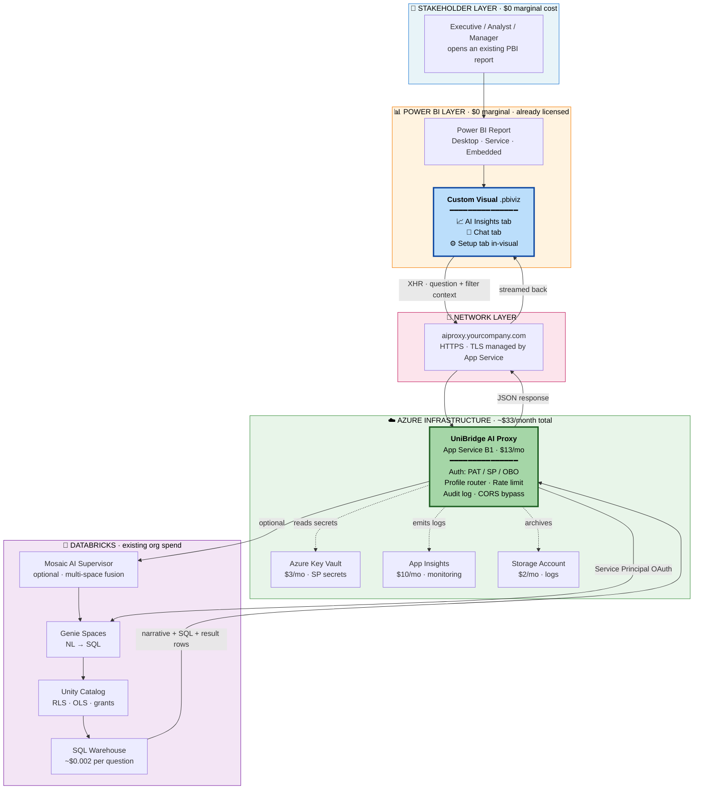
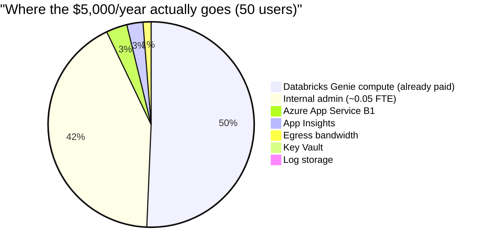
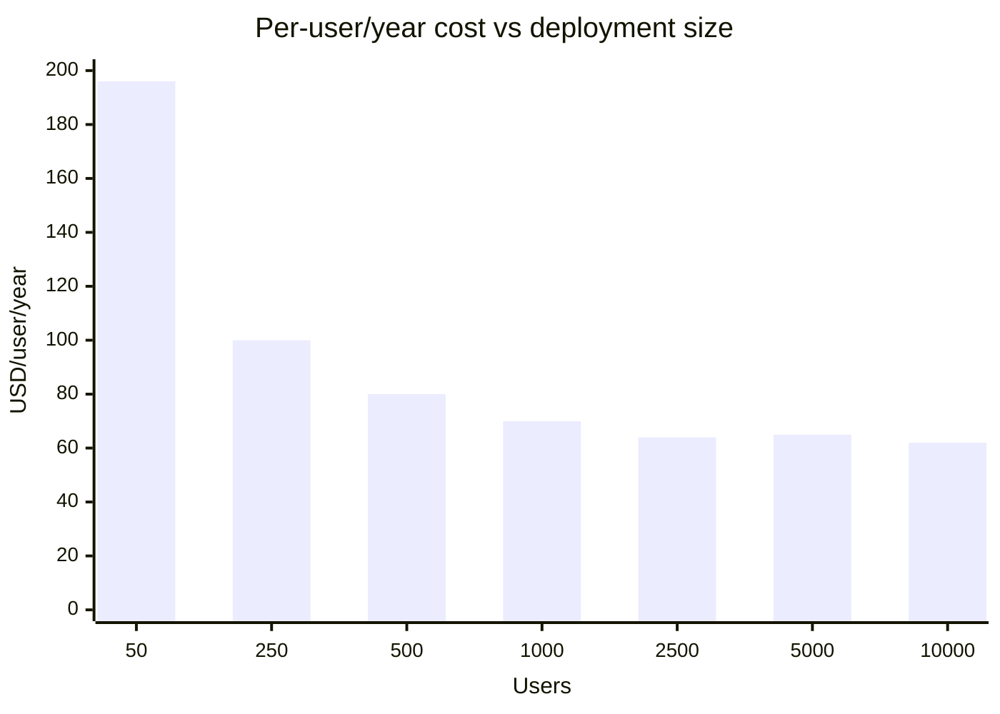
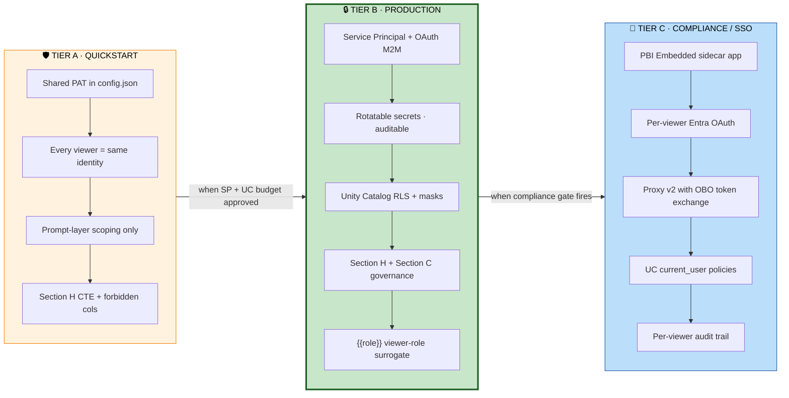
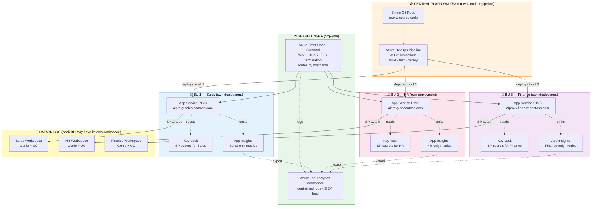
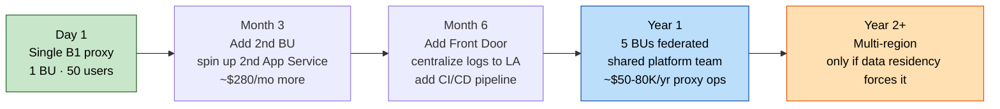

# PepPulse — Architecture & Knowledge Base (Consolidated)

> **System topology, cost ladder, security tiers, enterprise deployment, plus the analytics knowledge base that informs every prompt.**
>
> Audience: stakeholders, IT decision-makers, security reviewers, cloud architects, analytics leads.
>
> **Cross-references:** [`INDEX.md`](INDEX.md), [`AUTHOR_GUIDE.md`](AUTHOR_GUIDE.md), [`ROADMAP.md`](ROADMAP.md), [`SECURITY_REVIEW.md`](SECURITY_REVIEW.md), [`ANALYTICS_DOMAIN_TAXONOMY.md`](ANALYTICS_DOMAIN_TAXONOMY.md), [`INSIGHTS_SECTION_TAXONOMY.md`](INSIGHTS_SECTION_TAXONOMY.md), [`adr/`](adr/).


---

## Part 1 — System Topology, Cost Ladder & Security Tiers

*Source: `docs/ARCHITECTURE_DESIGN.md` — original title: "UniBridge AI for Power BI — Architecture & Cost Design".*

## UniBridge AI for Power BI — Architecture & Cost Design

> **Audience:** stakeholders, IT decision-makers, security reviewers, cloud architects, anyone evaluating whether to deploy this.
> **Length:** 5 pages. Page 1 is the one-pager (read alone for the gist). Pages 2-5 are optional deep dives — pick what your role needs.
> **Format:** Mermaid + Markdown — renders in GitHub natively, exports to PDF via `pandoc` or VS Code print.
> **Last updated:** 2026-05-04

---

### Page 1 — Architecture at a Glance



#### One-line value proposition

> **Drop one .pbiviz into any existing Power BI report. Stakeholders get AI grounded in their dashboards' real data, with zero per-seat licensing.**

#### What you get

| Capability | Where it lives | Cost |
|---|---|---|
| Natural-language Q&A inline next to charts | Custom visual | $0 |
| Auto-generated AI Insights (5-section pipeline) | Custom visual + Genie | $0 + Databricks compute |
| Multi-space fan-out across 2-9 Genie spaces | Custom visual + Proxy | $0 + Databricks compute |
| Mosaic AI Supervisor (cross-domain synthesis) | Proxy + Databricks endpoint | $0 + Databricks compute |
| Section H SQL governance (CTE preamble + forbidden tables) | Custom visual | $0 |
| Unity Catalog RLS / OLS enforcement | Databricks | already paid |
| Per-viewer SSO | ❌ not feasible inside PBI sandbox | requires Tier C upgrade |

#### The 60-second pitch

```
Stakeholder asks question in dashboard
          ↓
Visual passes filter context + question to proxy
          ↓
Proxy authenticates as Service Principal, routes to Genie
          ↓
Genie writes SQL (governed by Unity Catalog) and runs it
          ↓
Visual renders answer inline, stakeholder asks the next one
```

**No new tool to learn. No new login. No leaving the dashboard. No per-user license.**

---

### Page 2 — Cost & Scale

#### Cost components broken down (50 stakeholders, ~10 questions/user/day)



#### Per-user cost curve as you scale



#### Detailed cost ladder

| Stakeholders | Total Year-1 cost | $/user/year |
|---:|---:|---:|
| **50** | **$5K-10K** | **$100-200** |
| 250 | $25K | $100 |
| 500 | $40K | $80 |
| 1,000 | $70K | $70 |
| 2,500 | $160K | $64 |
| **5,000** | **$323K** | **$65** |
| 10,000 | $625K | $62 |

#### The honest reframe — incremental cost only

If you exclude Databricks compute (already in existing IT budget), **the new money you spend per user collapses fast**:

| Stakeholders | Incremental cost (proxy + admin only) | New $/user/year |
|---:|---:|---:|
| 50 | $7,400 | $148 |
| 500 | $25,000 | $50 |
| 1,000 | $40,000 | $40 |
| **5,000** | **$33,000** | **$7** |
| 10,000 | $50,000 | **$5** |

> **At 5,000 users, you're spending $7/user/year of new money to put AI inline next to every chart in every dashboard.**

#### Cost line-items in detail (50-user deployment)

| Component | Annual cost | What it is |
|---|---:|---|
| Custom visual `.pbiviz` | **$0** | Open / internal — distributed as a file, no licensing |
| Azure App Service B1 (proxy host) | $156 | $13/mo — single instance comfortably handles ~50 concurrent users |
| Azure Key Vault Standard | $36 | $3/mo — stores Service Principal client_id + secret |
| Application Insights (Basic) | $120 | $10/mo — proxy observability; can be skipped for $0 |
| Storage Account (logs + audit) | $24 | $2/mo — proxy logs and audit trail |
| Azure egress bandwidth | $60 | ~5 GB/mo of JSON to Databricks at $0.087/GB |
| Custom domain + TLS | $0 | App Service Managed Certificate is free |
| **Subtotal: Azure infrastructure** | **$396** | **~$33/mo total** |
| | | |
| Databricks Genie compute | ~$2,400 | 50 users × 10 q/day × 250 days × ~$0.002/query (Small SQL warehouse). **Already on existing Databricks bill** — not new spend. |
| Databricks Workspace + Unity Catalog | $0 marginal | Already paid (assumed pre-existing) |
| Service Principal | $0 | Free in Databricks |
| | | |
| Implementation (one-time, Year 1 only) | $0-2,000 | Half-day deploy by 1 engineer; or $0 if you already have an Azure admin |
| Internal admin (ongoing) | ~$2,000-5,000 | ~0.05 FTE — proxy is stateless, mostly self-running |
| | | |
| **TOTAL Year 1** | **~$5,000-10,000** | **$100-200/user/year** |
| **TOTAL Year 2+** | **~$5,000-8,000** | **$100-160/user/year** |

#### Why the cost flattens at scale

Three structural reasons:

1. **Proxy is stateless** — one Azure App Service instance comfortably serves thousands. B1 → S2 → P1V3 covers 50 → 5,000 → 50,000 users.
2. **Databricks compute is shared** — the SQL warehouse runs queries; it doesn't care how many users initiated them. Cost grows with total queries/sec, not unique user count.
3. **Admin doesn't scale linearly** — one part-time engineer can run the proxy for tens of thousands of users.

> ⚠️ **The numbers above assume a single-BU deployment on B1.** Enterprise deployment with multiple BUs uses a federated topology and Premium-tier App Service — see **Page 5 — Enterprise Deployment Topology** for the multi-BU cost structure.

---

### Page 3 — Security Tier Ladder



#### What each tier delivers, head-to-head

| Capability | Tier A (PAT) | Tier B (SP) | Tier C (SSO) |
|---|:-:|:-:|:-:|
| Identity audit (Databricks knows who) | service PAT only | Service Principal | **per-viewer** |
| UC row filters work per-viewer | ❌ | ❌ (per-SP only) | ✅ |
| UC column masks work per-viewer | ❌ | ❌ (per-SP only) | ✅ |
| Forbidden columns / read-only enforcement | ✅ (prompt-layer) | ✅ | ✅ |
| Section H CTE preamble + `{{role}}` injection | ✅ | ✅ | ✅ |
| Rotatable secrets | ❌ (PAT) | ✅ | ✅ |
| Per-viewer compliance audit (SOC 2 Type II) | ❌ | partial | ✅ |
| Drop-in deployment to existing PBI report | ✅ | ✅ | ❌ (needs host page) |
| **Code work to ship** | ✅ done | **3-4 days proxy upgrade** | **3-4 weeks rebuild** |
| **Per-customer setup time** | 30 min | 2-4 hours | 1-2 days |

#### When to pick which tier

| You need... | Pick... |
|---|---|
| A demo, internal POC, or single-team dashboard | **Tier A** |
| Production rollout to your enterprise (95% of cases) | **Tier B** |
| SOC 2 Type II, HIPAA, multi-tenant SaaS, per-viewer audit | **Tier C** |

#### The strategic insight

> The visual codebase is identical across all three tiers. **You only swap the proxy auth mode.** That means an org can start at Tier A on Friday, graduate to Tier B by next Friday, and only invest in Tier C when a paying customer with a compliance gate forces it.

---

### Page 4 — Caveats, Limits & What Doesn't Work

#### Honest caveats (we're not hiding these)

| Limitation | Why | Workaround |
|---|---|---|
| **No real per-viewer SSO inside the visual** | PBI sandbox blocks `window.parent`, blocks fetch, blocks any host-context API that exposes the viewer's identity to visual JS. Hard Microsoft constraint. | Tier C — rebuild as PBI Embedded sidecar app where the host page owns the OAuth token. |
| **`{{role}}` is a surrogate, not real identity** | The visual reads a DAX measure that returns the viewer's role. A malicious report author could mint claims for any role. | Acceptable for trusted-author enterprise BI (standard PBI trust model). Unacceptable for untrusted-viewer SaaS. |
| **AI Insights through Supervisor mode is slow** | Each of 3 Insights stages × supervisor (4-space fan-out + synthesis) = 3.5+ minutes total, often hits ECONNRESET. | Use a single Genie space profile (e.g. `sales`) for AI Insights. Reserve Supervisor for Chat tab cross-domain Q&A. |
| **PBI Desktop visual sandbox blocks `fetch`** | Microsoft chose XHR-only. | `genie.ts` uses `XMLHttpRequest` throughout — never replace with fetch. |
| **No per-viewer rate limiting** | Proxy rate-limits by IP, not by viewer (visual can't see viewer). | Tier C unlocks per-user rate limits via OBO identity. |
| **No usage analytics per stakeholder** | Same root cause — we can't identify viewers. | Aggregate proxy-side metrics by profile / endpoint, not by user. |
| **`fetch` is blocked, so streaming responses are emulated** | XHR doesn't support modern streaming. Supervisor uses NDJSON over XHR's `progress` event. | Works, but not as elegant as native SSE/EventSource. |
| **SQL formatter ships in the bundle (~40-80 KB)** | Lazy-loading not yet implemented. | Polish backlog item — not a blocker. |
| **CATEGORY PROFITABILITY occasionally returns assumption-only** | Genie LLM variability — sometimes outputs heading + assumption line and stops. Even with strengthened AMBIGUITY-RESOLUTION CONTRACT in Wave 20. | Re-run; second run usually succeeds. Wave 22+ may add post-process detection + auto-retry. |
| **Visual cannot enforce DML rejection — only warn** | Genie + UC enforce SQL execution. Visual can only flag DML in the response text. | Use UC SELECT-only grants on the SP — that's the actual enforcement. |

#### What's NOT included in the cost numbers

The cost lines above are the operational reality of running this stack in your tenant. Costs that would only apply in specific scenarios:

| Scenario | Additional cost |
|---|---|
| External-customer-facing SaaS deployment (rare for internal BI) | SOC 2 Type I audit: ~$20K-40K one-time |
| ISO 27001 certification (if procurement demands it) | ~$30K-80K depending on scope |
| Penetration testing of the proxy (annual, recommended for production) | ~$5K-15K |
| Disaster recovery — multi-region App Service + Key Vault replication | Roughly doubles the Azure infra line (~$33/mo → ~$66/mo) |
| 24/7 on-call rotation for the proxy | Roughly $50K-100K/year if outsourced; $0 if folded into existing platform team |

For internal-only deployment with normal business-hours operation: **none of the above apply** and the headline cost is what you actually pay.

#### What's still on the roadmap

| Wave | Item | Effort | Status |
|---|---|---|---|
| 19 | Runtime scope injection (forbidden cols, row filter, read-only) | Done | ✅ shipped |
| 20 | Setup field preview badge fix + CATEGORY PROFITABILITY prompt | Done | ✅ shipped |
| 21 | Section H SQL Configuration (CTE + forbidden tables + role injection) | Done | ✅ shipped |
| 22 | Tier B proxy upgrade — OAuth M2M / Service Principal | 3-4 days | ✅ shipped Session 60 (Wave 28) |
| 23 | sql-formatter lazy load (~40-80 KB savings) | 1 day | 📋 polish |
| 24 | Adaptive Genie poll backoff (currently fixed 2s) | 1 day | 📋 polish |
| 25 | Compact mode CSS media-query fallback | 1 day | 📋 polish |
| 26 | OpenAI / Bedrock backends made analytics-grade (SQL grounding) | 2 weeks | 📋 expansion |
| Tier C | PBI Embedded sidecar for true SSO | 3-4 weeks | 📋 wait for compliance trigger |

#### Open known issues (from latest live testing)

- Setup modal vertical-text overflow when running inside narrow PBI panels — fixed in Wave 20, awaiting your live re-test confirmation.
- Supervisor mode for AI Insights times out on ~20% of runs (3.5-minute pipeline).
- ECONNRESET / ENOTFOUND from the proxy when the network is interrupted mid-stage — surfaces as "AI Insights failed" with no recovery beyond user retry.

#### What this design intentionally does NOT do

- **Does NOT replace your existing WebApp + PBI Embedded portal.** Position both side-by-side: WebApp = governed central portal for analysts; visual = inline AI for the other 90% of users.
- **Does NOT ship with vendor-issued compliance attestations.** No pre-printed SOC 2 / HIPAA badge on the box — those are work products you commission if your procurement demands them. Tier B + UC enforcement gets you 80% of the way there for internal use; Tier C closes the rest.
- **Does NOT promise zero ongoing maintenance.** Proxy needs updates when Databricks API changes, dependencies need patching, monitoring needs review. Budget ~0.05 FTE indefinitely.

---

### Page 5 — Enterprise Deployment Topology

For anything beyond a single business unit, the right pattern is **federated**: one central platform team owns the proxy code + CI/CD pipeline, each BU runs its own deployment of that code with its own secrets and Databricks workspace.

#### Topology decision matrix

| Pattern | When to use | Trade-off |
|---|---|---|
| **Single centralized proxy** | One BU · single Databricks workspace · <500 users · single sensitivity tier | Cheapest infra; single point of failure; one BU's misbehavior affects everyone |
| **Federated per-BU proxies** ★ | 2+ BUs · independent Databricks workspaces or sensitivity tiers · 500-50,000 users | Independent failure domains; per-BU autonomy; ~Nx infra cost; needs CI/CD discipline |
| **Multi-region multi-tenant** | Global org · data residency requirements (EU/US/APAC isolation) · 50,000+ users | Highest cost; required for GDPR / data localization; ~3-5x federated cost |

> ★ **Recommended default for enterprise.** Single centralized only makes sense for single-BU deployments. Multi-region is overkill until data residency is a hard requirement.

#### Federated topology (the recommended pattern)



#### Why federated wins at enterprise

| Concern | Single Central | Federated |
|---|---|---|
| Blast radius when proxy crashes | **All BUs go dark** | Only the affected BU |
| One BU's rate-limit spam | Affects everyone | Contained to the offender |
| Different Databricks workspaces per BU | Central proxy needs creds for all | Each proxy only knows its own |
| Different sensitivity tiers (some Tier A, some Tier B/C) | Forces strictest profile on everyone | Each BU runs its appropriate tier |
| Audit ownership | Murky cross-BU access | Each BU owns its own logs + secrets |
| Upgrade coordination | "Everyone agrees together = nobody upgrades" | Early adopters move fast; laggards catch up later |
| Compliance scope | Whole proxy is in scope for any BU's audit | Only the BU under audit is in scope |
| **Infra cost** | 1× | ~N× (where N = BU count) |

The ~N× infra multiplier is the only real downside. At enterprise scale it's negligible vs the operational gains.

#### Committed platform stack (no ambiguity)

For each per-BU proxy deployment:

| Component | Specific Azure SKU | Monthly cost | Why this exact thing |
|---|---|---:|---|
| **Compute** | **Azure App Service Premium v3 (P1V3)** | $165 | Auto-scale, deployment slots (blue/green), VNet integration, sustained connections, predictable latency |
| **Secrets** | **Azure Key Vault (Standard)** | $3 | SP client_id + secret + proxy shared keys; managed identity from App Service for read access |
| **Observability** | **Azure Application Insights (workspace-based)** | $20-50 | Per-request tracing, dependency map, alerting; cost varies with log volume |
| **Edge security** | **Azure Front Door Standard** (shared across BUs) | $35 base + $0.01/10K requests | WAF, DDoS protection, TLS termination, health probing, regional failover |
| **Centralized logs** | **Azure Log Analytics Workspace** (shared) | ~$50-200/month | All BU proxy logs aggregated for SIEM / security review |
| **CI/CD** | **Azure DevOps Pipelines** OR **GitHub Actions** | Free tier covers most | Build-once, deploy-to-all-BUs |
| **Storage** | **Azure Storage Account (LRS)** | $5 | Audit log archive |
| **Bandwidth** | **Egress to Databricks** | $10-30 | Scales with question volume per BU |

**Per-BU monthly cost: ~$200-280**
**Per-BU annual cost: ~$2,400-3,400**

Shared (Front Door + Log Analytics) ÷ BUs = roughly $100/mo amortized

#### What is NOT in the stack (and why)

| Service | Why we don't use it |
|---|---|
| **❌ Azure Functions** | Cold starts (2-10s) break the chat UX; max execution timeout (5-10 min Consumption / 60 min Premium) is risky for long Genie polls; streaming over long-lived XHR isn't a Functions strength |
| **❌ Azure Container Apps** | Overkill for a stateless Express app; App Service Premium gives the same capability with less operational complexity |
| **❌ Azure Kubernetes Service** | Massive operational overhead for a single-container service; only consider if you're already running an AKS platform team |
| **❌ Azure API Management** | Useful eventually for org-wide API governance, but adds latency and cost without solving anything Front Door doesn't already cover |
| **❌ Cosmos DB / SQL DB** | Proxy is stateless by design — no DB needed; chat history goes to Databricks, not the proxy |

#### Enterprise cost example — 5 BUs, ~5,000 total users

| Component | Annual cost |
|---|---:|
| 5× per-BU proxies (App Service P1V3 + Key Vault + App Insights + Storage) | $12K-17K |
| Shared Front Door | $1K |
| Shared Log Analytics | $1K-3K |
| CI/CD pipeline | $0 (free tier) |
| Implementation (one-time, 5 BU rollout) | $10K-20K |
| Central platform team (~0.25 FTE for 5-BU operation) | $25K-40K |
| **Subtotal: enterprise infra + ops** | **$49K-81K** |
| Databricks Genie compute (5 BUs × 1K users × 10 q/day × $0.002) | ~$240K |
| **TOTAL Year 1, 5 BUs / 5K users** | **~$289K-321K** |
| **Per-user/year, fully loaded** | **~$58-64** |

The proxy infra is ~17-25% of the total. The rest is Databricks compute (already in existing IT budget). **Per-user incremental cost: ~$10-16/year of NEW money** to bring AI to every dashboard across 5 BUs.

#### Migration path: small → enterprise

You don't need to start federated. The federation pattern is a graduation, not a starting point.



Same proxy code at every step. You're just changing where it runs and how many copies.

---

### Quick reference card (print this)

```
╔═══════════════════════════════════════════════════════════╗
║  UniBridge AI for Power BI — One-Glance Summary           ║
╠═══════════════════════════════════════════════════════════╣
║                                                            ║
║  WHAT IT IS:  Custom .pbiviz that puts Databricks Genie   ║
║               inline in any existing PBI report           ║
║                                                            ║
║  COST:        Single BU (B1):  ~$33/mo Azure infra        ║
║               Per-BU enterprise (P1V3): ~$200-280/mo      ║
║               Year-1 at 50 users (1 BU):    ~$5K-10K     ║
║               Year-1 at 5K users (5 BUs):   ~$289K-321K  ║
║               ~75% of total is Databricks compute         ║
║               (already in existing IT budget)             ║
║                                                            ║
║  SECURITY:    A) Quickstart PAT (demo)                    ║
║               B) Service Principal + UC (production) ★    ║
║               C) PBI Embedded SSO (compliance-grade)      ║
║                                                            ║
║  DEPLOYMENT:  30 min for first stakeholder                ║
║               Hours for any new team after that           ║
║                                                            ║
║  KEY LIMIT:   No per-viewer SSO inside the sandbox        ║
║               (Tier C upgrade required for that)          ║
║                                                            ║
║  WHEN NOT:    Multi-tenant SaaS · per-viewer SOC 2 audit  ║
║                                                            ║
╚═══════════════════════════════════════════════════════════╝
```

---

### How to share this document

| Audience | Recommended view |
|---|---|
| Executive sponsor | Page 1 only (one-pager) + Quick Reference Card |
| Finance reviewer | Page 1 + Page 2 (cost) + Page 5 (enterprise topology cost) |
| Security reviewer | Page 1 + Page 3 (security tiers) + Page 4 (caveats) + Page 5 (federated audit boundaries) |
| Cloud / platform architect | Page 1 + Page 5 (enterprise topology + committed Azure SKUs) |
| IT deployment team | All 5 pages + the Recommended Security Setup section in `REPORT_AUTHOR_GUIDE.md` |
| Engineering peer review | All 5 pages + `CLAUDE.md` + `HANDOVER.md` |

#### Exporting

```bash
# To PDF (requires pandoc + a LaTeX engine)
pandoc docs/ARCHITECTURE_DESIGN.md -o ARCHITECTURE_DESIGN.pdf --from gfm

# To PNG diagrams (one per Mermaid block)
# Use the Mermaid Live Editor: https://mermaid.live
# Or VS Code extension "Markdown Preview Mermaid Support"

# Print directly from VS Code
# Cmd/Ctrl+Shift+V → File → Print → Save as PDF
```

---

*This document is the source of truth for the deployment story. If you find a number that doesn't match what's in `REPORT_AUTHOR_GUIDE.md` or `CLAUDE.md`, this file wins — those should be updated to match.*


---

## Part 2 — Analytics, Statistics, Data Visualization & Reporting Knowledge Base

*Source: `docs/ANALYTICS_KNOWLEDGE_BASE.md` — original title: "Analytics, Statistics, Data Visualization & Reporting — Knowledge Base".*

## Analytics, Statistics, Data Visualization & Reporting — Knowledge Base

> Maintained for the DwD AI Assistant for PBI project.
> Last updated: 2026-04-24.

---

### Table of Contents

1. [Chart Selection Frameworks](#1-chart-selection-frameworks)
2. [Data Visualization Design Standards](#2-data-visualization-design-standards)
3. [Statistical Concepts for BI](#3-statistical-concepts-for-bi)
4. [Reporting Frameworks](#4-reporting-frameworks)
5. [Color Theory for Data](#5-color-theory-for-data)
6. [Table Design Standards](#6-table-design-standards)
7. [Common Chart Types — Deep Reference](#7-common-chart-types--deep-reference)
8. [DAX and SQL Patterns for Common Analytics](#8-dax-and-sql-patterns-for-common-analytics)
9. [Power BI Specific Standards](#9-power-bi-specific-standards)
10. [AI-Assisted Analytics Patterns](#10-ai-assisted-analytics-patterns)

---

### 1. Chart Selection Frameworks

#### 1.1 The Four Data Relationship Types

Every chart answers one of four primary questions. Identify the question first, then select the chart.

| Relationship | Question asked | Examples |
|---|---|---|
| **Comparison** | How do values differ across categories or over time? | Sales by region, revenue this year vs last year |
| **Composition** | What parts make up the whole? | Market share, budget allocation, headcount by department |
| **Distribution** | How are values spread? Where do most values cluster? | Age distribution, order values, defect counts |
| **Correlation** | Do two (or more) variables move together? | Price vs demand, ad spend vs revenue |

A fifth and sixth group are common in BI:

| Relationship | Question asked | Examples |
|---|---|---|
| **Flow / Process** | How do items move through stages? | Sales funnel, process steps, Sankey flows |
| **Part-of-Whole over Time** | How does composition change over time? | Stacked area, 100% stacked bar with date axis |

#### 1.2 Chart Chooser Decision Tree

```
START: What is the primary insight you need to communicate?
│
├── HOW VALUES DIFFER (Comparison)
│   ├── Across categories (not time)?
│   │   ├── Few categories (≤7) → Horizontal Bar Chart
│   │   ├── Many categories → Horizontal Bar (sorted) or Table with conditional formatting
│   │   └── Two groups side-by-side → Grouped Bar Chart
│   └── Over time?
│       ├── Continuous trend → Line Chart
│       ├── Emphasize volume under trend → Area Chart
│       ├── Discrete periods (monthly, quarterly) → Column Chart
│       └── Period-over-period comparison → Overlapping Line or Small Multiples
│
├── PART-OF-WHOLE (Composition)
│   ├── Static (single point in time)?
│   │   ├── 2–5 segments, simple message → Donut or Pie Chart
│   │   ├── Many segments or precision needed → 100% Stacked Bar or Table
│   │   └── Hierarchical composition → Treemap or Sunburst
│   └── Over time?
│       ├── Emphasize absolute volumes → Stacked Area or Stacked Column
│       └── Emphasize proportions → 100% Stacked Area or 100% Stacked Column
│
├── DISTRIBUTION
│   ├── Single variable, all data points → Histogram
│   ├── Single variable, summary statistics → Box Plot
│   ├── Two variables, show density → Scatter Plot (with density contours)
│   └── Comparing distributions across groups → Box Plot (multiple) or Violin Plot
│
├── CORRELATION / RELATIONSHIP
│   ├── Two continuous variables → Scatter Plot
│   ├── Two continuous + one categorical → Scatter Plot (color/shape encoded)
│   ├── Two continuous + one size variable → Bubble Chart
│   └── Many variable pairs → Scatter Plot Matrix (SPLOM)
│
├── FLOW / PROCESS
│   ├── Sequential stages with drop-off → Funnel Chart
│   ├── Flows between categories → Sankey Diagram
│   └── Sequential steps (not proportional) → Process Diagram / Timeline
│
└── SPATIAL
    ├── Geographic aggregation (country, state, region) → Choropleth Map
    ├── Point data (stores, events) → Dot Map or Bubble Map
    └── Flow between locations → Flow Map
```

#### 1.3 Time-Series Specific Rules

| Scenario | Best chart | Second choice | Avoid |
|---|---|---|---|
| Single metric trend | Line | Area | Bars (unless truly discrete) |
| Multiple metrics trend | Multi-line (≤4 series) | Small multiples | Stacked area (confuses comparison) |
| Emphasize rate of change | Line with steeper aspect ratio | Slope chart | Flat aspect ratio (hides change) |
| Highlight cumulative total | Area | Running total table | Pie |
| Cyclical/seasonal pattern | Line with year-over-year overlay | Heatmap calendar | Single long line |
| Sparse events on a timeline | Dot plot or event timeline | Bar (per period) | Line (implies interpolation) |

#### 1.4 Comparison Anti-Patterns

- Never use a pie chart to compare values across categories — bars are always more accurate.
- Never use 3D charts — depth distorts relative magnitude.
- Never truncate bar chart axes at anything other than zero (bars encode length, not position).
- Line chart axes may be non-zero if the context is trend direction, not absolute magnitude.
- Never use dual-axis charts unless the two metrics are causally or logically related — they invite false correlation.

#### 1.5 The "How Many Categories" Rule

| Category count | Recommended approach |
|---|---|
| 2 | Single metric with comparison annotation (vs prior period); or small grouped bar |
| 3–7 | Standard bar/column; color-encoded categorical |
| 8–15 | Sorted horizontal bar; highlight top/bottom; gray the middle |
| 16+ | Aggregate into "Top N + Other"; use table with search; small multiples |

---

### 2. Data Visualization Design Standards

#### 2.1 Edward Tufte Principles

##### Data-Ink Ratio

The fundamental principle: maximize the share of ink devoted to actual data.

```
Data-Ink Ratio = Data Ink / Total Ink in the Graphic
```

Target: ratio as close to 1.0 as possible.

**Practical rules:**
- Remove chart borders that add no information.
- Remove gridlines where the values can be read from the axis; keep subtle gridlines only where they aid reading.
- Remove background fills, gradient fills, and 3D effects.
- Remove tick marks when the axis label itself is sufficient.
- Remove legends when series can be labeled directly.
- Remove shadows, bevels, and glow effects from any data element.

##### Chartjunk — What It Is and How to Spot It

Chartjunk is any visual element that does not encode data. Categories:

1. **Vibrations and moirés** — cross-hatching, dense patterns in bars.
2. **Grids** — heavy gridlines that compete with data.
3. **Duck** — decorative illustrations embedded in charts.
4. **Unnecessary color** — coloring bars in a single-series chart differently adds no information.
5. **3D effects** — depth, shadow, perspective.
6. **Redundant encoding** — pie chart where both angle and exploded slice highlight the same point.

##### Sparklines

Sparklines are "data-intense, design-simple, word-sized graphics." Rules:
- Scale should reflect variation within the series, not absolute magnitude — unless comparison across sparklines is needed.
- When sparklines are placed next to each other for comparison, share the same Y-axis scale.
- Include a start value, end value, and a highlighted high/low point.
- Width:height ratio approximately 4:1 for trend emphasis.
- Use in tables, KPI cards, and inline in text (as Tufte intended).

##### Small Multiples (Trellis / Faceting)

Principle: use the same chart template across multiple panels, varying one dimension (usually a category or time slice).

When to use small multiples:
- When you have 4–16 groups and overlaying them on one chart creates a spaghetti line or overcrowded bars.
- When you want the viewer to compare both the pattern within each group and across groups.
- When a dual-axis or stacked chart would obscure comparison.

Rules:
- All panels must share the same axes scales unless the purpose is pattern shape (then note "scales differ").
- Maintain consistent chart type, color, and labeling across all panels.
- Arrange panels in a logical order (rank, geography, time).
- Keep panel size uniform; use white space between panels, not borders.

##### Lie Factor

```
Lie Factor = Size of Effect in Graphic / Size of Effect in Data
```

Acceptable range: 0.95–1.05. Any chart with a lie factor > 1.05 distorts the data. Common sources: truncated axes, 3D perspectives, disproportionate icon sizes in pictograms.

#### 2.2 Stephen Few Guidelines

Few refined Tufte's principles for dashboards and screen-based design. Key additions:

**The dashboard occupies a single screen.** If a dashboard requires scrolling, it is a report, not a dashboard. Design accordingly.

**Perceptual accuracy hierarchy** (from most to least accurate encoding):
1. Position along a common scale (bar chart, scatter plot)
2. Length (bar chart)
3. Angle/slope (line chart, pie — angle is less accurate than length)
4. Area (bubble, treemap — notoriously difficult to judge)
5. Volume (3D — avoid entirely)
6. Color hue (categorical distinction — not for quantitative magnitude)
7. Color saturation (reasonable for sequential magnitude)

**Implications:** Prefer charts that encode data as position or length. Reserve area-based charts (treemap, bubble) for high-level overview only — never for precise comparison.

**Grouping principles for dashboards:**
- Group related KPIs visually with proximity and alignment, not decorative boxes.
- Separate sections with whitespace, not heavy borders.
- Use consistent visual templates per KPI type (e.g., all revenue KPIs use the same card format).

#### 2.3 Nielsen Heuristics Applied to Data Dashboards

Originally formulated for UI, these translate directly to dashboard design:

| Heuristic | Dashboard application |
|---|---|
| **Visibility of system status** | Always show when data was last refreshed; show loading states; indicate when a filter is active |
| **Match between system and real world** | Use business terminology, not technical field names; dates in the user's locale format |
| **User control and freedom** | Make filters clearable; provide a "reset to default" option; allow drill-through back-navigation |
| **Consistency and standards** | Same color for the same metric across all pages; same visual type for the same analytical question |
| **Error prevention** | Warn when filters produce no data; validate date range selections; prevent selecting incompatible slicer combinations |
| **Recognition over recall** | Label data points directly; keep the legend visible; do not require memorizing a color key |
| **Flexibility and efficiency** | Provide bookmarks for common filter states; enable cross-filter; support drill-through for analysts |
| **Aesthetic and minimalist design** | Show only what is needed for the audience's question; every element must earn its place |
| **Help users recognize and recover from errors** | Provide clear error states with actionable messages (not "Error 500" but "No data found — try clearing filters") |
| **Help and documentation** | Tooltips on KPIs explaining definition; info icons for metrics with non-obvious calculation |

#### 2.4 IBCS — International Business Communication Standards

IBCS provides a notation system (HICHERT+DESIGN) for consistent management reporting. Core concepts:

##### SUCCESS Acronym (IBCS Rules)

| Letter | Principle | Key rule |
|---|---|---|
| **S** | Say | Every chart needs a message title (the insight), not just a label (the topic) |
| **U** | Unify | Use standardized notation across the entire report set |
| **C** | Condense | Show as much relevant information as possible in the available space |
| **C** | Check | Ensure semantic integrity — the visual must not contradict the data |
| **E** | Express | Use appropriate visualization type for the data relationship |
| **S** | Simplify | Remove everything that is not data or navigation |
| **S** | Structure | Organize content logically; use consistent layout templates |

##### IBCS Notation Rules

**Scenario notation (time-based comparisons):**
- Actual (AC) = solid fill
- Previous year (PY) = outlined/hollow with gray
- Plan/Budget (PL/BU) = outlined/hollow with dark color
- Forecast (FC) = hatched pattern

**Column types:**
- Absolute values → filled bars/columns
- Variance (absolute delta) → pin charts or delta bars (positive = dark, negative = light red)
- Variance (%) → text or pin chart with % scale

**Title standard:**
- Message title: "Revenue grew 12% YoY, driven by EMEA" (not "Revenue by Region")
- Source and calculation notes in footer, not title

**Axis zero rules:**
- Bar/column charts: always start at zero
- Line charts showing variance or index: can have non-zero baseline; clearly annotate

---

### 3. Statistical Concepts for BI

#### 3.1 Descriptive Statistics

##### Central Tendency

| Measure | Formula | When to use | When NOT to use |
|---|---|---|---|
| **Mean** | Sum / Count | Symmetric distributions, no extreme outliers | Skewed data, data with outliers |
| **Median** | Middle value (sorted) | Skewed distributions, income, house prices | When all data values matter equally (rare) |
| **Mode** | Most frequent value | Categorical data, discrete counts | Continuous data (rarely meaningful) |

**Choosing between mean and median:**
- If mean > median, distribution is right-skewed (long tail of high values).
- If mean < median, distribution is left-skewed.
- For business KPIs involving money, time, or counts — always report both. Mean is useful for totals; median is useful for "typical."

##### Spread / Variability

| Measure | Formula | Interpretation |
|---|---|---|
| **Range** | Max − Min | Total spread; highly sensitive to outliers |
| **Variance** | Average squared deviation from mean | Intermediate; difficult to interpret in original units |
| **Standard Deviation (StdDev)** | √Variance | Spread in original units; 68-95-99.7 rule for normal distributions |
| **IQR (Interquartile Range)** | Q3 − Q1 | Middle 50% spread; robust to outliers; use for box plots |
| **Coefficient of Variation (CV)** | StdDev / Mean | Relative spread; useful to compare variability across different scales |

**The 68-95-99.7 Rule (for normal distributions):**
- 68% of values fall within ±1 StdDev of the mean
- 95% of values fall within ±2 StdDev
- 99.7% of values fall within ±3 StdDev

This rule is often used to flag outliers: values beyond ±3 StdDev are rare by chance and merit investigation.

##### Percentiles

| Percentile | Also called | Interpretation |
|---|---|---|
| P25 | Q1, first quartile | 25% of values are at or below this value |
| P50 | Q2, median | 50% of values are at or below this value |
| P75 | Q3, third quartile | 75% of values are at or below this value |
| P90 | 90th percentile | 90% of values are at or below this value |
| P95 | 95th percentile | Common SLA threshold for latency and response times |
| P99 | 99th percentile | Captures almost all values; used for worst-case SLAs |

**IQR = Q3 − Q1.** The whiskers in a box plot typically extend to Q1 − 1.5×IQR (low) and Q3 + 1.5×IQR (high). Values beyond the whiskers are plotted as individual outlier points.

#### 3.2 Inferential Statistics for BI Practitioners

##### Confidence Intervals (Practical Level)

A 95% confidence interval means: if we ran the same data collection 100 times, 95 of those intervals would contain the true population value.

**Practical BI interpretation:**
- If the confidence interval for a conversion rate is [4.2%, 5.8%], you cannot tell from this data whether a change is real or noise — the true rate could be anywhere in that range.
- When comparing two groups, if the confidence intervals overlap substantially, the difference may not be statistically meaningful.
- Narrow CI = more data = more certainty. Wide CI = less data = more uncertainty.

**When to display CIs in dashboards:**
- Survey data and sample-based metrics (not full population)
- A/B test results
- Forecast bands
- Do not display CIs on exact counts or sums from complete data — they are not estimates.

##### P-values (Practical Interpretation)

A p-value is the probability of observing a result at least as extreme as the data, assuming the null hypothesis is true.

- p < 0.05: conventionally "statistically significant" — but does not mean practically important.
- p > 0.05: insufficient evidence to reject the null hypothesis — does not mean the null is true.

**Critical BI warning:** Statistical significance does not equal business significance. A p-value of 0.001 on a 0.02% improvement in conversion rate is statistically significant but may be commercially irrelevant. Always pair p-values with effect size (e.g., absolute difference, relative lift, number of users affected).

**For BI dashboards:** Avoid displaying raw p-values to business users. Instead, show:
- The observed change
- A confidence interval for that change
- A plain-language statement: "This result is likely real (95% confidence)" or "Not enough data to be sure."

##### Correlation vs Causation

**Correlation** measures the strength and direction of a linear relationship between two variables.

| Pearson r value | Interpretation |
|---|---|
| 0.9 – 1.0 | Very strong positive |
| 0.7 – 0.9 | Strong positive |
| 0.5 – 0.7 | Moderate positive |
| 0.3 – 0.5 | Weak positive |
| < 0.3 | Negligible |
| Negative values | Same magnitudes, opposite direction |

**Causation requires:**
1. Correlation (necessary but not sufficient)
2. Temporal precedence (cause must precede effect)
3. Elimination of confounders (third variables causing both)
4. Plausible mechanism (or experimental evidence)

**Common BI correlation traps:**
- Ice cream sales and drowning rates are correlated — confounder is summer/heat.
- Number of firefighters and fire damage are correlated — confounder is fire size.
- Employee count and revenue are correlated — both grow with company size.

**How to flag in dashboards:** When showing scatter plots or correlation metrics, always add a disclaimer: "Correlation does not imply causation — further analysis required."

#### 3.3 Outlier Detection Methods

##### Z-Score Method

```
Z = (x − mean) / StdDev
```
Flag as outlier if |Z| > 3. Assumes normal distribution. Sensitive to the very outliers it's trying to detect (since they inflate the mean and StdDev).

##### IQR / Tukey Fence Method (Preferred for Skewed Data)

```
Lower fence = Q1 − 1.5 × IQR
Upper fence = Q3 + 1.5 × IQR
```
Values outside the fences are flagged. More robust than Z-score for non-normal distributions. This is the method used in standard box plots.

##### Modified Z-Score (Most Robust)

```
Modified Z = 0.6745 × (x − median) / MAD
where MAD = median(|xi − median|)
```
Flag if |Modified Z| > 3.5. Recommended when data is highly skewed.

##### Business Rules-Based (Most Common in Practice)

Define outliers based on domain knowledge:
- Order value > $100,000 when typical order is $500–$2,000
- Negative inventory counts
- Percentages outside [0%, 100%]
- Dates in the future on a historical transaction table

**BI recommendation:** Use automated outlier detection to surface candidates; always validate with business rules before acting on an "outlier."

#### 3.4 Period-over-Period Calculations

##### YoY (Year-over-Year)

```
YoY Change (%) = (Current Period Value − Same Period Last Year) / |Same Period Last Year| × 100
```

Use absolute value in denominator to handle sign changes (e.g., going from loss to profit). Be explicit when the base is negative — the percentage is technically correct but counterintuitive.

##### MoM (Month-over-Month)

```
MoM Change (%) = (Current Month − Prior Month) / |Prior Month| × 100
```

Caution: MoM comparisons have calendar effects (number of working days, seasonal patterns). Prefer YoY or seasonally adjusted MoM for business decision-making.

##### WoW (Week-over-Week)

Same formula as MoM, using prior week as the base. Useful for high-frequency operational metrics (e-commerce, support ticket volumes). Calendar effects (holidays, day-of-week mix) still apply.

##### Same Period Last Year (SPLY)

When comparing partial periods, compare "month-to-date this year" against "same month-to-date last year" — not the full prior-year month.

#### 3.5 Moving Averages

| Type | Formula | Purpose |
|---|---|---|
| **Simple Moving Average (SMA)** | Average of last N periods | Smooth short-term noise; equal weight to all N periods |
| **Weighted Moving Average (WMA)** | Sum of (value × weight) / sum of weights | More recent periods weighted higher |
| **Exponential Moving Average (EMA)** | EMA = α × current + (1−α) × prior EMA | Reacts faster to recent changes; never forgets old data |

**Choosing N for SMA:**
- 7-day MA: operational smoothing (e-commerce, support)
- 30-day MA: tactical trend visibility (monthly operational)
- 90-day MA: strategic trend (quarterly board reporting)
- 12-month MA: removes seasonality entirely

**The crossing signal:** When a short MA crosses above a long MA, it can indicate an upward trend change. When it crosses below, a downward shift. Use with caution in business reporting — signal lag means the trend has already started.

#### 3.6 Running Totals

A running total (cumulative sum) at each point is the sum of all values up to and including that point.

**Use cases:**
- Year-to-date (YTD) revenue vs prior YTD
- Cumulative defects vs cumulative budget
- Progress toward a target (with a target line overlay)
- Pareto analysis (cumulative % of total)

#### 3.7 Ranking

**Dense ranking:** 1, 2, 2, 3 (ties share rank, no gaps)
**Standard ranking:** 1, 2, 2, 4 (ties share rank, gap after tie)
**Row number:** 1, 2, 3, 4 (no ties; arbitrary for equal values)

**Business application:** Top-N analysis (top 10 customers by revenue), bottom-N analysis (worst-performing stores), rank change analysis (which product moved from rank 5 to rank 2).

#### 3.8 Pareto Analysis

The Pareto Principle (80/20 rule): approximately 80% of effects come from 20% of causes.

**Implementation:**
1. Sort items by value descending.
2. Calculate cumulative sum.
3. Calculate cumulative % = cumulative sum / total.
4. The point where the cumulative % crosses 80% marks the "vital few."

**Chart:** Combo chart — bar columns for individual values (left Y-axis, descending), line for cumulative % (right Y-axis, 0%–100%).

---

### 4. Reporting Frameworks

#### 4.1 KPI Selection — SMART Metrics

A KPI must be:

| Letter | Criterion | Test question |
|---|---|---|
| **S** | Specific | Does it measure one clearly defined outcome? |
| **M** | Measurable | Can we calculate it unambiguously from available data? |
| **A** | Achievable / Actionable | Can a person or team act to change this metric? |
| **R** | Relevant | Does it tie directly to a business objective? |
| **T** | Time-bound | Is there a target with a defined time horizon? |

**Anti-patterns for KPIs:**
- "Customer satisfaction" — not measurable until defined as NPS, CSAT, or CES score.
- "Increase sales" — not specific or time-bound.
- "Number of meetings held" — not relevant to outcomes.
- "Data quality score" — may not be actionable by the audience.

#### 4.2 Leading vs Lagging Indicators

| Type | Definition | Examples | Use |
|---|---|---|---|
| **Lagging** | Measures outcomes after they occur | Revenue, Profit, Customer churn, NPS | Score performance; confirm strategy worked |
| **Leading** | Measures activity that predicts future outcomes | Pipeline coverage, Proposal send rate, Employee engagement | Enable intervention before outcomes solidify |

**Best practice:** Every dashboard should have both. A lagging indicator (revenue this quarter) paired with a leading indicator (pipeline coverage at 3x target) tells a complete story — what happened and what will likely happen.

**The risk of lagging-only dashboards:** Executives who see only lagging indicators discover problems too late to act. The value of BI is enabling proactive decisions.

#### 4.3 Dashboard Design by Audience Type

##### Executive Dashboard

**Audience:** C-suite, board, senior leadership
**Decision type:** Strategic, course-correction
**Update frequency:** Weekly, monthly, quarterly

Design principles:
- Maximum 5–7 KPIs on the primary view
- Every KPI has a comparison (vs target, vs prior period) — never show a number without context
- Traffic-light status (green/amber/red) with clear threshold definitions
- Trend sparkline next to each KPI (last 12 periods)
- Single click to the next level of detail (not embedded on the executive view)
- No filters exposed on the executive view — pre-filtered to the most relevant cut

Layout pattern:
```
[Page title / date range]
[KPI 1 | KPI 2 | KPI 3]    ← Top 3 most critical
[Trend chart 1]  [Trend chart 2]  ← 2 key trends
[Exception list / top/bottom table]
```

##### Operational Dashboard

**Audience:** Operations managers, supervisors, frontline leads
**Decision type:** Tactical, real-time adjustments
**Update frequency:** Real-time, hourly, daily

Design principles:
- Prominent alerts and exception flags (what needs attention now)
- Current status vs target with time remaining in period
- Drill-down to individual transactions, agents, or units
- Filters for the operational owner's scope (their region, their team)
- Trend shown for a short recent window (7 days, 30 days) — not 12 months

Layout pattern:
```
[Scope filters: Region / Team / Date]
[Real-time KPIs with status flags]
[Exception list: items outside threshold]
[Detail drill-down table]
```

##### Analytical Dashboard

**Audience:** Analysts, data scientists, BI power users
**Decision type:** Exploratory, hypothesis testing, pattern finding
**Update frequency:** Daily, on-demand

Design principles:
- More chart variety acceptable (scatter plots, histograms, box plots)
- Filters and slicers prominently available — analysts will slice heavily
- Show distributions, not just averages
- Cross-filter interactions enabled
- Export options (CSV, Excel) accessible
- Statistical annotations (trend lines, R², confidence bands) appropriate

#### 4.4 The Pyramid Principle for Data Storytelling

The Pyramid Principle (Barbara Minto, McKinsey) structures communication from conclusion to evidence — the opposite of how analysis proceeds.

**Structure:**
```
GOVERNING THOUGHT (the headline insight)
├── KEY LINE (3–5 supporting arguments)
│   ├── Support with data
│   ├── Support with data
│   └── Support with data
├── KEY LINE 2
│   ├── ...
└── KEY LINE 3
    ├── ...
```

**Applied to BI reports:**
1. Start with the most important finding as the report title (not the topic).
2. Each page has one message, stated in the page title.
3. Each chart has a message title, not a topic label.
4. Data supports the message; it does not replace the message.

**Example:**
- Bad: "Revenue by Region — Q1 2026"
- Good: "EMEA drove 60% of Q1 2026 revenue growth, offsetting Americas decline"

**The SCR Framework (Situation, Complication, Resolution):**
- **Situation:** Establishes common ground (what we know). "Revenue was flat for 3 quarters."
- **Complication:** Introduces the tension. "New competitive entrants in EMEA threaten our position."
- **Resolution:** Answers "So what?" or "What now?" "Targeting 15% growth in digital channel within 6 months mitigates the threat."

---

### 5. Color Theory for Data

#### 5.1 Palette Types

##### Categorical (Qualitative) Palettes

Used for distinguishing unordered, discrete categories (product lines, regions, departments).

Rules:
- Maximum 7–10 distinct hues (human eye struggles beyond this in a single chart)
- Hues should be perceptually equidistant (each color feels equally distinct)
- Do not use color to imply ranking or magnitude — use position/length for that
- Keep colors consistent across the entire report for the same category

Recommended categorical palettes:
- **Tableau 10** — industry standard; well-tested
- **D3 Category10 / Category20** — web standard
- **ColorBrewer Qualitative** — print and screen safe
- **IBM Carbon** — enterprise-grade, accessible

##### Sequential Palettes

Used for ordered, quantitative data where values go from low to high (population density, sales volume, age).

Rules:
- Single hue progressing from light to dark (light = low, dark = high)
- Or multi-hue from light neutral to saturated color
- Never use a rainbow/spectrum — it implies categorical distinction and has no perceptual ordering
- The "0" or "null" value should be clearly distinguishable (white or very light gray)

Recommended: Blues, Greens, Oranges, Purples (single-hue), or YlOrRd, BuPu (multi-hue) from ColorBrewer.

##### Diverging Palettes

Used when data has a meaningful midpoint (zero, a target, an average) and values can go in either direction (profit/loss, growth/decline, above/below average).

Rules:
- Two contrasting hues on each end; light/neutral at the midpoint
- Most common: red–white–green (but see accessibility note below)
- The midpoint color should be very close to white or light gray
- Midpoint must represent a meaningful value (not an arbitrary center)
- Never use a diverging palette for one-directional data

Recommended: RdBu, PRGn, BrBG from ColorBrewer. Avoid RdYlGn for colorblind users (see below).

#### 5.2 Accessibility — WCAG and Colorblind-Safe Design

##### WCAG Contrast Requirements

- **AA standard:** 4.5:1 contrast ratio for text on background
- **AAA standard:** 7:1 for enhanced accessibility
- **Large text (18pt+ or 14pt bold):** 3:1 minimum
- Data labels overlaid on colored bars must meet 4.5:1 against the bar color

Test contrast: use WebAIM Contrast Checker or browser DevTools accessibility panel.

##### Color Vision Deficiency

Approximately 8% of males and 0.5% of females have some form of color vision deficiency.

| Type | Frequency | What they cannot distinguish |
|---|---|---|
| **Deuteranopia** (green-blind) | ~5% males | Red from green |
| **Protanopia** (red-blind) | ~1% males | Red from green (reds appear dark) |
| **Tritanopia** (blue-blind) | Very rare | Blue from yellow |
| **Achromatopsia** (total) | Extremely rare | All colors |

**Practical rules:**
- Never rely on red/green alone to convey a positive/negative signal. Pair with shape (up/down arrow), pattern, or position.
- The most common mistake: red = bad, green = good — invisible to 5% of male users.
- Use blue/orange as a safe red/green alternative (both deuteranopes and protanopes see them as distinct).
- Test visualizations with a colorblind simulator (Coblis, or the "Grayscale" filter — if the chart reads in grayscale, it will read for most colorblind users).

**Colorblind-safe palettes:**
- **Okabe-Ito** (8 colors) — gold standard for scientific figures
- **Paul Tol** palettes — carefully tested across deficiency types
- **ColorBrewer** sets marked "colorblind safe" — verified

#### 5.3 Traffic-Light Conventions

Standard traffic-light (RAG) status:

| Status | Color | Meaning |
|---|---|---|
| Green | #00A651 or similar | On target / good |
| Amber | #FFB900 or similar | At risk / caution — requires monitoring |
| Red | #D32F2F or similar | Off target / action required |

**Rules for traffic lights:**
- Define thresholds explicitly and document them in a tooltip or footnote.
- Never let a chart default to traffic-light colors without configured thresholds.
- Include a fourth state: **Gray** = insufficient data / not yet available.
- For colorblind accessibility, pair the color with a shape icon (check mark, warning triangle, X, question mark).
- In tabular formats, use background color at low opacity (20–30%) to avoid overwhelming the text.

**Threshold definition pattern:**
```
Green:  ≥ 95% of target
Amber:  80% to < 95% of target
Red:    < 80% of target
```
Document what "target" means and when it was set. Thresholds should be reviewed when targets change.

#### 5.4 Color Encoding Rules

- Use color as a last encoding channel — position, length, and shape communicate more accurately.
- Assign one color per category — never the same color for two different categories in the same report.
- Use gray for "everything else" — it does not compete with the highlighted series.
- Reserve red for negative/bad; reserve green for positive/good — users have this expectation.
- Do not use color gradients on a categorical variable — it implies ordering.
- Keep background colors neutral (white, light gray). Colored backgrounds compete with the data.

---

### 6. Table Design Standards

#### 6.1 Table vs Chart Decision

Use a **table** when:
- Readers need exact values (financial reporting, data entry validation)
- Multiple metrics need to be shown per row (each needs its own column)
- The data will be exported and used in further calculations
- The audience needs to look up specific values (not trends)
- More than ~10 items need comparison on more than one dimension simultaneously

Use a **chart** when:
- The message is about pattern, trend, ranking, or proportion
- Approximate values are sufficient for the decision
- The audience is non-technical and needs pattern recognition
- You are communicating to a broad audience simultaneously

**Hybrid approach:** Use a chart for the insight and a table for the detail. The chart drives understanding; the table drives action.

#### 6.2 Column Alignment Rules

| Data type | Alignment | Rationale |
|---|---|---|
| **Numbers** | Right-aligned | Decimal points and place values align vertically; easier to compare magnitudes |
| **Dates** | Right-aligned | Consistent format allows comparison |
| **Text / Categories** | Left-aligned | Natural reading direction |
| **Short codes / IDs** | Center-aligned | When values are fixed-width and comparison is not needed |
| **Percentages** | Right-aligned | Treated as numbers |
| **Headers** | Match the column content alignment | Never center a header over a right-aligned column |

**Decimal consistency:** All numbers in a column must use the same number of decimal places. Mixing "12.5%" and "8%" in the same column makes comparison harder.

#### 6.3 Number Formatting Standards

| Scale | Format | Example |
|---|---|---|
| Units (< 1,000) | 0 or 0.0 | 842, 14.3 |
| Thousands (1K–999K) | #,##0 or abbreviate | 142,305 or 142K |
| Millions (1M–999M) | Abbreviate with 1 decimal | $14.3M |
| Billions (1B+) | Abbreviate with 1–2 decimals | $2.4B |
| Percentages | 0.0% or 0% | 14.2%, 8% |
| Currency | Include currency symbol in header; omit in cells unless multi-currency table | |
| Negative numbers | Red text or parentheses — not just a minus sign (too small to see at a glance) | (142) or -142 in red |

#### 6.4 Conditional Formatting Conventions

**Data bars:**
- Best for showing relative magnitude within a column
- Fill direction: left to right for positive, right to left for negative
- Keep bars subtle — they should enhance, not replace, the number
- Do not use data bars on text columns

**Color scales:**
- Use sequential palettes for one-directional data
- Use diverging palettes for data with a meaningful midpoint (profit/loss, vs target)
- Apply to the entire visible table, not to a subset of rows

**Icon sets:**
- Best for status / traffic-light encoding
- Use shapes that work in grayscale (arrows, stars, flags — not just colored dots)
- 3-tier sets (Red/Amber/Green) are the most interpretable; 5-tier sets create ambiguity

**Rules for conditional formatting:**
- Document thresholds in a legend or tooltip
- Apply consistently within a column — never conditionally format only some rows based on a hidden criterion
- Test in grayscale for print and accessibility

#### 6.5 Heat Maps in Tables

A heat map table uses a color scale applied to cell values, functioning as a matrix visualization.

**When to use:**
- Showing correlation matrices (variable-by-variable)
- Time-by-category analysis (hour of day × day of week for call volumes)
- Customer × product purchase patterns
- Geographic × time patterns

**Design rules:**
- Include the raw values as text within cells — color alone does not communicate exact magnitude
- Use consistent color scale across the entire matrix (not per-row or per-column normalization unless explicitly needed)
- Annotate the color scale legend with min/max values
- Sort rows and columns meaningfully (by total, by cluster, alphabetically — be consistent)

---

### 7. Common Chart Types — Deep Reference

#### 7.1 Bar Chart (Vertical Column)

**Use case:** Comparing discrete categories. Works well for nominal or ordinal data with relatively few categories.

**Data requirements:** One categorical dimension, one quantitative measure. Can support grouped and stacked variants.

**Variants:**
- **Clustered/Grouped bar:** Multiple measures or a secondary categorical dimension shown side-by-side. Best for direct comparison between subgroups.
- **Stacked bar:** Segments stacked to show composition within each category. Best for showing how parts add to a whole.
- **100% Stacked bar:** All bars extend to 100%; shows only proportions, not absolute magnitudes. Best for comparing composition ratios across categories.

**Do's:**
- Sort bars by value (descending for "top N" analysis) unless a natural order exists (month names, hierarchy levels).
- Start the Y-axis at zero — bar length encodes magnitude, and truncation creates a lie factor.
- Use horizontal orientation for category labels longer than 5 characters.
- Label bars directly when ≤ 7 bars (reduces eye travel to the axis).

**Don'ts:**
- Do not use 3D bars — depth distorts comparison.
- Do not use stacked bars for more than 4–5 segments — inner segments are hard to compare.
- Do not use a secondary axis on a bar chart — it conflates two independent scales.
- Do not use 100% stacked bars when absolute magnitude matters.

**Common mistakes:**
- Alphabetical sorting when value ordering is more meaningful.
- Too many categories (15+) — unreadable; aggregate or filter to top N.
- Missing data label for "all others" segment at the bottom of a stacked bar.
- Applying a color per bar in a single-series chart — use one color.

#### 7.2 Line Chart

**Use case:** Showing trends over a continuous dimension, typically time. Implies continuity between points.

**Data requirements:** Continuous or time-based X-axis, quantitative Y-axis. Multiple series supported (up to 4–5 before it becomes spaghetti).

**Variants:**
- **Single-line trend:** Simplest; one metric over time.
- **Multi-line:** Two to four related metrics on the same time scale.
- **Small multiples:** 5+ series broken into separate panels with shared axes.
- **Connected dot plot:** Highlights individual data points; useful when data is sparse.

**Do's:**
- Use rounded/curved lines (Cardinal spline) for smooth continuous data; straight segments for sparse data.
- Include a reference line for targets, averages, or prior-year values.
- Show anomalies explicitly (annotated callout box or reference band).
- The aspect ratio should be "banking to 45°" — an average slope of ~45 degrees maximizes perception of rate-of-change.

**Don'ts:**
- Do not plot categorical data on a line chart — line implies continuity.
- Do not use more than 5 series on a single line chart.
- Do not use markers (circles) on every data point when data is dense — the line communicates the trend, markers emphasize individual points.
- Do not start the Y-axis at a value that removes meaningful zero context for business metrics.

**Common mistakes:**
- Missing data points cause a broken line — use a dashed segment to indicate the gap explicitly.
- Y-axis does not include zero, creating exaggerated visual impression of change.
- Month labels written as "Jan 26" on a line chart where the actual data is weekly — date axis granularity should match the data.

#### 7.3 Area Chart

**Use case:** Same as line chart, but emphasizes the volume of the metric, not just its direction.

**Variants:**
- **Single area:** Shaded below one line. Good for cumulative totals (YTD).
- **Stacked area:** Multiple series stacked. Beware: the upper series traces absolute totals, not individual values.
- **100% stacked area:** Shows proportional composition over time.
- **Streamgraph:** Aesthetic variant of stacked area, centered on zero axis. Better for exploration than precise reading.

**Do's:**
- Use semi-transparency (40–60% opacity) for overlapping areas in non-stacked variant.
- Use for data with a clear start at zero (volumes, counts, cumulative metrics).

**Don'ts:**
- Do not use stacked area charts with more than 4–5 series — they become unreadable.
- Do not use area charts for negative-value data without a clear zero baseline.
- Stacked area charts do not allow comparison of individual series — use small multiples instead.

#### 7.4 Scatter Plot

**Use case:** Showing the relationship between two continuous variables. Identifying clusters, outliers, and correlations.

**Data requirements:** Two quantitative dimensions (X and Y). Optional: color for categories, size for a third quantitative variable (becomes a bubble chart).

**Variants:**
- **Basic scatter:** X vs Y, each point is one observation.
- **Bubble chart:** X vs Y vs Z (size). Requires clear size legend.
- **Connected scatter:** Points connected in time order — traces a narrative path.
- **Scatter with regression line:** Adds a best-fit line and R² annotation.

**Do's:**
- Include a trend line if the message is about correlation.
- Label outliers directly (they are usually the most interesting points).
- Use semi-transparent fill for dense data to reveal overlapping points.
- Ensure axes begin at a meaningful value (not necessarily zero for scatter plots).

**Don'ts:**
- Do not plot more than 1,000–2,000 points without aggregation or alpha blending.
- Do not interpret a linear trend line as causal.
- Do not use bubble charts when size is not meaningful — the area encoding is imprecise.

**Common mistakes:**
- Overplotting (points obscure each other) — use hexbin, 2D density, or sampling.
- Incorrect aspect ratio — X and Y axes at different scales distort the apparent slope.
- Missing axis labels — impossible to interpret without context.

#### 7.5 Pie / Donut Chart

**Use case:** Showing part-to-whole relationships. Communicates approximate proportions, not precise values.

**Data requirements:** One categorical dimension, one quantitative measure. Values must be positive; they must logically add to a meaningful whole.

**Variants:**
- **Pie:** Full circle. Each segment is proportional to its value.
- **Donut:** Pie with hollow center — the center can be used for a total value or KPI text.
- **Multi-level donut:** Concentric rings for hierarchical composition. Use sparingly.

**Do's:**
- Use for 2–5 segments maximum.
- Sort segments by size (largest starting at 12 o'clock, clockwise).
- Label segments with percentage (and optionally value) directly on or beside each segment.
- Use the donut center for the "100% total" label.

**Don'ts:**
- Do not use pie/donut charts to compare across categories — use bars.
- Do not use more than 5 segments without an "Other" consolidation.
- Do not use 3D pie charts — angle distortion changes perceived size.
- Do not use exploded slices unless highlighting one specific segment.
- Do not use pie charts when values are very similar (e.g., all segments between 18–22%) — bars communicate this better.

**Common mistakes:**
- Using a pie chart when a bar chart would be more accurate.
- Segments that do not sum to 100% (overlapping categories, double-counting).
- Tiny segments (< 2%) — create visual noise without conveying information.

#### 7.6 Funnel Chart

**Use case:** Showing a sequential process where volume decreases at each stage. Classic use: sales pipeline, marketing funnel, conversion analysis.

**Data requirements:** Ordered categorical dimension (stages), quantitative measure (volume at each stage). Stages must be sequential.

**Variants:**
- **Standard funnel:** Bars narrowing to show volume loss. Can be shown symmetrically or as bars.
- **Conversion funnel:** Includes conversion rate between each stage as a label.
- **Inverted funnel (pyramid):** Shows build-up rather than drop-off.

**Do's:**
- Label each stage with both the absolute count and the conversion rate from the prior stage.
- Sort stages in natural process order — not by volume.
- Highlight the largest drop-off stage (where most attrition occurs).

**Don'ts:**
- Do not use a funnel if stages are not sequential.
- Do not use a funnel if values can increase between stages (re-entries, referrals) — use a Sankey instead.

#### 7.7 Waterfall Chart

**Use case:** Showing how an initial value changes through a series of positive and negative increments to reach a final value. Classic use: profit bridge, budget variance, cash flow.

**Data requirements:** An ordered sequence of labeled categories, each with a positive or negative delta, and a start and end total.

**Do's:**
- Color positive increments differently from negative increments (green/red or dark/light).
- Color the start and end totals differently from the increments (solid vs hatched or gray).
- Include the final value label prominently.
- Sort increments by magnitude when the order is not semantically meaningful.

**Don'ts:**
- Do not use waterfall for more than 10–12 segments — readability degrades.
- Do not use it for time-series data where each bar is a period value, not a delta.

#### 7.8 Combo Chart (Bar + Line)

**Use case:** Showing two related metrics that have different scales or different chart types (e.g., revenue as bars, margin % as a line).

**Rules for dual-axis combo charts:**
- Both metrics must be logically related (if the bar goes up, the line going up should make intuitive sense).
- Label both Y-axes clearly with their units.
- Use different visual types (bar + line) to differentiate the two series.
- Reserve the secondary axis — it is a second axis, not a second scale for the same range.

**Avoid:**
- Two bar series on a dual-axis (one is always misread as part of the other).
- A dual-axis where both scales make the lines look perfectly correlated (misleading).
- Using a combo chart where a small multiples approach would be cleaner.

#### 7.9 Gauge / KPI Card

**Use case:** Communicating performance of a single metric against a target at a glance.

**Variants:**
- **KPI Card:** Number + trend sparkline + vs-target indicator. The most information-dense and recommended variant.
- **Gauge/Speedometer:** Needle on a semi-circular scale. Visually impactful; poor data density. Reserve for physical-style dashboards.
- **Bullet Chart (Stephen Few):** The gold standard for KPI display. A performance bar, a reference line (target), and a qualitative background (poor/satisfactory/good ranges).

**Rules for bullet charts:**
- The performance measure is a solid horizontal bar.
- The target is a short vertical line (the "bullet").
- Background bands show qualitative performance ranges (not required; use sparingly).
- Three ranges maximum: poor, satisfactory, good.

**KPI card rules:**
- Show: current value, comparison value (vs target or prior period), delta (absolute and %), trend sparkline.
- Use traffic-light color for the delta, not the entire card.
- Clearly label what "vs" means (vs budget? vs last year? vs last month?).

#### 7.10 Treemap

**Use case:** Showing hierarchical, proportional data where both the hierarchy and the proportions matter.

**Data requirements:** One or two levels of categorical hierarchy, one quantitative measure for size (and optionally a second for color).

**Do's:**
- Use when relative sizes of the whole matter (which category dominates?).
- Label cells with both the category name and the value.
- Use a sequential or diverging color scale for the second measure (e.g., size = revenue, color = margin).

**Don'ts:**
- Do not use a treemap for precise comparison — area encoding is inaccurate.
- Do not use more than 2 levels of hierarchy in a single treemap.
- Do not use when any cells become too small to read labels.

**Alternative:** When precise comparison is needed, use a bar chart. Treemaps are for overview and pattern finding, not precise reading.

#### 7.11 Heat Map

**Use case:** Showing a matrix of values across two categorical dimensions. Reveals clusters, patterns, and anomalies.

**Common applications:**
- Hour × Day call center volume matrix
- Month × Year sales performance
- Customer × Product purchase frequency
- Correlation matrix between variables

**Rules:**
- Apply the color scale consistently across the entire matrix.
- Include the raw value in each cell when the matrix is small enough.
- Sort rows and columns meaningfully (by total, by cluster, by natural order).
- Add row and column totals for context.

#### 7.12 Box Plot

**Use case:** Showing the distribution of a quantitative variable — central tendency, spread, skew, and outliers simultaneously.

**Reading a box plot:**
```
  |
  |    ┌─────────────────┐
  |    │                 │
─────  └─────────────────┘  ─────
       │                 │
      Min               Max
(whisker)           (whisker)
         │       │
         Q1     Q3
              │
              Q2 (median line)
         ↕
         IQR
```

**Whisker extent:** Q1 − 1.5×IQR (lower) and Q3 + 1.5×IQR (upper). Points beyond whiskers are outliers plotted individually.

**Do's:**
- Use to compare distributions across multiple groups.
- Overlay individual data points when N < 50 (jitter or strip plot).
- Include the mean as a diamond or dot overlaid on the box (shows skew between mean and median).

**Don'ts:**
- Do not use box plots for very small samples (N < 10) — distributions are not meaningful.
- Do not use for non-quantitative data.

#### 7.13 Histogram

**Use case:** Showing the frequency distribution of a single continuous variable.

**Data requirements:** One continuous quantitative variable. The analyst chooses the number of bins (or bin width).

**Bin count guidance:**
- Sturges' rule: k = 1 + log₂(n) (fast, reasonable for moderate N)
- Square root rule: k = √n (common default)
- For exploratory work: start with 10–20 bins and adjust until the shape is clear

**Do's:**
- Bars should touch (no gap between bars — this distinguishes histograms from bar charts).
- Label the X-axis with the variable and its units.
- Overlay a normal distribution curve if testing for normality.

**Don'ts:**
- Do not confuse a histogram with a bar chart — histograms show continuous data; bar charts show categorical data.
- Do not use too few bins (loses detail) or too many (noise obscures pattern).

#### 7.14 Sparkline

**Use case:** Compact, inline trend visualization placed within a table or KPI card. Conveys trend direction and volatility without precise scale.

**Rules (Tufte's specification):**
- Word-sized: approximately 1 em tall, 4–8 em wide.
- No axes, no gridlines, no labels (except the first and last value, optionally).
- Mark the high point, low point, and current value with a distinct dot or color.
- When comparing sparklines, use the same Y-axis scale unless the message is about shape, not magnitude.

**In Power BI:** Sparklines are available natively on tables and matrices. Configure the summary column and line color; disable the axis display for clean output.

---

### 8. DAX and SQL Patterns for Common Analytics

#### 8.1 Period-over-Period (DAX)

##### Year-over-Year (YoY) with SAMEPERIODLASTYEAR

```dax
Revenue YoY % =
VAR CurrentRevenue = [Total Revenue]
VAR PriorYearRevenue =
    CALCULATE(
        [Total Revenue],
        SAMEPERIODLASTYEAR('Date'[Date])
    )
RETURN
    DIVIDE(
        CurrentRevenue - PriorYearRevenue,
        ABS(PriorYearRevenue),
        BLANK()
    )
```

##### Year-to-Date (YTD)

```dax
Revenue YTD =
TOTALYTD(
    [Total Revenue],
    'Date'[Date],
    "12/31"  -- fiscal year end; omit for calendar year
)
```

##### Same Period Last Year YTD (for YoY YTD comparison)

```dax
Revenue PYTD =
CALCULATE(
    [Revenue YTD],
    SAMEPERIODLASTYEAR('Date'[Date])
)
```

##### Month-over-Month

```dax
Revenue MoM % =
VAR CurrentMonth = [Total Revenue]
VAR PriorMonth =
    CALCULATE(
        [Total Revenue],
        DATEADD('Date'[Date], -1, MONTH)
    )
RETURN
    DIVIDE(CurrentMonth - PriorMonth, ABS(PriorMonth), BLANK())
```

#### 8.2 Running Totals (DAX)

```dax
Revenue Running Total =
CALCULATE(
    [Total Revenue],
    FILTER(
        ALLSELECTED('Date'),
        'Date'[Date] <= MAX('Date'[Date])
    )
)
```

Note: Use `ALLSELECTED` (not `ALL`) to respect the user's date range filter while still accumulating within it.

#### 8.3 Moving Average (DAX)

##### 7-Day Simple Moving Average

```dax
Revenue 7D MA =
VAR LastDate = MAX('Date'[Date])
VAR StartDate = LastDate - 6
RETURN
    AVERAGEX(
        FILTER(
            ALL('Date'),
            'Date'[Date] >= StartDate &&
            'Date'[Date] <= LastDate
        ),
        [Total Revenue]
    )
```

##### 12-Month Moving Average (for trend smoothing)

```dax
Revenue 12M MA =
CALCULATE(
    AVERAGEX(
        VALUES('Date'[Month]),
        [Total Revenue]
    ),
    DATESINPERIOD(
        'Date'[Date],
        LASTDATE('Date'[Date]),
        -12,
        MONTH
    )
)
```

#### 8.4 Percentage of Total (DAX)

##### % of Grand Total (ignores all filters)

```dax
Revenue % of Total =
DIVIDE(
    [Total Revenue],
    CALCULATE([Total Revenue], ALL('FactSales'))
)
```

##### % of Filtered Total (respects page/report filters but not visual row context)

```dax
Revenue % of Category Total =
DIVIDE(
    [Total Revenue],
    CALCULATE([Total Revenue], ALLSELECTED('DimProduct'[Category]))
)
```

#### 8.5 Ranking (DAX)

##### Dense Rank Within a Category

```dax
Product Sales Rank =
RANKX(
    ALLSELECTED('DimProduct'[ProductName]),
    [Total Revenue],
    ,
    DESC,
    Dense
)
```

##### Top N Filter Pattern (for use in a visual-level filter)

```dax
Is Top 10 Customer =
IF(
    RANKX(
        ALLSELECTED('DimCustomer'[CustomerID]),
        [Total Revenue],
        ,
        DESC,
        Dense
    ) <= 10,
    1,
    0
)
```

Apply `Is Top 10 Customer = 1` as a visual-level filter.

#### 8.6 Cumulative Distribution / Pareto (DAX)

```dax
Revenue Cumulative % =
VAR CurrentRevenue = [Total Revenue]
VAR TotalRevenue = CALCULATE([Total Revenue], ALL('DimProduct'))
VAR RankValue =
    RANKX(
        ALL('DimProduct'[ProductName]),
        [Total Revenue],
        ,
        DESC,
        Dense
    )
VAR CumulativeRevenue =
    CALCULATE(
        [Total Revenue],
        FILTER(
            ALL('DimProduct'[ProductName]),
            RANKX(
                ALL('DimProduct'[ProductName]),
                [Total Revenue],
                ,
                DESC,
                Dense
            ) <= RankValue
        )
    )
RETURN
    DIVIDE(CumulativeRevenue, TotalRevenue)
```

#### 8.7 SQL Patterns

##### Year-over-Year

```sql
SELECT
    current_year.month,
    current_year.revenue AS current_revenue,
    prior_year.revenue AS prior_revenue,
    (current_year.revenue - prior_year.revenue) / ABS(prior_year.revenue) AS yoy_pct
FROM
    (SELECT MONTH(order_date) AS month, SUM(revenue) AS revenue
     FROM orders WHERE YEAR(order_date) = 2026
     GROUP BY MONTH(order_date)) AS current_year
LEFT JOIN
    (SELECT MONTH(order_date) AS month, SUM(revenue) AS revenue
     FROM orders WHERE YEAR(order_date) = 2025
     GROUP BY MONTH(order_date)) AS prior_year
    ON current_year.month = prior_year.month
ORDER BY current_year.month;
```

##### Running Total (SQL Window Function)

```sql
SELECT
    order_date,
    daily_revenue,
    SUM(daily_revenue) OVER (
        PARTITION BY YEAR(order_date)
        ORDER BY order_date
        ROWS BETWEEN UNBOUNDED PRECEDING AND CURRENT ROW
    ) AS ytd_revenue
FROM daily_sales
ORDER BY order_date;
```

##### Moving Average (SQL Window Function)

```sql
SELECT
    order_date,
    daily_revenue,
    AVG(daily_revenue) OVER (
        ORDER BY order_date
        ROWS BETWEEN 6 PRECEDING AND CURRENT ROW
    ) AS seven_day_ma
FROM daily_sales
ORDER BY order_date;
```

##### Ranking with Ties

```sql
SELECT
    product_name,
    total_revenue,
    RANK() OVER (ORDER BY total_revenue DESC) AS rank_with_gaps,
    DENSE_RANK() OVER (ORDER BY total_revenue DESC) AS dense_rank,
    ROW_NUMBER() OVER (ORDER BY total_revenue DESC, product_id) AS row_num
FROM product_sales
ORDER BY total_revenue DESC;
```

##### Top-N Per Group

```sql
-- Top 3 products per region by revenue (SQL standard)
SELECT *
FROM (
    SELECT
        region,
        product_name,
        total_revenue,
        DENSE_RANK() OVER (
            PARTITION BY region
            ORDER BY total_revenue DESC
        ) AS regional_rank
    FROM product_sales
) ranked
WHERE regional_rank <= 3
ORDER BY region, regional_rank;
```

##### Percentage of Total (SQL)

```sql
SELECT
    category,
    total_revenue,
    total_revenue / SUM(total_revenue) OVER () AS pct_of_grand_total,
    total_revenue / SUM(total_revenue) OVER (PARTITION BY region) AS pct_of_region
FROM category_sales;
```

##### Pareto (Cumulative %)

```sql
SELECT
    product_name,
    total_revenue,
    SUM(total_revenue) OVER (ORDER BY total_revenue DESC
        ROWS BETWEEN UNBOUNDED PRECEDING AND CURRENT ROW) AS cumulative_revenue,
    SUM(total_revenue) OVER (ORDER BY total_revenue DESC
        ROWS BETWEEN UNBOUNDED PRECEDING AND CURRENT ROW)
        / SUM(total_revenue) OVER () AS cumulative_pct
FROM product_sales
ORDER BY total_revenue DESC;
```

---

### 9. Power BI Specific Standards

#### 9.1 Visual Hierarchy on a Report Page

A Power BI report page should communicate a clear reading order. The eye naturally moves top-left to bottom-right (Z-pattern or F-pattern).

**Page layout zones:**

```
┌─────────────────────────────────────────────────────┐
│  [Page Title]          [Date / Filter context]       │  ← Zone 1: Identity
├──────────┬──────────┬──────────────────────────────┤
│  KPI     │  KPI     │  KPI          │  KPI          │  ← Zone 2: Headlines (KPI cards)
│  card    │  card    │  card         │  card         │
├──────────┴──────────┴───────────────┬──────────────┤
│                                     │               │  ← Zone 3: Primary insight
│  Primary Chart (largest visual)     │  Secondary    │
│                                     │  chart        │
├─────────────────────────────────────┴──────────────┤
│  Supporting detail chart or table                   │  ← Zone 4: Supporting detail
└─────────────────────────────────────────────────────┘
```

**Rules:**
- The most important insight occupies the largest area and the top-left position.
- KPI cards appear at the top — they are the "headline" before the story.
- Filters and slicers: place at the top (horizontal filter bar) or left (vertical panel), not scattered.
- Avoid placing important content at the bottom — it is often cut off on smaller screens.

**Visual size rules:**
- Primary visual: 40–60% of the available canvas
- Secondary visuals: 20–30% each
- KPI cards: consistent width, top row, 15–20% of canvas height
- Never place a tiny chart in a large canvas space — use the space or remove the chart

#### 9.2 Cross-Filter vs Cross-Highlight

**Cross-highlighting (default PBI behavior):**
- Clicking a segment in Visual A retains all data in Visual B but fades non-selected values.
- The visual still shows all categories; non-selected ones are grayed.
- **Use when:** the comparison between selected and unselected is meaningful.
- **Risk:** users often misinterpret faded values as "zero" rather than "not selected."

**Cross-filtering:**
- Clicking a segment in Visual A filters Visual B to show only related data.
- Non-related categories disappear entirely.
- **Use when:** the audience needs to see filtered context without distraction.
- Set via Visual interactions (Edit interactions → Filter icon).

**Rules:**
- Make cross-filter/highlight behavior consistent across a page.
- Do not mix filtering and highlighting on the same page without clear UX rationale.
- Cards and KPI visuals should cross-filter (not highlight) — otherwise partial numbers in a KPI card confuse users.
- Tables should cross-filter — highlighted tables are difficult to read.
- If cross-highlight is on, consider adding a text note: "Click a segment to filter."

**When to use "No interaction":**
- On a page-level summary KPI that should always show the page total, not the cross-filtered subset.
- On navigation buttons or decorative elements.

#### 9.3 Tooltip Design

**Native tooltips (default hover behavior):**
- Show the value of the data point being hovered.
- Customizable via Format pane → Tooltip → Values.
- Always include: the series label, the X-axis value, and the Y-axis value.

**Report page tooltips (custom tooltip pages):**
- A separate hidden report page, set to tooltip size (typically 320×240px or 400×300px).
- Activated on any visual via Format → Tooltip → Type = Report page.
- Can include sparklines, supporting metrics, text explanations, related KPIs.

**Tooltip design rules:**
- A tooltip should provide information that is not visible on the main visual.
- Do not replicate what the main visual already shows.
- Keep tooltip pages compact — they should load quickly.
- Use a consistent tooltip template across all visuals on a page.
- Test tooltips at the standard screen zoom level — they can overflow the canvas edge.

**Tooltip anti-patterns:**
- A tooltip page that is identical to the main visual in smaller form.
- Tooltip showing technical field names instead of business names.
- Tooltip with excessive decimal precision (show rounded values in tooltips; full precision in tables).

#### 9.4 Drill-Through Patterns

Drill-through allows a user to right-click a data point and navigate to a detail page filtered to that context.

**Implementation:**
1. Create a "detail page" dedicated to the drill-through destination.
2. Add the drill-through field(s) to the "Drill through" well on the detail page.
3. On the source page, right-click any visual data point and select "Drill through → [Page name]."

**Design rules for drill-through pages:**
- The page title should reflect the selected context (use the drill-through field value in the title, e.g., "Customer Detail — Contoso Ltd").
- Include a "Back" button (automatically generated by Power BI) — never remove it.
- Show the filter context prominently (e.g., "Filtered by: Region = EMEA, Year = 2026").
- The drill-through page should answer "Why?" after the source page answered "What?"

**Drill-through vs drill-down:**
- **Drill-down:** Hierarchical navigation within the same visual (Year → Quarter → Month).
- **Drill-through:** Cross-page navigation to a contextual detail page.
- Use drill-down for hierarchical exploration; use drill-through for detailed investigation.

**Drill-through anti-patterns:**
- No Back button or Back button that goes to the wrong page.
- Drill-through page showing the same metrics as the source page (wasted navigation).
- More than 3 levels of drill-through depth — creates disorientation.

#### 9.5 Bookmark Usage

Bookmarks capture the current state of a report page (filters, slicers, visual visibility, scroll position).

**Legitimate uses:**
- **Alternate views:** Show/hide different charts using bookmark buttons (toggle between chart and table view of the same data).
- **Story navigation:** Create a guided narrative sequence through bookmarks (a "presentation mode" for reports).
- **Saved filter states:** Bookmark a specific filter combination for quick access (e.g., "Q4 2025 EMEA view").
- **Default state:** Use the "Reset to default" approach — a bookmark that resets all slicers.

**Bookmark design rules:**
- Bookmarks that control visibility should be managed via Selection Pane — name every visual clearly.
- Do not use bookmarks to replace proper filter pane functionality — filters are dynamic; bookmarks are static.
- Test bookmarks after report changes — visuals renamed or deleted will break bookmark references.
- Group related bookmarks logically (report-level navigation bookmarks separate from page-level state bookmarks).

#### 9.6 Accessibility in Power BI Reports

Power BI supports accessibility; authors must actively configure it.

**Tab order:**
- Set explicitly in View → Selection → Tab order for each page.
- Order: filters/slicers first, then KPI cards, then charts, then tables.
- Screen readers navigate in tab order.

**Alt text for visuals:**
- Set in Format pane → General → Alt text.
- Write descriptive alt text: "Bar chart showing Sales by Region. EMEA leads with $14.2M, followed by Americas at $11.8M."
- Do not use default alt text ("Chart 1") — it is meaningless.
- For dynamic alt text, use DAX expressions in the alt text field:
  ```
  "Sales by Region. " & [Top Region] & " leads with " & FORMAT([Top Revenue], "$#,##0.0M")
  ```

**Color contrast:**
- Use the Accessibility Checker (View → Accessibility checker) to identify low-contrast issues.
- Text on colored backgrounds must meet 4.5:1 contrast ratio.
- Data labels on colored bars must be readable.

**Keyboard navigation:**
- All slicers, buttons, and navigation elements must be keyboard-accessible.
- Test by pressing Tab through the report and confirming all interactive elements are reachable.

**Font size minimums:**
- Body text, axis labels, data labels: minimum 10pt (12pt preferred).
- KPI card values: minimum 18pt.
- Page titles: minimum 20pt.

---

### 10. AI-Assisted Analytics Patterns

#### 10.1 How to Frame Natural Language Questions for BI AI Tools

The quality of AI-generated analysis is directly determined by the quality of the question. Apply these principles when querying AI BI tools (including the DwD AI Assistant).

##### The Five-Part Question Structure

```
[Time scope] + [Metric] + [Breakdown] + [Comparison] + [Purpose/Action]
```

**Examples:**
- Weak: "Show me sales data."
- Strong: "Show me total sales revenue for Q1 2026 broken down by region, compared to Q1 2025, to identify which regions are underperforming."

- Weak: "Why is profit down?"
- Strong: "Profit margin has dropped from 18% in Q3 2025 to 14% in Q4 2025. Which product categories, regions, or cost drivers contributed most to this decline?"

##### Question Types and Templates

| Intent | Template | Example |
|---|---|---|
| **Trend analysis** | "How has [metric] changed over [time period] by [dimension]?" | "How has customer churn rate changed monthly over the past 12 months by segment?" |
| **Comparison** | "Compare [metric A] vs [benchmark] for [scope]." | "Compare actual revenue vs budget for each sales territory in H1 2026." |
| **Root cause** | "Why did [metric] change from [X] to [Y] during [period]?" | "Why did average order value drop from $245 to $198 in March 2026?" |
| **Top/bottom N** | "What are the top/bottom [N] [dimension] by [metric] in [period]?" | "What are the bottom 10 products by gross margin in 2026?" |
| **Anomaly** | "Are there any unusual patterns or outliers in [metric] during [period]?" | "Are there unusual spikes in returns or complaints in the last 30 days?" |
| **Forecast** | "Based on [historical data], what is the expected [metric] for [future period]?" | "Based on the last 24 months of data, what is the expected revenue for Q2 2026?" |
| **Distribution** | "How are [metric] values distributed across [dimension]?" | "How are deal sizes distributed across customer segments?" |
| **Correlation** | "Is there a relationship between [metric A] and [metric B]?" | "Is there a relationship between marketing spend and new customer acquisition?" |

#### 10.2 Prompt Patterns for KPI Analysis

When asking an AI to analyze a KPI, provide:
1. **The KPI name and its definition** — do not assume the AI knows your specific calculation.
2. **The current value and context** — time period, scope (region, product, team).
3. **The benchmark** — prior period value, target, industry average, or peer comparison.
4. **The question framing** — what decision does this analysis need to inform?

**KPI analysis prompt template:**

```
I am analyzing [KPI Name] defined as [definition/calculation].

Current context:
- Period: [date range]
- Scope: [region/product/segment being analyzed]
- Current value: [X]
- Comparison value: [Y] ([prior period / target / benchmark])
- Change: [delta, direction, %]

Bound data includes: [list of dimensions and measures visible to the AI]
Active filters: [any filters currently applied]

Please analyze:
1. The magnitude and direction of the change — is it material?
2. Which dimensions (regions, products, segments) are driving the change?
3. Are there any offsetting trends (some up, some down)?
4. Is the pattern consistent with seasonal expectations?
5. What are the 2–3 most likely root causes?
6. What follow-up questions should I investigate?
```

#### 10.3 Anomaly Detection Prompts

**Pattern:** Specify the metric, the expected behavior, and ask for statistical framing.

```
Template:
"For [metric], over the past [N periods], identify any values that fall outside the normal range. 
Please calculate the average and standard deviation of the last [M periods] as the baseline, 
flag any periods where the value is more than 2 standard deviations from the average, 
and suggest possible explanations for each anomaly."
```

**Example:**
```
"For daily order count over the past 90 days, identify any days that fall outside the 
normal range. Calculate the 30-day rolling average and flag days more than 2 standard 
deviations from the rolling average. For each flagged day, note whether it coincides 
with a promotion, holiday, or system event."
```

#### 10.4 Trend Explanation Prompts

**Pattern:** Provide the trend direction and magnitude, then ask for structured explanation.

```
Template:
"[Metric] has [increased/decreased] by [amount/percentage] from [start period] to [end period].
Given the data available (dimensions: [list], measures: [list], filters: [active filters]),
provide:
1. A one-sentence headline summarizing the trend.
2. The top 3 contributing factors (by dimension breakdown).
3. Any counteracting trends that partially offset the main direction.
4. Whether this trend is likely to continue based on leading indicators.
5. The recommended action for a [executive/manager/analyst/frontline] audience."
```

#### 10.5 Recommendation Generation Prompts

Good AI recommendations in BI context require:
- The current state (data)
- The desired state (goal or target)
- The audience's decision scope (what they can actually act on)

**Template:**

```
"Based on the current data:
- We are currently at [metric value] vs [target].
- The gap is [absolute gap] / [% gap].
- The primary underperformers are [top N] based on [dimension].
- Our timeframe for closing the gap is [period].

The audience for this recommendation is [role: executive/manager/frontline/analyst], 
who has authority over [their decision scope].

Please generate:
1. The most important insight (one sentence).
2. Three concrete, specific recommended actions within their decision authority.
3. The expected impact of each action if executed.
4. The data I would need to monitor to know if the actions are working."
```

#### 10.6 AI Answer Quality Checklist

When evaluating an AI-generated BI answer, check:

- [ ] **Factual grounding:** Is every number in the answer traceable to the bound data?
- [ ] **Scope alignment:** Does the answer reflect the active filters, or did the AI ignore them?
- [ ] **Calculation correctness:** Is the YoY / variance / percentage calculated correctly?
- [ ] **Qualification:** Does the AI appropriately caveat when data is incomplete or the sample is small?
- [ ] **Actionability:** Does the answer contain a recommendation, or just a restatement of data?
- [ ] **Audience fit:** Is the language and depth appropriate for the stated user role?
- [ ] **No hallucination:** Does the AI claim facts not present in the bound data? (Check the SQL/trace view in developer mode.)

#### 10.7 Prompt Engineering for the DwD AI Assistant Specifically

The DwD AI Assistant sends a structured context block to Genie with every request. Authors can improve answer quality by:

**Bind only meaningful fields:**
- A visual bound with 20 dimensions and 15 measures produces a bloated, noisy context.
- Bind only what the analysis needs: the 2–4 dimensions that define the business question, and the 2–4 metrics that measure it.

**Use the User Role measure:**
- Binding a User Role measure causes Genie to adapt its language, depth of explanation, and recommendation style.
- An `executive` user gets executive summaries; an `analyst` user gets SQL, methodology details, and caveats.

**Custom AI Insights prompt:**
- Leave blank for auto-generated analysis of all bound measures.
- Set a specific custom prompt when you know the exact question: "Identify the top 3 regions by revenue growth and explain what is driving each region's performance."

**Filters as mandatory scope:**
- Active slicers and page filters are always included as a mandatory context block.
- Do not duplicate filter conditions in the prompt text — they are already there.

**Iterative refinement:**
- Use the Session Log (gear icon) to inspect the full prompt sent to Genie and the raw response.
- If answers are off, the Session Log will reveal whether the problem is in the context (too much noise), the prompt (ambiguous question), or the Genie space (missing table/column).

---

### Appendix: Quick Reference Tables

#### A.1 Chart Selection at a Glance

| Goal | Primary chart | Alternative | Avoid |
|---|---|---|---|
| Compare categories | Horizontal bar | Column chart | Pie, 3D |
| Show trend over time | Line | Area | Pie, bar (for continuous) |
| Show composition | Stacked bar / 100% stacked | Donut (simple) | Grouped bar |
| Show distribution | Histogram | Box plot | Pie |
| Show correlation | Scatter plot | Bubble | Line |
| Show funnel/attrition | Funnel | Stacked bar | Pie |
| Show hierarchy + size | Treemap | Stacked bar | Nested pie |
| Show KPI vs target | Bullet chart | KPI card + sparkline | Gauge/speedometer |
| Show matrix patterns | Heat map | Table + conditional format | Scatter |
| Show change between states | Waterfall | Bridge chart | Stacked bar |

#### A.2 DAX Time Intelligence Quick Reference

| Calculation | DAX function | Notes |
|---|---|---|
| Year-to-date | `TOTALYTD` | Or `DATESYTD` in CALCULATE |
| Quarter-to-date | `TOTALQTD` | |
| Month-to-date | `TOTALMTD` | |
| Same period last year | `SAMEPERIODLASTYEAR` | Requires contiguous dates |
| Prior N periods | `DATEADD(..., -N, MONTH)` | MONTH/QUARTER/YEAR |
| Last N periods | `DATESINPERIOD` | Rolling window |
| Year-over-year % | `DIVIDE(current - prior, ABS(prior))` | Handle sign changes |

#### A.3 Color Palette Recommendations

| Use case | Recommended palette | Source |
|---|---|---|
| Categorical (universal) | Okabe-Ito 8-color | Color Oracle / Okabe & Ito 2008 |
| Categorical (enterprise) | Tableau 10 / IBM Carbon | Tableau, IBM |
| Sequential (print safe) | Blues, Greens, YlOrRd | ColorBrewer |
| Diverging (colorblind safe) | PRGn, BrBG | ColorBrewer |
| Avoid | Rainbow / Jet spectrum | Introduces false ordering and is not colorblind safe |

#### A.4 Statistical Method Selection

| Question | Method | DAX/SQL available? |
|---|---|---|
| What is the typical value? | Median (skewed data), Mean (symmetric) | Yes |
| How spread out is the data? | StdDev, IQR | Yes |
| Are there outliers? | IQR fence, Z-score, Modified Z | Partial |
| Is there a trend? | Linear regression, moving average | Moving avg: Yes |
| Are two variables related? | Pearson correlation, R² | Limited native; Python/R needed |
| How likely is this difference real? | T-test, confidence intervals | External (Python/R in PBI) |
| What drives the outcome? | Regression, attribution | AI Insights / external |

---

*This knowledge base is maintained alongside the DwD AI Assistant for PBI project. All DAX patterns have been tested against Power BI Desktop (March 2026 release). SQL patterns use ANSI SQL window functions compatible with Databricks SQL and most modern SQL engines.*
