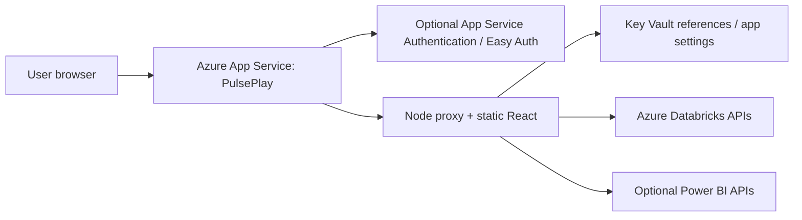

# PulsePlay on Azure App Service - Configuration Challenges And Guidance

> **Status:** Configuration guide, created 2026-05-22.
> **Scope:** Azure App Service hosting for PulsePlay's React playground plus Node/Express proxy. This guide documents what will be hard, what must be configured deliberately, and what to validate before any live deployment.
> **Relationship:** Use [HOSTING_OPTIONS.md](HOSTING_OPTIONS.md) to choose a hosting shape. Use this guide when the chosen shape is **single Azure App Service** or **App Service proxy with a separate frontend host**. Use [research/AZURE_APP_SERVICE_DEPLOYMENT_FINDINGS_2026-05-22.md](research/AZURE_APP_SERVICE_DEPLOYMENT_FINDINGS_2026-05-22.md) for the full research packet, account inventory, cost gates, and approval plan.

## Recommendation

For the first App Service proof, use **one Linux Azure App Service** that serves both:

- the Vite-built React frontend from `playground/dist`
- the Node/Express proxy from `proxy/server.js`

That shape is closest to the Databricks Apps deployment and avoids CORS/frontdoor complexity for the first Azure-hosted proof. It is not the final enterprise ideal for every rollout. For broad enterprise rollout, the cleaner shape is often static frontend on Azure Static Web Apps or Storage + Front Door, with App Service hosting only the proxy.

## Current PulsePlay Fit

| Concern | Current repo state | App Service implication |
|---|---|---|
| Root app detection | No root `package.json`; Node package files live under `proxy/` and `playground/`. | App Service/Oryx will not reliably detect and build the app from repo root without a root package or custom deployment script. |
| Frontend build | `playground/dist` is generated by `npm run build` and should not be committed as a normal source artifact. | Build in CI/App Service startup, or deploy a curated ZIP that already contains `playground/dist`. |
| Proxy startup | `proxy/server.js` already listens on `process.env.PORT` before local config port. | Good fit for Linux App Service, which expects the app to listen on the assigned port. |
| Static hosting | Proxy supports `STATIC_DIR=playground/dist` and SPA fallback. | Same combined-host strategy as Databricks Apps can work. |
| `/api/*` path | Proxy strips `/api/` to match Vite dev behavior. | Same-origin production calls from React should work. |
| Secrets | Proxy supports `PROXY_PROFILE_*` env vars. | App Service app settings or Key Vault references can provide profile secrets. |
| Auth | Proxy refuses `PROXY_AUTH_MODE=none` when `NODE_ENV=production` or `PROXY_REQUIRE_AUTH=true`. | Auth is the main challenge. App Service Easy Auth and PulsePlay proxy auth are separate gates. |

## First-Proof Topology



Use this for:

- a quick Azure-hosted proof after Databricks Apps
- an internal departmental pilot
- teams that already operate Node apps on App Service

Do not use this as-is for:

- unauthenticated public internet hosting
- production with plaintext secrets in app settings
- production where per-user Databricks authorization must be guaranteed before the proxy has an Easy Auth / Entra token integration story

## App Service Configuration Checklist

### Runtime

| Setting | Guidance |
|---|---|
| OS | Prefer Linux App Service. Windows introduces `web.config` behavior and different path assumptions. |
| Runtime stack | Use a supported Node LTS runtime, preferably `NODE|24-lts` where available, or the org-approved Node LTS after local validation. |
| Startup command | For a curated package or root package: `node proxy/server.js`. If using PM2, use foreground mode such as `pm2 start proxy/server.js --no-daemon`. |
| Port | Do not hardcode. PulsePlay reads `PORT`, which App Service provides. |
| Always On | Enable for Basic+ plans used by pilots. Free/shared tiers can sleep and produce poor first-load behavior. |
| HTTPS only | Enable. App Service Authentication also redirects to HTTPS when enabled. |

### Build And Deployment

| Challenge | Guidance |
|---|---|
| Monorepo detection | Add a root deployment package/script before live deploy. App Service build automation expects a detectable app root (`package.json`, `server.js`, or `app.js`). |
| Nested installs | The deploy process must install both `playground` and `proxy` dependencies. `npm install --production` at repo root is not enough today. |
| Frontend dev dependencies | Vite/TypeScript build dependencies live in `playground/devDependencies`. A production-only install can skip the tools needed to build `playground/dist`. |
| Large dirty repo | Do not ZIP the whole working tree. Evidence folders, `.xlsx` exports, local config, and dev artifacts can bloat or leak. Use a curated artifact. |
| Package layout | A working package must include `proxy/`, `proxy/package*.json`, installed/built proxy dependencies or an install step, `playground/dist`, and any config files intentionally needed at runtime. |
| Oryx build automation | If using App Service build automation, set `SCM_DO_BUILD_DURING_DEPLOYMENT=true` and provide root scripts/custom deployment logic that builds the nested frontend. |
| ZIP deploy | ZIP contents must be at the app root, not inside an extra top-level folder. |

Recommended first-proof deploy package after approval:

```text
wwwroot/
  proxy/
    server.js
    package.json
    package-lock.json
    lib/
    config.example.json
  playground/
    dist/
      index.html
      assets/
```

Then configure startup to run `node proxy/server.js` and set `STATIC_DIR=playground/dist`.

## Authentication Challenge

This is the sharpest App Service difference from Databricks Apps.

### Layer 1 - App Service Authentication

App Service Authentication, often called Easy Auth, can require Microsoft Entra sign-in before requests reach the Node app. It can:

- redirect browsers to Entra sign-in
- reject unauthenticated requests
- inject authenticated identity into request headers
- manage the auth session outside application code

This is good for the App Service edge, but it does not automatically satisfy PulsePlay's internal `PROXY_AUTH_MODE=idp` because the proxy currently verifies `Authorization: Bearer <jwt>` itself.

### Layer 2 - PulsePlay Proxy Auth

PulsePlay supports:

| Mode | Current behavior | App Service guidance |
|---|---|---|
| `none` | No proxy-level auth. Refused when `NODE_ENV=production` or `PROXY_REQUIRE_AUTH=true`. | Acceptable only for a lab proof behind Easy Auth, with the limitation recorded. |
| `shared-key` | Requires `X-PulsePlay-Key` / `X-Genie-Key`. | Not ideal for browser-first same-origin app because the key would be exposed to the browser if used by React. |
| `idp` | Requires and verifies Bearer JWT via configured JWKS. | Production-correct, but the frontend must acquire and send a token for API calls. |
| `idp-or-shared-key` | Accepts Bearer JWT or shared key. | Useful for service-to-service fallback, but still needs a real frontend token path for browser calls. |

### Practical Auth Guidance

For the first App Service proof:

1. Enable App Service Authentication with Microsoft Entra.
2. Require authentication for all requests.
3. Do not set `NODE_ENV=production` until the proxy auth mode is settled, or the proxy will refuse `PROXY_AUTH_MODE=none`.
4. Record the proof honestly: the edge is authenticated by App Service, but PulsePlay is not yet making per-route authorization decisions from Easy Auth headers.

For production:

Choose one:

- Add a small proxy enhancement that treats App Service Easy Auth headers as a verified platform-auth user only when a trusted App Service environment marker is present.
- Or wire the frontend to acquire an Entra access token and send `Authorization: Bearer ...` so existing `PROXY_AUTH_MODE=idp` can verify it.
- Or deploy the proxy behind an enterprise gateway/Front Door pattern that injects verifiable identity and keep `PROXY_AUTH_MODE=idp`.

Do not call a production App Service deployment done while the proxy is effectively anonymous unless the entire app is protected by a reviewed, tested edge-auth policy.

## Secret And Configuration Guidance

### Prefer Key Vault References

App Service app settings are encrypted at rest and exposed as environment variables. For production secrets, prefer Key Vault references:

```text
PROXY_PROFILE_DEFAULT_TOKEN=@Microsoft.KeyVault(SecretUri=https://<vault>.vault.azure.net/secrets/<secret-name>/)
PROXY_SHARED_KEY=@Microsoft.KeyVault(SecretUri=https://<vault>.vault.azure.net/secrets/<secret-name>/)
```

Required platform steps:

1. Enable a managed identity on the App Service.
2. Grant that identity `Key Vault Secrets User` on the vault or exact secrets.
3. Put non-secret values directly in app settings.
4. Put tokens, client secrets, and shared keys in Key Vault references.
5. Mark environment-specific secrets as slot settings when using deployment slots.

### Minimum Settings For A Databricks-Backed Proof

| Setting | Example | Notes |
|---|---|---|
| `STATIC_DIR` | `playground/dist` | Required for combined static + proxy host. |
| `PROXY_INLINE_CREDENTIALS_MODE` | `off` | Required production posture. |
| `PROXY_AUTH_MODE` | `none`, `idp`, or `idp-or-shared-key` | See auth section. Do not choose casually. |
| `PROXY_CORS_ORIGIN` | `https://<app>.azurewebsites.net` | Needed if split-origin later. Single-host can be stricter. |
| `PROXY_PROFILE_DEFAULT_HOST` | `https://<workspace>.azuredatabricks.net` | Non-secret. |
| `PROXY_PROFILE_DEFAULT_TOKEN` | Key Vault reference | Transitional credential. Prefer service principal or approved token. |
| `PROXY_PROFILE_DEFAULT_SPACE_ID` | `<genie-space-id>` | Non-secret but environment-specific. |
| `PROXY_PROFILE_DEFAULT_WAREHOUSE_ID` | `<warehouse-id>` | Non-secret but environment-specific. |
| `NODE_OPTIONS` | `--use-system-ca` | Only if enterprise TLS/root chain requires it. |
| `NODE_EXTRA_CA_CERTS` | path to PEM | Only if the runtime has the enterprise root CA file. |

## Network And Enterprise Edge Guidance

| Challenge | Guidance |
|---|---|
| Public `azurewebsites.net` URL | Use Easy Auth at minimum. For enterprise, add access restrictions, private endpoint, App Gateway, or Front Door/WAF according to platform policy. |
| Databricks private networking | If the Azure Databricks workspace or Key Vault is private, App Service needs VNet integration and DNS resolution that can reach those endpoints. |
| Key Vault firewall | If Key Vault public access is restricted, ensure App Service VNet integration and Key Vault network rules allow secret resolution. |
| Outbound IP allowlists | App Service outbound IPs can change by plan/scale events. Prefer VNet integration/NAT Gateway when upstream allowlists matter. |
| Custom domain | Configure before production auth hardening because redirect URIs and cookies depend on final hostnames. |
| TLS | Enforce HTTPS-only and minimum TLS per org policy. |

## Diagnostics And Safety

PulsePlay currently exposes:

- `/health`
- `/__diag/static`
- `/__diag/env`

These are useful during deployment. `/__diag/env` returns token lengths only, never token values, but it still reveals environment key names and configuration shape.

Guidance:

- Safe for internal lab when Easy Auth requires sign-in for every request.
- Not safe on an unauthenticated public App Service.
- For production, either keep these paths behind edge auth or add a feature flag/auth check before exposing them.

Minimum smoke:

| URL | Expected |
|---|---|
| `/` | React app loads, no blank page. |
| `/health` | JSON health response, no secret values. |
| `/__diag/static` | `exists: true`, `index_html_exists: true`, assets listed. |
| `/__diag/env` | Expected `PROXY_PROFILE_*` keys, token lengths only. |
| `/api/assistant/profiles` | Works through same-origin `/api` prefix strip. |
| `/launchpad` | Loads if Databricks profile is configured. |

## Logging And Observability

| Need | Guidance |
|---|---|
| Startup failures | Use App Service log stream and deployment logs first. Most failures will be missing build artifact, wrong startup command, missing env var, or production auth refusal. |
| Runtime request logs | Enable App Service logging for the proof; wire Application Insights for production. |
| Audit logs | PulsePlay audit logs should move to an approved sink for production. Local file logs are not a durable enterprise audit path. |
| Secret redaction | Do not log raw prompts/rows/secrets by default. Preserve request IDs/support codes. |
| Deployment slots | Use slots for UAT/prod swap, but mark secrets and profile IDs as slot settings. Verify auth callback URLs for each slot. |

## Scale And Cost Guidance

| Area | Guidance |
|---|---|
| SKU | Free/shared tiers are fine only for a smoke proof. Use Basic+ for Always On; use Premium v3 when VNet integration, deployment slots, and enterprise scale matter. |
| Stateless proxy | The proxy is mostly stateless, but process-local caches duplicate per instance. Horizontal scale should be correct but may increase upstream calls. |
| Session affinity | Prefer not to depend on ARR affinity. If streaming or auth behavior exposes issues, diagnose before enabling sticky sessions as a bandage. |
| Cold starts | Enable Always On for pilots. Avoid building `playground` during every app start in production. |
| Artifact size | Keep deployment package lean. Do not include `docs/evidence`, local exports, old `node_modules`, or unrelated enablers unless needed. |

## Challenge Matrix

| Challenge | Symptom | Mitigation |
|---|---|---|
| No root Node app | App Service deploys but shows default page or cannot start. | Add root package/start script or deploy curated package with explicit startup command. |
| Frontend not built | `/` returns 500 or blank page; `/__diag/static` missing `index.html`. | Build `playground/dist` in CI/App Service build, or include it in the package. |
| Wrong `STATIC_DIR` | Static fallback cannot find `index.html`. | Use `STATIC_DIR=playground/dist`, not `../playground/dist`. |
| Production auth refusal | Logs show `PROXY_AUTH_MODE=none is refused`. | Decide App Service Easy Auth integration vs Bearer JWT proxy mode before setting `NODE_ENV=production`. |
| Shared key exposed | Browser must send `X-PulsePlay-Key`. | Do not use browser-visible shared keys as the primary App Service auth model. |
| Easy Auth misunderstood | User can open app but proxy has no user identity. | Treat Easy Auth as edge auth until proxy/header integration is implemented. |
| Key Vault ref unresolved | Env setting appears as unresolved `@Microsoft.KeyVault(...)` or empty. | Check managed identity, Key Vault RBAC, firewall, and config reference status. |
| App settings changed | App restarts unexpectedly. | Batch changes and plan restarts; Key Vault refresh may also restart after config updates. |
| Kudu ZIP has extra folder | App files deployed under nested directory; startup misses files. | ZIP contents, not the containing folder. |
| Logs unavailable | Cannot see startup error. | Enable App Service logs and tail with Azure CLI/portal. |
| Azure CLI local profile blocked | `az` fails reading `C:\Users\...\azureProfile.json`. | Use a workspace-local `AZURE_CONFIG_DIR` and login, or run approved commands outside sandbox. |
| Enterprise CA/TLS issue | Databricks calls fail with certificate verification errors. | Use platform CA install, `NODE_OPTIONS=--use-system-ca`, or `NODE_EXTRA_CA_CERTS` if supported by the runtime image. |
| Public diagnostics | `/__diag/env` accessible anonymously. | Require Easy Auth/access restrictions or add app-level guard before production. |

## First Proof Runbook

Do this only after the deployment plan is approved.

1. Create a curated deployment package strategy or root App Service package scripts.
2. Build locally:

```powershell
npm --prefix playground run lint
npm --prefix playground run test
npm --prefix playground run build
npm --prefix proxy test
```

3. Run a local production-shape smoke:

```powershell
$env:STATIC_DIR = "playground/dist"
$env:PROXY_INLINE_CREDENTIALS_MODE = "off"
node proxy/server.js
```

4. Verify local:

```powershell
Invoke-WebRequest -UseBasicParsing http://127.0.0.1:8787/health
Invoke-WebRequest -UseBasicParsing http://127.0.0.1:8787/__diag/static
Invoke-WebRequest -UseBasicParsing http://127.0.0.1:8787/api/assistant/profiles
```

5. Provision App Service with managed identity, Application Insights, and Key Vault references.
6. Configure Easy Auth for the proof, or explicitly document why it is disabled.
7. Deploy via approved `azure-validate` -> `azure-deploy` flow.
8. Browser-smoke as a signed-in enterprise user.

## Official References

- [Configure Node.js apps in Azure App Service](https://learn.microsoft.com/en-us/azure/app-service/configure-language-nodejs)
- [Deploy files to Azure App Service](https://learn.microsoft.com/en-us/azure/app-service/deploy-zip)
- [Configure an App Service app](https://learn.microsoft.com/en-us/azure/app-service/configure-common)
- [Environment variables and app settings in Azure App Service](https://learn.microsoft.com/en-us/azure/app-service/reference-app-settings)
- [Use Key Vault references as app settings](https://learn.microsoft.com/en-gb/azure/app-service/app-service-key-vault-references)
- [Authentication and authorization in Azure App Service](https://learn.microsoft.com/en-us/azure/app-service/overview-authentication-authorization)
