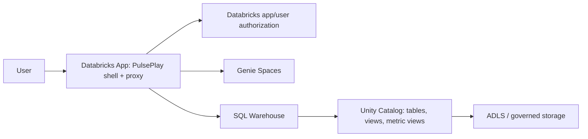
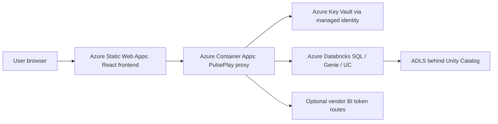
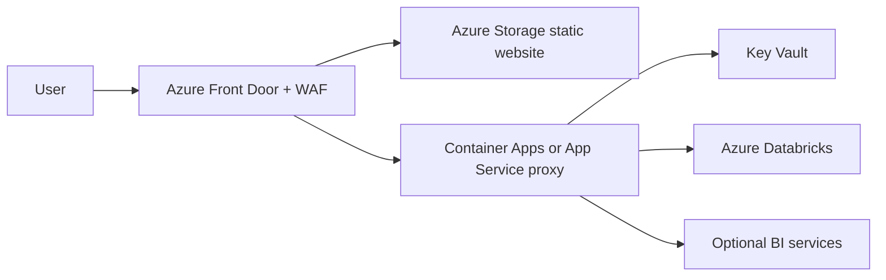
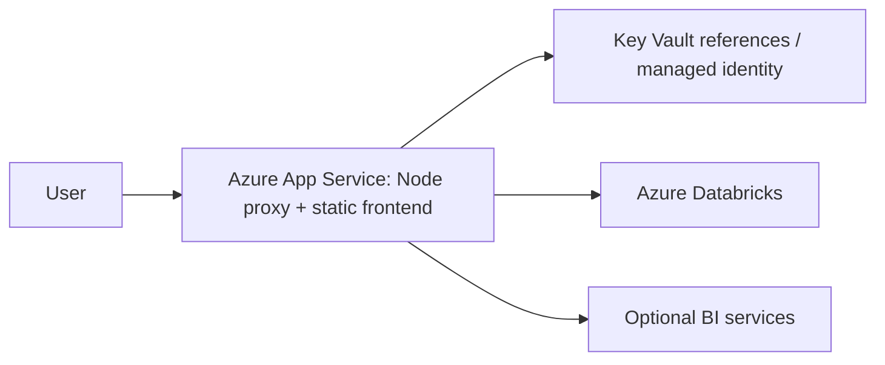
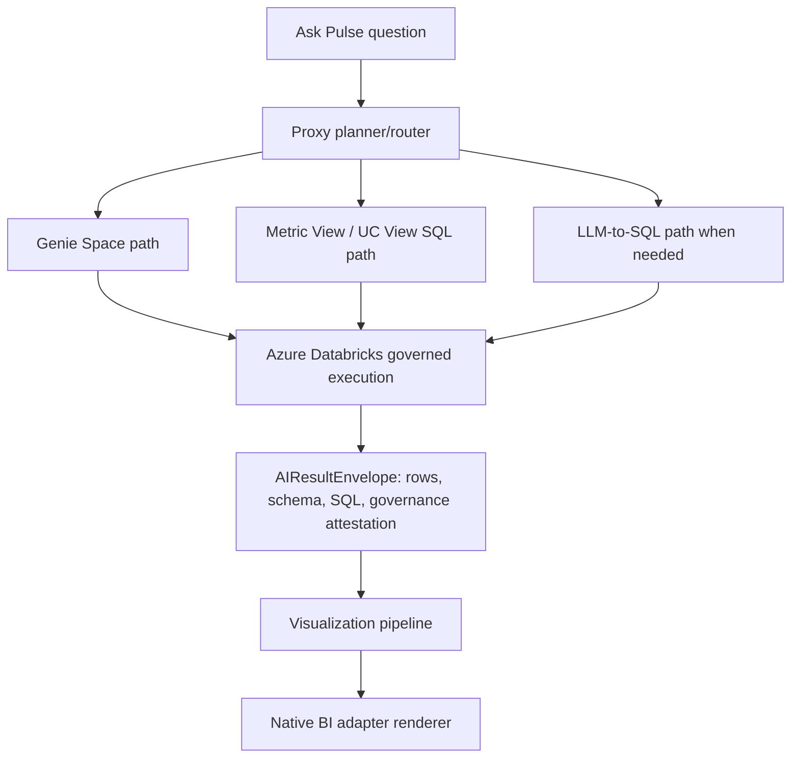

# PulsePlay Hosting Options

> **Status:** Deployment architecture guide, created 2026-05-21.
> **Scope:** Internal-org PulsePlay hosting choices for the Azure Databricks-first strategy. This document does not replace [DEPLOY_MVP_0.2.md](DEPLOY_MVP_0.2.md) or [DEPLOY_DATABRICKS_APP.md](DEPLOY_DATABRICKS_APP.md); it tells platform teams which hosting shape to choose before they follow a deployer checklist.

## Executive Recommendation

For the current Azure Databricks-centered build, keep the hosting story boring:

1. **Fastest Databricks pilot:** host PulsePlay as a **Databricks App** when the consuming team already lives in Azure Databricks and the app should sit close to Genie Spaces, SQL Warehouses, Unity Catalog assets, and Databricks-native auth.
2. **Best enterprise default:** host the **React frontend on Azure Static Web Apps or Azure Storage + Front Door**, and host the **Node proxy on Azure Container Apps or Azure App Service**. This keeps static assets cheap, keeps secrets server-side, and gives platform teams familiar Azure networking, managed identity, Key Vault, WAF, and observability controls.
3. **Simplest single-host fallback:** host both static frontend and proxy from **one Azure App Service** when speed matters more than separate scaling boundaries.
4. **Only use AKS/OpenShift/VMs when the organization already standardizes on them.** PulsePlay does not need Kubernetes to be good. Adding a cluster just for this app is waste, not maturity.

The native BI adapter does not change the hosting boundary. It is still renderer-only. SQL execution, Genie calls, governance attestation, secrets, and row-level/column-level access all stay behind the proxy/data layer.

## Non-Negotiable Architecture Boundary

PulsePlay has three deployable concerns:

| Concern | What runs there | Secrets allowed? | Scale shape |
|---|---|---:|---|
| **Frontend host** | Vite-built React static assets, design system CSS, BI adapter loader, AI sidebar UI | No | CDN/static scale |
| **Proxy host** | Node/Express API, connector routing, auth checks, Databricks/Power BI/vendor token issuance, audit logging | Yes, via vault/managed identity | Stateless HTTP scale |
| **Data/AI plane** | Azure Databricks, Unity Catalog, ADLS, SQL Warehouses, Metric Views, Views, Genie Spaces, Foundation Models, Supervisors | Platform-owned | Platform-managed |

Do not collapse these rules:

- The browser never receives Databricks PATs, service-principal secrets, Power BI embed-token issuance secrets, warehouse credentials, or Python execution authority.
- The native adapter never executes SQL. It renders a result envelope that was already authorized and produced by the proxy/data plane.
- Governance is enforced before data reaches the renderer. Unity Catalog row filters, column masks, views, Metric Views, and Genie/warehouse permissions are the source of truth.
- Vendor BI adapters stay optional. A deployment can be Databricks-native, Power BI-first, Tableau/Qlik/Looker-first, generic-iframe, native renderer, or a mix, but all paths still route privileged work through the proxy.

## Required Platform Inventory

For the current Databricks-first path, minimum production-grade hosting needs:

| Platform | Required for | Notes |
|---|---|---|
| **Azure Databricks workspace** | Genie, SQL Warehouses, UC assets, optional Databricks Apps | Prefer one workspace per governed environment unless platform policy says otherwise. |
| **Unity Catalog** | Governance, table/view/metric visibility, row filters, column masks | This is where RLS/OLS-style enforcement belongs. |
| **ADLS Gen2 / Azure Storage** | Lake storage behind UC external locations or managed storage | PulsePlay should not bypass UC to read raw ADLS directly. |
| **Databricks SQL Warehouse** | SQL execution for metric/view/table paths | Use serverless or approved warehouse sizing; avoid all-purpose clusters for BI-style query traffic unless justified. |
| **Metric Views / UC Views / tables** | Governed data contract for native chart rendering and evidence queries | Prefer Metric Views for reusable business metrics; use Views for curated SQL shapes. |
| **Genie Spaces** | NL Q&A over governed Databricks assets | Use when the semantic context already exists and the question is exploratory. |
| **Microsoft Entra ID** | User identity, app registrations, service principals | Use tenant allowlists and group-based access in the proxy. |
| **Secret manager** | Proxy secrets | Azure Key Vault for Azure-hosted proxy; Databricks secret/resource binding for Databricks Apps where appropriate. |
| **Frontend host** | React app | Static host, CDN, or same App Service. No secrets. |
| **Proxy host** | Node API | App Service, Container Apps, Databricks App, AKS, or equivalent internal platform. |
| **Observability** | Audit, errors, support codes | Application Insights/Azure Monitor, Databricks logs, or approved enterprise log sink. |

Optional platform pieces:

| Optional platform | Use when |
|---|---|
| **Power BI / Tableau / Qlik / Looker** | A team wants to keep an existing BI surface as the thing users look at. |
| **Azure Front Door + WAF** | Internet-routable or broadly accessible internal deployments need perimeter control, TLS, caching, and WAF. |
| **Private Link / VNet integration** | Databricks, Key Vault, or proxy endpoints are private-only. |
| **Redis / external cache** | Multi-instance proxy traffic makes token/cache duplication materially expensive. Not needed for pilot. |
| **Azure SQL / Synapse** | Future non-Databricks source mode. For now, route SQL to Azure Databricks only. |
| **Container registry** | Required for Container Apps, AKS, or custom App Service containers. |

## Hosting Option Matrix

| Option | Frontend | Proxy | Best for | Cost/ops weight | Recommendation |
|---|---|---|---|---|---|
| **Local dev** | Vite dev server | Local Node proxy | Developer workstations | XS | Dev only |
| **Databricks App** | Same app runtime or served static assets | Same app runtime | Databricks-native pilot, close to Genie/UC/SQL resources | S | Strong pilot choice |
| **Azure Static Web Apps + Container Apps** | Static Web Apps | Container Apps | Clean enterprise split with managed serverless containers | M | Best balanced default |
| **Azure Storage static website + Front Door + Container Apps/App Service** | Storage static website behind Front Door | Container Apps or App Service | Larger internal rollout, custom WAF/CDN/network controls | M | Strong production option |
| **Single Azure App Service** | Served by Node or static directory | Same App Service | One app, one host, simple operations | S | Best simplicity fallback |
| **Azure App Service split** | Static frontend on App Service or storage | App Service | Teams already standardized on App Service | M | Good enterprise option |
| **AKS** | Ingress-served static assets or CDN | Containerized proxy | Existing Kubernetes platform team, strict cluster policy | L | Only if already standard |
| **Enterprise PaaS/OpenShift** | Existing internal web platform | Existing internal service platform | Non-Azure platform standard with Databricks reachability | M/L | Acceptable if secrets/network are mature |
| **VM / IIS / Nginx + Node service** | Nginx/IIS/static files | Node system service | Legacy-only or isolated network | M/L | Avoid unless mandated |
| **Serverless Functions rewrite** | Static host | Azure Functions | Future API refactor | M/L | Not recommended now |
| **Pure frontend-only static site** | Static host | None | None for real PulsePlay | XS but unsafe | Reject for production |

## Reference Topologies

### Option A - Databricks App

Use this when the first real consumers are Databricks users and the deployment should feel native to the Databricks workspace.



**Pros**

- Smallest conceptual distance to Genie Spaces, SQL Warehouses, Unity Catalog, Metric Views, and Databricks App resources.
- Good fit for a Databricks-first proof point.
- App resources can avoid hardcoded workspace IDs where the platform supports resource bindings.
- Databricks App user authorization can let Databricks evaluate access with the user's existing identity and UC policies where that preview capability is approved.

**Cons**

- More Databricks-specific than Azure-hosted split topology.
- Less ideal if the shell must sit behind a corporate portal, custom WAF edge, or multi-BI estate from day one.
- App/runtime constraints may evolve; keep the proxy code portable.

**Use when**

- The deployment is mostly `native` + Genie + Metric Views / Views.
- The audience is already inside the Databricks workspace.
- You want minimum platform tickets and fastest governed Databricks pilot.

**Do not use when**

- The app needs a highly customized enterprise edge, cross-cloud routing, or central web platform controls that Databricks Apps cannot satisfy.
- The team expects this host to become the universal multi-vendor BI portal immediately.

### Option B - Azure Static Web Apps + Azure Container Apps

This is the clean enterprise default when PulsePlay is a web app used outside the Databricks workspace UI.



**Pros**

- Static assets and API scale separately.
- Container Apps fits the current Express proxy without an API rewrite.
- Managed identity + Key Vault is a clean secret story.
- Container Apps handles ingress, scaling, and infrastructure management without requiring Kubernetes operations.

**Cons**

- Two Azure services to deploy and monitor.
- Frontend auth and proxy auth need a deliberate token forwarding story.
- Cold starts can appear if scaled to zero; set minimum replicas for production if latency matters.

**Use when**

- You want a sustainable enterprise baseline without cluster operations.
- You want the proxy packaged as a container.
- The platform team already supports Container Apps and Azure Monitor.

**Do not use when**

- The organization bans Container Apps or requires all web workloads on App Service/AKS.

### Option C - Azure Storage Static Website + Azure Front Door + Proxy Host

This is the more explicit edge-controlled version of Option B.



**Pros**

- Strong fit for global/internal edge control, WAF, custom domains, TLS, caching, and single front door routing.
- Keeps frontend extremely cheap and cacheable.
- Lets the platform team choose App Service or Container Apps for the proxy.

**Cons**

- More moving pieces than Static Web Apps.
- SPA routing must be configured carefully so deep links such as `/settings`, `/knowledge`, and `?surface=` survive refresh.
- Edge headers, CSP, CORS, and auth forwarding must be treated as owned configuration, not defaults.

**Use when**

- The platform team wants central WAF/CDN/TLS control.
- Multiple regional/business-unit deployments need consistent edge policy.

### Option D - Single Azure App Service

This is the simplest Azure production fallback: one App Service runs the proxy and serves the built React assets.



**Pros**

- One service to deploy, configure, scale, and monitor.
- App Service supports Node.js, custom containers, managed identity, VNet integration, deployment slots, and mature enterprise workflows.
- Good bridge from local `node server.js` mental model to production.

**Cons**

- Frontend and API scale together.
- Static asset caching is weaker than CDN-first unless Front Door/CDN is added.
- A proxy bug can take down static serving too.

**Use when**

- You need a pilot or departmental deployment with minimal platform overhead.
- The organization already runs Node apps on App Service.

**Do not use when**

- The app will serve many business units and needs strict separation between static/web edge and API scaling.

### Option E - Azure App Service Split

Use App Service for the proxy and either App Service, Static Web Apps, or Storage/Front Door for the frontend.

**Pros**

- Familiar enterprise path with deployment slots, managed certificates, managed identity, VNet integration, and Key Vault references.
- Good when Container Apps is not approved.

**Cons**

- Less container-native than Container Apps unless using custom containers.
- Scaling and networking options are plan-dependent.

**Use when**

- Platform standards say "App Service for internal web APIs."
- The team wants deployment slots and App Service operational muscle.

### Option F - AKS

AKS is technically valid but should not be the default.

**Pros**

- Strong when the organization already has ingress, cert-manager, workload identity, network policy, logging, and GitOps standardized.
- Good for strict platform consistency across many containerized apps.

**Cons**

- Highest operational weight for this workload.
- Requires cluster upgrades, ingress ownership, secret integration, pod security, autoscaling, and observability work that PulsePlay itself does not need.

**Use when**

- The platform team already gives product teams a paved AKS path.

**Do not use when**

- The only reason is "Kubernetes feels production-grade." That is not an architecture reason.

### Option G - Existing Enterprise PaaS / OpenShift / Cloud Foundry / Internal Portal

PulsePlay can run anywhere that can host:

- Static frontend assets.
- A Node 20+ compatible proxy runtime.
- HTTPS ingress.
- Secret injection from an approved vault.
- Outbound connectivity to Azure Databricks and vendor BI APIs.
- User identity forwarding to the proxy.

**Pros**

- Fits organizations that already standardized outside Azure-native hosting.
- May reduce ticket count if the internal platform is paved.

**Cons**

- Needs a careful Databricks auth story. Managed identity will not automatically exist outside Azure; use service principals/OAuth or platform-specific workload identity.
- The platform must own TLS, logs, vulnerability scans, and secret rotation.

### Option H - VM / IIS / Nginx + Node Service

Technically possible, strategically unattractive.

**Use only when**

- A locked-down network has no approved PaaS or container platform.
- A regulated environment requires manually managed hosts.

**Hard requirements**

- Node service runs under a least-privilege service identity.
- Secrets come from vault or machine-level secret store, not committed config.
- Reverse proxy terminates TLS and forwards only required paths.
- OS patching, log rotation, backup, and restart policy are owned.

### Option I - Azure Functions API Rewrite

This is not a hosting option for the current proxy without a rewrite. The current proxy is an Express app with route-level state, streaming paths, connector routing, health checks, audit logging, and shared helpers.

**Use later only if**

- The connector/plugin split makes function boundaries natural.
- Long-running/streaming routes are validated against the chosen Functions plan.
- The operations team strongly prefers Functions over Container Apps/App Service.

### Option J - Frontend-Only Static Hosting

Reject this for any real deployment.

PulsePlay without a proxy cannot safely call Databricks, issue embed tokens, enforce allowlists, attest governance, audit requests, or keep secrets out of the browser. A frontend-only build can display a static demo shell, but it is not PulsePlay as an enterprise system.

## Decision Tree

Start here:

| Question | If yes | If no |
|---|---|---|
| Is the first deployment mostly Databricks-native and consumed by Databricks users? | Choose **Databricks App**. | Continue. |
| Does the platform team already have a blessed Azure web pattern? | Use it if it supports frontend static hosting, Node proxy, vault, identity, logs, and Databricks egress. | Continue. |
| Do you want the cleanest Azure split without Kubernetes? | Choose **Static Web Apps + Container Apps** or **Storage/Front Door + Container Apps**. | Continue. |
| Do you need one host and the fewest moving pieces? | Choose **single App Service**. | Continue. |
| Is AKS already a paved road with workload identity, ingress, logs, and GitOps? | AKS is acceptable. | Avoid AKS. |
| Are you tempted to host only the React bundle? | Stop. You need a proxy. | Continue. |

## Environment Model

Every hosting option should support the same environment separation:

| Environment | Purpose | Data access | Auth |
|---|---|---|---|
| **Local** | Developer loop | Dev workspace/profile only | Shared key or dev IdP |
| **Dev** | Shared engineering validation | Non-prod Databricks workspace | IdP or shared-key fallback |
| **Test/UAT** | Business validation | Masked or approved UAT data | IdP required |
| **Prod** | Real users | Production UC-governed assets | IdP required; shared-key only for controlled service-to-service paths if explicitly approved |

Minimum environment variables and config responsibilities:

| Setting | Frontend or proxy? | Notes |
|---|---|---|
| `VITE_API_BASE_URL` | Frontend build | Only when frontend and proxy are on different origins. |
| `PROXY_AUTH_MODE` | Proxy | Prefer `idp` for strict user identity, `idp-or-shared-key` where service fallback is approved. |
| `PROXY_CORS_ORIGIN` | Proxy | Must list the frontend origin; never `*` in production. |
| `PROXY_IDP_*` | Proxy | JWKS URL, issuer, audience. |
| `PROXY_SHARED_KEY` | Proxy | Strong random secret from vault if shared-key mode is enabled. |
| `PROXY_INLINE_CREDENTIALS_MODE=off` | Proxy | Required production stance. |
| `PROXY_PROFILE_*` secrets | Proxy | Prefer env/vault over plaintext `config.json`. |
| `NODE_OPTIONS=--use-system-ca` or `NODE_EXTRA_CA_CERTS` | Proxy | Use when enterprise TLS interception/root chain blocks Node's Databricks calls. |
| `APP_RESOURCE_*` | Databricks App | Resource-mode binding for SQL Warehouse, Genie Space, dashboard, metric view, vector index, etc. |

## Configuration Ownership

Hosting should not blur configuration ownership. The clean split is:

| Layer | Owns | Never contains |
|---|---|---|
| **Deployment JSON / app config** | Workspace URLs, warehouse IDs, catalog/schema allowlists, BI surface mode defaults, feature flags, non-secret resource references | Tokens, OAuth client secrets, service-principal passwords |
| **Proxy/backend config** | OAuth M2M credentials, allowlist enforcement mode, governance attestation authority, audit destinations, token issuance policy | Browser-visible defaults or UI-only preference state |
| **PulsePack / governed pack artifact** | Source refs, KPI definitions, prompt templates, validation rules, chart guidance, per-pack compute budget | Source-system credentials |

The working rule: **JSON defines possibilities; the proxy defines permissions; the pack defines intent.**

For Databricks-first deployments, source references should be typed and portable, not inline SQL strings:

```ts
type DatabricksSourceRef =
  | { kind: "genie-space"; spaceId: string; warehouseId?: string; displayName: string }
  | { kind: "metric-view"; fullName: string; warehouseId: string; displayName: string }
  | { kind: "uc-function"; fullName: string; warehouseId: string; displayName: string }
  | { kind: "view"; fullName: string; warehouseId: string; displayName: string }
  | { kind: "table"; fullName: string; warehouseId: string; displayName: string };
```

That source-ref contract belongs in the proxy/pack layer and future result envelope work, not in `bi-adapters/native/`. Hosting can carry the config safely, but execution and authorization still happen server-side.

## Databricks-First Data Contract

For now, SQL goes to Azure Databricks. Future Synapse/Azure SQL/vendor source options stay open, but the current clean path is:



Preferred answer ladder:

1. **Metric View** when the business metric exists. Lowest semantic drift, best reusability.
2. **UC View** when the answer needs a curated SQL shape but not a full metric model.
3. **Genie Space** when the semantic context already exists and the user asks exploratory natural language questions.
4. **LLM-to-SQL over Databricks** when neither Metric Views nor Genie cover the question.
5. **Controlled Python/tool execution** only when SQL cannot answer the analysis and a governed backend sandbox exists.

Sustainability rules:

- Use the cheapest governed path that answers correctly.
- Avoid waking large compute for tiny lookups.
- Prefer cached metadata/probe results over repeated discovery calls.
- Apply row limits and preview limits before visualization.
- Lazy-load heavy chart libraries.
- Never run duplicate vendor queries just to make the UI feel busy.

## Security And Data-Leak Guardrails

| Risk | Required guardrail |
|---|---|
| Browser receives secrets | Never. All secrets stay in proxy/vault/Databricks App resource bindings. |
| Native adapter becomes a query engine | Block by capabilities, command rejection, and import-boundary tests. |
| Data bypasses Unity Catalog | Proxy must query Databricks governed objects, not raw ADLS paths. |
| RLS/OLS duplicated in UI | Do not duplicate. Trust proxy/data-layer attestation; fail closed when required attestation is missing. |
| Cross-origin vendor iframe overreach | Keep adapter sandbox and allowlists narrow per vendor. |
| Logs leak prompts/rows/secrets | Redact support bundles and audit logs; log request IDs/support codes instead of raw sensitive payloads by default. |
| Over-broad production auth | Use IdP, tenant allowlists, group-filtered profiles, and strict CORS. |
| Unbounded LLM/tool spend | Cache, rate-limit, cap rows/tokens, and prefer Databricks semantic assets before LLM-generated SQL. |

## Production Readiness Checklist

Before any production pilot, require:

- [ ] Hosting option chosen and recorded in the deployment README/runbook.
- [ ] Frontend and proxy origins decided; CORS/CSP configured to match.
- [ ] `NODE_ENV=production` and production auth gates enabled.
- [ ] IdP issuer/audience/JWKS configured and smoke-tested with a real user.
- [ ] Proxy secrets stored in Key Vault, Databricks resources, or approved vault; no plaintext production secrets in repo config.
- [ ] Unity Catalog grants, row filters, column masks, Metric Views, and Views reviewed by data platform owners.
- [ ] SQL Warehouse sizing and auto-stop policy approved.
- [ ] Audit logs flow to the approved sink.
- [ ] Support-code path tested for proxy errors.
- [ ] Network egress from proxy to Databricks and vendor APIs approved.
- [ ] Browser smoke run from a normal user's machine, not only local dev.
- [ ] Cost guardrails set: row limits, query timeouts, rate limits, metadata cache TTLs.
- [ ] Rollback path documented: previous frontend build, previous proxy image/app slot, previous config.

## Hosting Choices By Stage

| Stage | Recommended host | Why |
|---|---|---|
| **Developer loop** | Local Vite + local Node proxy | Fastest feedback, no platform dependency. |
| **Databricks-native proof** | Databricks App | Best alignment with Genie/UC/Metric Views and resource binding. |
| **Department pilot** | Single App Service or Static Web Apps + Container Apps | Low operational weight, good Azure controls. |
| **Enterprise internal rollout** | Front Door + static frontend + Container Apps/App Service proxy | Strong edge, WAF, logs, separation of concerns. |
| **Platform-standard rollout** | Existing paved PaaS/AKS | Only if the organization already owns the platform maturity. |
| **Public OSS / external SaaS** | Deferred | Out of v0.x/v1.x Path C scope; see [PUBLIC_OSS_AGENDA.md](PUBLIC_OSS_AGENDA.md). |

## What Not To Build Yet

- Do not create a separate PulsePlay database just for hosting state unless a real product feature needs shared state.
- Do not add Kubernetes only to look enterprise.
- Do not move SQL execution into the BI adapter.
- Do not host a production app as frontend-only static assets.
- Do not add Synapse/Azure SQL execution until a concrete deployment needs it; keep the Databricks SQL path first-class now.
- Do not build public multi-tenant isolation for this internal v1 path. That is explicitly deferred.
- Do not duplicate Unity Catalog governance in React.

## Relationship To Existing Deploy Docs

| Doc | Use it for |
|---|---|
| [HOSTING_OPTIONS.md](HOSTING_OPTIONS.md) | Choosing the hosting shape. |
| [DEPLOY_DATABRICKS_APP.md](DEPLOY_DATABRICKS_APP.md) | Deploying the Databricks App path once chosen. |
| [DEPLOY_AZURE_APP_SERVICE.md](DEPLOY_AZURE_APP_SERVICE.md) | Configuring and troubleshooting the Azure App Service path once chosen. |
| [research/AZURE_APP_SERVICE_DEPLOYMENT_FINDINGS_2026-05-22.md](research/AZURE_APP_SERVICE_DEPLOYMENT_FINDINGS_2026-05-22.md) | Deep App Service deployment findings, cost guardrails, account inventory, and approval gates. |
| [DEPLOY_MVP_0.2.md](DEPLOY_MVP_0.2.md) | Configuring the earlier Genie + Power BI deployment cell. |
| [PROXY_REFERENCE.md](PROXY_REFERENCE.md) | Proxy routes, profiles, auth modes, and backend behavior. |
| [SECURITY.md](SECURITY.md) | Internal security guardrails and production posture. |

## Official References

These are the platform references used to ground this guide:

- [Azure Databricks Apps key concepts](https://learn.microsoft.com/en-us/azure/databricks/dev-tools/databricks-apps/key-concepts)
- [Configure authorization in a Databricks app](https://learn.microsoft.com/azure/databricks/dev-tools/databricks-apps/auth)
- [Databricks app environment variables](https://learn.microsoft.com/en-us/azure/databricks/dev-tools/databricks-apps/environment-variables)
- [Databricks app resources](https://learn.microsoft.com/en-us/azure/databricks/dev-tools/databricks-apps/apps-resource)
- [Azure Databricks Statement Execution API](https://learn.microsoft.com/en-us/azure/databricks/dev-tools/sql-execution-tutorial)
- [Unity Catalog business semantics](https://learn.microsoft.com/en-us/azure/databricks/business-semantics/)
- [Unity Catalog row filters and column masks](https://learn.microsoft.com/en-us/azure/databricks/data-governance/unity-catalog/filters-and-masks/manually-apply)
- [Azure Static Web Apps configuration](https://learn.microsoft.com/en-us/azure/static-web-apps/configuration)
- [Azure Static Web Apps authentication and authorization](https://learn.microsoft.com/en-us/azure/static-web-apps/authentication-authorization)
- [Azure Container Apps serverless containers](https://learn.microsoft.com/en-us/azure/container-apps/start-serverless-containers)
- [Azure App Service overview](https://learn.microsoft.com/en-us/azure/app-service/overview)
- [Managed identity for App Service and Azure Functions](https://learn.microsoft.com/en-us/azure/app-service/overview-managed-identity)
- [Key Vault references in App Service](https://learn.microsoft.com/en-us/azure/app-service/app-service-key-vault-references)
- [Azure Storage static website hosting](https://learn.microsoft.com/en-us/azure/storage/blobs/storage-blob-static-website-how-to)
- [Azure Front Door overview](https://learn.microsoft.com/en-us/azure/frontdoor/front-door-overview)
- [Azure Front Door WAF/CDN scenarios](https://learn.microsoft.com/en-us/azure/frontdoor/scenarios)
- [Azure Kubernetes Service core concepts](https://learn.microsoft.com/en-us/azure/aks/concepts-clusters-workloads)
