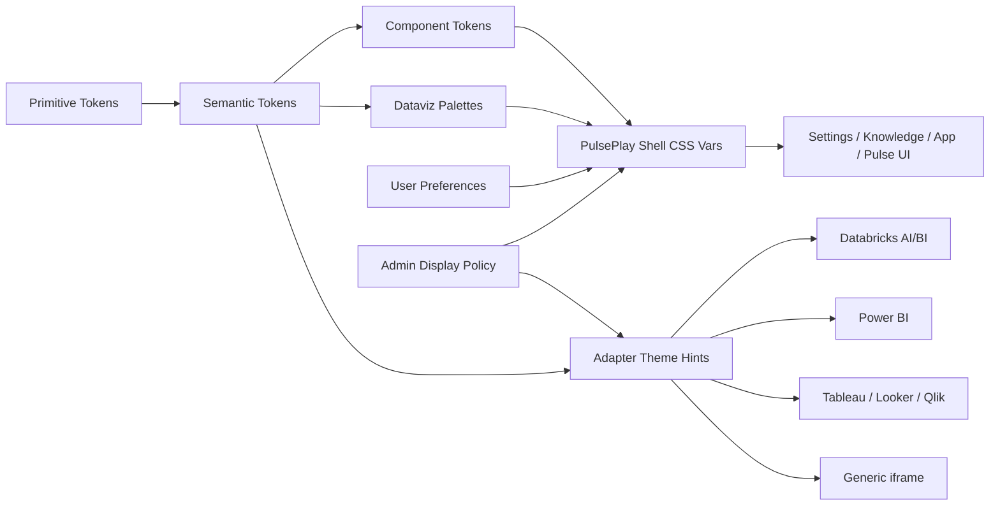

# PulsePlay Adaptive Theme Research Packet

Status: research packet only. Not a canonical architecture decision.

Date: 2026-05-17

Audience: Rajesh, Claude, Codex, and future agents reviewing the adaptive UI/theme lane.

## Purpose

Rajesh asked for broad, end-to-end research on how PulsePlay can stay fresh, engaging, enterprise-safe, and usable for a diverse internal audience. This packet deliberately does not choose the final architecture. It prepares a shared evidence base so Claude can do an independent challenge pass before Rajesh decides the canonical direction.

The scope is wider than color. It covers theming, accessibility, personalization, data visualization, Databricks-forward embedding, vendor BI constraints, design-token architecture, migration risk, and validation.

## Executive Takeaway

PulsePlay should treat adaptive theme and display behavior as an enterprise capability, not cosmetic polish.

The durable direction is:

- A quiet enterprise-neutral shell with one restrained primary accent.
- First-class `system`, `light`, `dark`, and `high-contrast` modes.
- Separate semantic status colors from data visualization palettes.
- Shallow personalization: role preset, density, font scale, data palette, and optional org/workspace brand layer.
- Admin guardrails for what can be changed, with user-level overrides for comfort.
- Non-color cues for every critical state.
- A token architecture that lets the UI evolve without moving core workflows.

The weak direction is:

- A "theme by generation" model.
- A large free-form theme editor.
- Neon/purple AI chrome as a brand language.
- Recoloring `styles.css` while leaving inline styles, Pulse legacy `--gn-*` tokens, and vendor iframes drifting.

## Evidence Patterns

### 1. Standards Prefer Tokens, Modes, And Auditable Semantics

The W3C Design Tokens Community Group final report describes design tokens as a platform-agnostic way to express design decisions and keep design/development tools in sync. It is not a W3C Recommendation, but the 2025 report is stable and intended for implementation.

Implication for PulsePlay: token names should carry intent, not raw palette taste. A future file or module can be organized as primitive tokens, semantic tokens, component tokens, and adapter hints.

Recommended token layers:

1. `primitive`: raw scales such as neutral, blue, red, green, amber, spacing, radius, shadow, typography.
2. `semantic`: `surface`, `text`, `border`, `accent`, `success`, `warning`, `danger`, `info`, `focus`, `selection`.
3. `component`: `button.primary.bg`, `input.border`, `pane.header.bg`, `setupPill.warning.bg`, `evidence.badge.bg`.
4. `dataviz`: categorical, sequential, diverging, alert overlays, color-safe palettes.
5. `adapter`: best-effort hints for Databricks, Power BI, Tableau, Looker, Qlik, and generic iframe surfaces.

### 2. Accessibility Is A Release Gate, Not A Preference

WCAG 2.2 remains the audit baseline. Normal text needs 4.5:1 contrast, large text needs 3:1, and meaningful UI controls/graphics need 3:1 against adjacent colors. WCAG also says color cannot be the only way to convey information.

Implication for PulsePlay: setup readiness, connected/error states, AI confidence, selected filters, current frame, chart alerts, and active tabs must always have a text/icon/shape/border/label cue in addition to color.

Use APCA or perceptual-color tooling only as secondary design diagnostics. Do not replace WCAG 2.2 checks with APCA until the compliance target changes.

### 3. Browser Preferences Are Now Part Of The Product Surface

Modern CSS gives us useful preference hooks:

- `prefers-color-scheme` for system light/dark preference.
- `prefers-contrast` for increased or reduced contrast.
- `forced-colors` for Windows High Contrast and other limited-palette modes.
- `prefers-reduced-motion` for animation sensitivity.

Implication for PulsePlay: the theme engine should expose explicit app settings but also respect OS/browser preferences when the user selects `system`.

### 4. Enterprise Design Systems Converge On Semantic Tokens

Fluent 2, Atlassian, Canva, Shopify Polaris, IBM Carbon, and Salesforce Lightning all converge on the same pattern:

- avoid hard-coded hex at component call sites;
- use semantic or functional color names;
- support light/dark/high-contrast or equivalent modes;
- make color usage consistent across state, hierarchy, and components;
- handle accessibility centrally.

Implication for PulsePlay: the final architecture should not invent a visual foundation from scratch. It should use local tokens shaped like mature enterprise systems and keep the brand layer thin.

### 5. Dark Mode Is Not An Inversion

Apple HIG and mature design systems treat dark mode as its own authored mode. Stack Overflow's dark-mode writeup is also a useful caution: dark mode can create fatigue, low usable contrast, and harder depth cues if it is not designed carefully.

Implication for PulsePlay: dark mode should not be produced by simply flipping light tokens. It needs authored surface, border, focus, shadow/elevation, and chart palettes.

### 6. BI Vendors Already Have Their Own Theme Scopes

Databricks AI/BI dashboards now support dashboard theme settings, workspace themes, light/dark preview, font/canvas/widget/visualization palette settings, and JSON/export/API operations. Power BI supports report theme JSON and high contrast themes. Tableau recommends color-blind palettes, contrast tools, shape/size/labels, and keyboard/screen-reader friendly views. Looker embedded themes can customize fonts, text, backgrounds, buttons, tiles, and color collections with URL or admin theme precedence. Qlik custom themes can define fonts, colors, palettes, spacing, and per-visual styles through theme files.

Implication for PulsePlay: the shell can own its own theme, but embedded vendor content is a governed guest. PulsePlay should pass adapter-specific theme hints only when the vendor supports it and the deployment allows it. It should never promise full recoloring of a cross-origin iframe.

### 7. Data Visualization Colors Are Not App Chrome Colors

Dataviz palettes need their own logic:

- categorical: distinguish unordered categories;
- sequential: show low-to-high magnitude;
- diverging: show negative/neutral/positive or below/above target;
- status overlays: alert, risk, confidence, freshness;
- color-safe variants: preserve readability under common color-vision deficiencies.

Implication for PulsePlay: `--pp-accent` should not become the chart palette. Chart colors should be chosen by data relationship, chart type, and accessibility needs.

### 8. Freshness Should Be Curated, Not Chaotic

Jared Spool's change-aversion work is relevant: users usually resist surprise, broken mastery, and forced relearning more than change itself. Interface freshness should therefore arrive through safe token refreshes, optional presets, seasonal brand accents, and better affordances, not by moving core controls every few weeks.

Implication for PulsePlay: let users choose comfortable display modes, but keep navigation and task flow stable.

## PulsePlay Local Observations

These are codebase observations from a read-only scan on 2026-05-17.

### What Already Exists

- `playground/src/styles.css` defines a small `--pp-*` token set: background, surface, text, muted text, border, accent, error, and control shadows/focus.
- `playground/src/pulse/themeConfig.ts` contains a richer inherited Pulse theme system with built-in themes and `ThemeTokens`.
- `playground/src/pulse/themeInheritance.ts` maps Power BI host palette values into `--gn-*` CSS variables and has pure planning helpers.
- `playground/src/pulse/style/visual.less` already contains many `--gn-*` references plus some dark-theme and forced-colors handling.
- `playground/src/settings/settingsStore.tsx` persists `uiMode`, visible components, layout mode, BI tile policy, and active AI profile.
- Recent UI work already improved control affordances: setup pill, AI pane maximize/minimize/open/refresh, and backend-governed BI tile count.

### Gaps And Drift

- There is no unified PulsePlay theme token plane across `--pp-*` and legacy `--gn-*`.
- `KnowledgeShell.tsx` and `SettingsShell.tsx` use `var(--pp-fg, #111)` in places, but `styles.css` defines `--pp-text`, not `--pp-fg`. This hints at token naming drift.
- Theme/user preference state does not yet include `themeMode`, `density`, `fontScale`, `dataPalette`, or `reduceMotion`.
- There are many hard-coded colors and inline styles across App, Settings, Knowledge, FirstRunWizard, EmbedConfigForm, SustainabilityIndicator, Pulse visual code, and LESS.
- Data visualization cluster colors are hard-coded in Pulse code instead of defined in a dataviz token layer.
- Forced-colors support appears in the inherited Pulse LESS but not as a consistent PulsePlay-wide guarantee.
- Vendor theme capability is not modeled as adapter metadata yet.

## Option Space

### Option A - Minimal Hardening

Add aliases and a few missing tokens to `styles.css`, fix the `--pp-fg` drift, and avoid visible UI controls for themes.

Pros: low risk, fast, reduces some drift.

Cons: does not solve adaptive UI, dark/high-contrast, user comfort, vendor-adapter hints, or dataviz palette governance.

Use only as a quick stabilization patch.

### Option B - Unified Theme Token Plane

Create a PulsePlay theme module and CSS contract that defines tokens and modes, then migrate Settings/Knowledge/App/Pulse surfaces gradually.

Recommended decision candidate.

Suggested shape:

- `playground/src/theme/themeTokens.ts`
- `playground/src/theme/themeModes.ts`
- `playground/src/theme/datavizPalettes.ts`
- `playground/src/theme/themeCssVars.ts`
- `playground/src/theme/themeValidation.ts`

User-facing modes:

- `system`
- `light`
- `dark`
- `high-contrast`

Preference controls:

- role preset: `business`, `analyst`, `executive`, `developer`
- density: `comfortable`, `compact`
- font scale: `100`, `110`, `125`
- data palette: `standard`, `color-safe`, `muted`, `high-contrast`
- motion: `system`, `reduced`

Admin controls:

- org/workspace brand accent
- allowed modes
- default role preset
- allowed data palettes
- vendor theme hint policy

Pros: modular, future-proof, testable, readable, fits enterprise.

Cons: requires careful migration of inline styles and legacy `--gn-*` bridge.

### Option C - Full Theme Pack Registry

Turn themes into installable/policy-controlled packs with metadata, preview, validation, versioning, and adapter capabilities.

Pros: strongest long-term story; fits inner-source growth.

Cons: too much for the next UI cleanup cycle unless the token plane exists first.

Treat as v1.x evolution after Option B foundation.

### Option D - Persona Or Generation Skins

Create age/generation/persona-based visual skins.

Not recommended.

This is fragile, hard to validate, potentially exclusionary, and less useful than task/role/accessibility-driven preferences.

## Proposed Architecture Direction To Debate

This is the candidate direction for Claude to challenge, not a decision.

Key principle: theme is a local experience contract first; vendor adapter hints are best effort and capability-gated.

## Validation Strategy

Minimum release gates before claiming this lane works:

- Static token scan: no new hard-coded colors outside token definitions or approved vendor examples.
- Contrast test: all semantic foreground/background pairs meet WCAG 2.2 AA thresholds.
- Non-text contrast test: control borders, focus indicators, active states, icons, and chart essentials meet 3:1 where required.
- Mode screenshots: light, dark, high-contrast, forced-colors, compact density, expanded font scale.
- Keyboard/focus pass: focus rings visible in every mode.
- Reduced-motion pass: spinners/transitions respect `prefers-reduced-motion`.
- Vendor-adapter audit: each adapter declares whether it supports theme hints, ignores them, or requires admin/vendor-side theme setup.
- Databricks-specific smoke: AI/BI dashboards with workspace theme, preset/custom theme, and shell theme mismatch cases.

## Migration Plan Candidates

1. Inventory hard-coded colors and classify them as shell, semantic status, dataviz, vendor sample, or legacy compatibility.
2. Add token aliases so existing `--pp-text` and stray `--pp-fg` usages do not drift.
3. Introduce app-level `data-pp-theme`, `data-pp-density`, and `data-pp-font-scale` attributes.
4. Implement theme preferences in Settings without changing visual design yet.
5. Migrate Settings and Knowledge first because they are controlled app surfaces.
6. Migrate App chrome and pane controls.
7. Bridge Pulse legacy `--gn-*` variables from the PulsePlay token plane.
8. Move chart palettes into a dataviz token file.
9. Add adapter `themeCapabilities` metadata and only then pass Databricks/Power BI/Looker/Qlik hints.
10. Add visual/accessibility regression screenshots.

## Claude Challenge Request

Claude should do an independent findings pass before Rajesh makes the canonical architecture decision.

Please challenge these points:

- Is Option B the right next architecture step, or should we do Option A first to reduce risk?
- Should theme preferences live only in localStorage, or should admin display policy own defaults/allowlists through the proxy?
- Which surface should be migrated first: Settings, Knowledge, App chrome, Pulse visual shell, or Databricks Launchpad?
- Should `BIAdapter`/future `InsightSurfaceAdapter` expose `themeCapabilities`, or should theme hints live outside adapters?
- Are role presets useful enough, or should we limit v0.x to only mode/density/font scale?
- What are the exact pilot acceptance criteria for high contrast and dark mode?
- What should be explicitly out of scope so we do not overpromise against cross-origin BI iframes?

## Source Index

| Source | Author / owner | Why it matters |
|---|---|---|
| W3C Design Tokens Format Module 2025.10 | W3C Design Tokens Community Group; editors Louis Chenais, Kathleen McMahon, Drew Powers, Matthew Strom-Awn, Donna Vitan | Stable token interchange foundation and vocabulary. |
| WCAG 2.2 and WAI Understanding docs | W3C Accessibility Guidelines Working Group | Accessibility release gates for color, contrast, controls, and graphics. |
| MDN `prefers-color-scheme`, `prefers-contrast`, `forced-colors`, `prefers-reduced-motion` | MDN contributors | Browser preference hooks for adaptive UI. |
| Microsoft Fluent 2 color and design tokens | Microsoft | Enterprise token layering, accessibility, light/dark/high-contrast support. |
| Apple HIG Color and Dark Mode | Apple | Dark/high-contrast variants, consistent color meaning, non-color cues. |
| Atlassian Design System color/tokens | Atlassian | Semantic color roles, mode-aware neutrals, state tokens. |
| IBM Carbon data visualization color palettes | IBM | Separate accessible dataviz palettes from UI chrome. |
| Canva Apps SDK color guidance | Canva | Functional color roles and automatic theme handling. |
| Shopify Polaris color tokens | Shopify | Semantic token roles and state/prominence model. |
| Databricks dashboard settings | Databricks / Microsoft Learn | AI/BI dashboard workspace themes, light/dark preview, visualization palette configuration. |
| Power BI report themes | Microsoft | JSON report themes, built-in high contrast and color-blind-safe themes, theme limitations. |
| Tableau accessible views | Tableau | Color-blind palette, color plus shape/label guidance, contrast guidance. |
| Looker embedded themes | Google Cloud | Embed theme precedence, URL/admin theme behavior, theme capabilities and edition limits. |
| Qlik Sense custom themes | Qlik | Theme files, JSON, palettes, spacing, and QMC governance. |
| Users Don't Hate Change. They Hate Our Design Choices. | Jared Spool, Center Centre/UIE | Why freshness should not disrupt mastered workflows. |
| Building dark mode on Stack Overflow | Aaron Shekey, Stack Overflow | Practical dark-mode migration caution from a mature design system. |

## Links

- W3C Design Tokens Format Module 2025.10: https://www.w3.org/community/reports/design-tokens/CG-FINAL-format-20251028/
- WCAG 2.2: https://www.w3.org/TR/WCAG22/
- WAI Understanding Use of Color: https://www.w3.org/WAI/WCAG22/Understanding/use-of-color.html
- WAI Understanding Contrast Minimum: https://www.w3.org/WAI/WCAG22/Understanding/contrast-minimum.html
- WAI Understanding Non-text Contrast: https://www.w3.org/WAI/WCAG22/Understanding/non-text-contrast.html
- MDN prefers-color-scheme: https://developer.mozilla.org/en-US/docs/Web/CSS/Reference/At-rules/@media/prefers-color-scheme
- MDN prefers-contrast: https://developer.mozilla.org/en-US/docs/Web/CSS/@media/prefers-contrast
- MDN forced-colors: https://developer.mozilla.org/en-US/docs/Web/CSS/@media/forced-colors
- MDN prefers-reduced-motion: https://developer.mozilla.org/en-US/docs/Web/CSS/@media/prefers-reduced-motion
- Fluent 2 design tokens: https://fluent2.microsoft.design/design-tokens
- Fluent 2 color: https://fluent2.microsoft.design/color
- Apple HIG color: https://developer.apple.com/design/human-interface-guidelines/color
- Apple HIG dark mode: https://developer.apple.com/design/human-interface-guidelines/dark-mode
- Atlassian color: https://atlassian.design/foundations/color
- Atlassian design tokens: https://atlassian.design/foundations/tokens/design-tokens/
- IBM Carbon data visualization palettes: https://carbondesignsystem.com/data-visualization/color-palettes/
- Canva colors: https://www.canva.dev/docs/apps/design-guidelines/colors/
- Shopify Polaris color tokens: https://polaris-react.shopify.com/design/colors/color-tokens
- Figma variable modes: https://help.figma.com/hc/en-us/articles/15343816063383-Modes-for-variables
- Databricks dashboard settings: https://learn.microsoft.com/en-us/azure/databricks/dashboards/manage/settings
- Databricks dashboards: https://docs.databricks.com/aws/en/dashboards
- Power BI report themes: https://learn.microsoft.com/en-us/power-bi/create-reports/desktop-report-themes
- Tableau accessible views: https://help.tableau.com/current/pro/desktop/en-us/accessibility_best_practice.htm
- Looker embedded themes: https://docs.cloud.google.com/looker/docs/themes-for-embedded-dashboards-and-explores
- Qlik Sense custom themes: https://help.qlik.com/en-US/sense-developer/November2025/Subsystems/Extensions/Content/Sense_Extensions/custom-themes-introduction.htm
- Jared Spool on change aversion: https://articles.centercentre.com/users-dont-hate-change-they-hate-our-design-choices/
- Stack Overflow dark mode: https://stackoverflow.blog/2020/03/31/building-dark-mode-on-stack-overflow/
