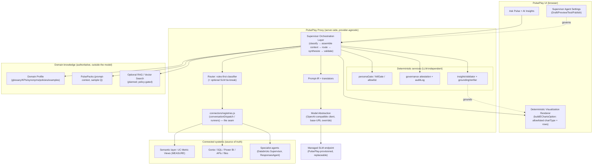

# Feasibility & Design: Embedded Domain-Aware SLM Supervisor + Responsive Ask Pulse

**Status:** Feasibility assessment (no production build of the Supervisor). Date: 2026-07-27.
**Method:** Inspected the actual codebase (4 parallel architecture-research passes). Every current-state
claim below carries file evidence. `[VERIFIED]` = executing code read this session. `[PLANNED]` =
doc/architecture only. `[ASSUMPTION]`/`[OPEN]` flag things not proven here.
**Companion delivered this session:** the responsive Ask Pulse fix (§9) is **built + headed-verified +
committed** (`0322e59`) — see §11. The Supervisor itself is assessed, not built.

---

## 0. Executive verdict

| Item | Verdict |
|---|---|
| **Inbuilt SLM-powered Supervisor Agent** | **PARTIALLY FEASIBLE** — feasible as a *PulsePlay-managed, replaceable, hybrid* supervisor; **not** as a browser-embedded in-process model, and **never** as the source of truth for data/metrics/security. |
| **Delivery without separate user install** | **YES** via a PulsePlay-managed serving endpoint (Options C/D). **NO** as a practical in-process/in-browser model on the current free deploy tiers. |
| **Responsive Ask Pulse + generated visuals** | **DONE (core)** — shipped + headed-verified this session; fuller design (focus mode, author controls) specced in §11. |
| **Recommended build stance** | **BUILD** the routing/supervisor layer on the *existing unused seam*; **INTEGRATE** an approved small model via the *existing OpenAI-compatible client + a managed endpoint*; **HYBRID** = rules-first + SLM assistance + larger-model fallback. |

**One-paragraph why.** PulsePlay already has ~70% of the scaffolding: a provider-agnostic proxy that
dispatches by `profile.type`, an *unused but boot-wired* routing-registry seam
(`proxy/connectors/registries.js`), an OpenAI-compatible model client with structured output
(`foundationModelClient.js`), a vendor-neutral prompt contract (`promptIR.js`), curated domain packs
(glossary/KPIs/sample-questions), a full stack of **deterministic** governance gates
(`personaGate`/`hitlGate`/`allowlist`/`governance`/`groundingVerifier`), and a proven server-governed
**publish/versioning/kill-switch** workflow to copy (`experienceConfig.js`). What is genuinely *missing*
is the one thing the proposal is really about: **a component that reads a request and decides which
connector/tool/agent should handle it.** Today the **user picks the connector**; nothing classifies the
request. That gap is real but bounded, and the seam to fill it already exists.

---

## 1. Current-state inventory (evidence)

### 1.1 Orchestration / routing — the core gap
- **No content-aware router exists.** Backend is chosen by the *resolved profile's* `type`, via an
  `if`-chain in the shared route (`proxy/server.js:3457` start, `:3473` powerbi, `:3483` foundation,
  `:3489` supervisor-local, `:3618` else→Genie; mirrored in `/messages` `:3650`). Profile resolution is
  body/header/host + allowlist (`resolveProfile` `:840`, `profileAllowedForRequest` `:578`). **The user's
  active AI profile picks the connector; no code inspects the question to route it.** `[VERIFIED]`
- **`supervisor-local`** `[VERIFIED]` — real in-proxy path (`runLocalSupervisor` `proxy/server.js:8061`):
  fans out to **all** helper Genie spaces (never a per-question subset), stagger `STAGGER_MS ?? 2000`
  (`:8108`, ADR-0003), then `synthesizeSupervisorAnswer` (`:7933`) merges via a Foundation Model endpoint
  (default `databricks-meta-llama-3.1-405b-instruct`). Inference is **Databricks, not local**.
- **`supervisor` (serving)** `[VERIFIED]` — calls a deployed Mosaic AI agent endpoint like any serving
  endpoint (`startSupervisorConversation` `:6840`).
- **Databricks LangGraph agent** `[VERIFIED as template, not deployed]` — `databricks-agents/supervisor/agent.py`
  is the *only* real LLM-as-router (hand-built `StateGraph`, `bind_tools` over 4 Genie-space tools,
  `agent.py:125-224`). It runs **on Databricks**, is deployed manually, and is **absent from the active
  `config.json`**. (README claims `create_react_agent`; code does not — README stale, `agent.py:9-18`.)
- **The routing seam** `[VERIFIED, unused]` — `proxy/connectors/registries.js` exports
  `conversationDispatch` / `callLlmProviders` / `sectionedRunners`; the connector host is built and
  registered at boot (`server.js:9005-9030`), **but no producer calls `.add()` and no live route calls
  `.resolve()`** — pure scaffold. Two real connectors (`decision-assist.js`, `decision-canvas.js`) are
  route-only (`matchProfile()===false`). **This is exactly where a router belongs.**

### 1.2 Provider-agnostic backend abstraction — strong
- 10 backend paths, all `[VERIFIED]`, dispatched by `profile.type` (`connectorManifests.js` describes 12
  manifests; `CATALOG_VISIBLE_IDS` filters the UI to 3). Adding a new backend = a profile type + a ~30-line
  client + one dispatch branch (agent-confirmed minimal surface).
- **`foundationModelClient.js`** `[VERIFIED]` — **OpenAI-compatible** body (`messages/temperature/max_tokens/
  response_format`, `:61-87`), **structured output via `response_format: json_schema`** (`:84`, presets
  `:189`), OpenAI response parsing that already tolerates self-hosted `usage` shapes (`:108-122`). **URL/auth
  are hardcoded to Databricks** `/serving-endpoints/{ep}/invocations` (`:163`). **First-class tool-calling is
  NOT in the client body-builder** (the IR translator emits `functions`, but the client doesn't consume them
  — `promptTranslators/foundationModel.js:10-12` vs `foundationModelClient.js`).
- **Prompt-IR** `[VERIFIED but off hot path]` — vendor-neutral contract (`promptIR.js`, schema `:379`),
  translators for genie/foundation(=openai/bedrock-llama)/supervisor (`promptTranslators/index.js:19`),
  additive dispatcher not yet wired into live routes (Phase 11b, `promptDispatcher.js:11-22`).

### 1.3 Semantic layer & domain knowledge — lives in Databricks + packs, no live RAG
- **Semantic layer = Databricks/Genie UC metric views** (`MEASURE()`), *not* the client
  (`scripts/synthetic_poc/supply_chain_measures.py:80-167`; client only *references* a source via the
  ADR-0010 answer ladder `visualization/sourceRef.ts:12`, no measure execution client-side). `[VERIFIED]`
- **Domain context today = prompt injection of curated PulsePack markdown** (glossary + per-sub-vertical
  `prompt-context.md`), delivered connector-agnostically (`packPromptInjector.js:54-135`,
  `packPromptLoader.js:74-153`). Packs carry glossary, KPI defs, sample questions, `prompt-ir.yaml`,
  bi-ai-fit (`pulsepacks/cpg-fmcg/…`). `packMatcher.js` = keyword scoring (Smart Connect). `[VERIFIED]`
- **No live RAG / vector retrieval in the answer path.** `/assistant/vector-search/query` exists
  (`server.js:2914`) but is **never called by answer code**; Settings marks Vector Search **hibernating**
  (`AiGroup.tsx:505`). The full "governed retrieval plane" in `KNOWLEDGE_BASE_ARCHITECTURE.md` is
  **`[PLANNED]`** (self-labeled "contracts, not committed TypeScript", line 143). Grounding today =
  *executed-SQL rows*, not embeddings. `[VERIFIED]`
- **Discovery** `[VERIFIED]` — `discoveryEngine.js` fuses connector probe + BI-adapter metadata + pack KPIs
  **deterministically (no LLM)** into a `DiscoverySnapshot`.

### 1.4 Deterministic governance — strong, reusable, LLM-independent
All `[VERIFIED]`, pure/server-side:
- `personaGate.js` — IdP-role→capability authority (never client values); `AI_ALLOW_DEMO_PERSONA` default
  **off** (`:59`). `hitlGate.js` — deterministic approval verdict + logged-only L3 queue.
- `allowlist.js` — per profile/space/pack/provider/origin gating, **already carries `supervisorProfiles`**
  (`:21,127,152`); **production fail-closed startup** (refuses to boot without a strict allowlist,
  `server.js:470`). Frontend mirror fail-closes new selections when unreachable (`settingsStore.tsx:307`).
- `governance.js` — `buildGovernanceAttestation` (`authority ∈ {unity-catalog,…}`, **mock forbidden in
  prod**, `enforced:true`, `policyVersion`, frozen output; browsers must not construct).
- Output validators — `insightsValidator.js` (section-shape contract + single retry),
  `groundingVerifier.js` (**5 statuses** verified/partial/unverified/no-numeric-claims/ungrounded — numeric
  cross-check vs source rows), `artifactValidator.ts` (**4 client statuses** verified/grounded-draft/
  suggestion/blocked), `groundingAdvisory.ts` (fail-closed — a SQL *string* is rejected as forgeable).
- `auditLog` + `spIdentityHash` stamped on every AI call.

### 1.5 Settings framework & publish precedent
- Group registry is **hardcoded** in 3 spots: `settingsRoute.ts` (union/array), `SettingsShell.tsx`
  (labels/rail/leaf/`ActiveGroup` switch), and a `groups/*.tsx` component. State via `settingsStore.tsx`
  + local `useSettingsDraft.ts` (Draft/Save, **not** server publish). `[VERIFIED]`
- **`experienceConfig.js` is the publish/versioning/kill-switch precedent to copy** `[VERIFIED]`:
  server-owned, versioned, **optimistic-concurrency PUT (409 on stale)**, author-gated via IdP roles,
  `auditLog`, **env kill-switch** (`PP_EXPERIENCE_KILLSWITCH`), fail-safe resolve. `GET/PUT /experience/config`.
- A **presentational** supervisor settings page already exists (`AiSupervisorFusion.tsx`, hidden by the
  2026-07-24 curation) — a UI shell to graft governed states onto. `[VERIFIED]`

### 1.6 Deployment & hosting reality
- One origin: **persistent Node/Express proxy** serves the Vite SPA + all backends (`DEPLOYMENT_GUIDE.md:9`,
  `app.yaml`). Deploy tiers today: **Azure F1** (60 CPU-min/day, no Always-On, SSE needs B1+) and
  **Databricks Apps Free** (24h auto-stop, outbound allowlist). A resident model **needs paid/B1+ compute**. `[VERIFIED]`
- **In-browser model (WebGPU/WASM/DuckDB-WASM) is aspirational, NOT implemented** — grep of `playground/`
  for `duckdb|WebGPU|WASM|web-llm|transformers|onnx` finds **nothing**; CLAUDE.md's "available by default"
  is an over-claim confirmed by a prior audit. **Option B is not code-viable today.** `[VERIFIED]`
- **Generated visualizations are already a governed structured spec**, not arbitrary code:
  `buildEChartsOption(chartType, columns, rows)` takes an allowlisted `chartType` + tabular data → ECharts
  option. **No model-generated JS/HTML/executable chart code exists** — §9.2's core requirement is already met. `[VERIFIED]`

---

## 2. Gap analysis (what must change)

| Capability | State | Work to close |
|---|---|---|
| Content→connector/tool routing | **Missing** | New router (rules-first classifier; optional SLM). Wire the unused `registries.js` seam. |
| Domain config as first-class config | **Partial** (packs = markdown; direction rules = JSON) | A structured, versioned "Domain Profile" (glossary/KPIs/synonyms/policies/examples/prohibitions) bound at setup. |
| Managed small-model endpoint | **Partial** (FM client exists; Databricks-bound URL/auth) | Add a base-URL/request-fn override so the same client can target a PulsePlay-managed SLM endpoint. |
| First-class tool-calling | **Missing in client** | Consume IR `functions` → OpenAI `tools`/`tool_calls` in the client body-builder + a bounded tool executor (allowlisted). |
| RAG / retrieval | **Planned only** | Optional; not required for POC. Wire `/vector-search/query` behind a `RetrievalPolicy` when a workspace enables it. |
| Supervisor Settings page (publish/versioning/kill-switch) | **Missing** (precedent exists) | New settings group + a `supervisorConfig.js` modeled on `experienceConfig.js`. |
| Confidence + routing-trace surfacing | **Partial** (grounding statuses exist) | Add classification confidence + an auditable routing trace to the answer envelope. |
| Responsive Ask Pulse | **Core DONE**; fuller design pending | Focus mode, table fallback, author display controls (§11). |

---

## 3. Recommended target architecture

**Shape:** a thin **Supervisor Orchestration Layer** in the proxy (deterministic-first), calling a
**replaceable managed SLM** through a stable abstraction, sitting *above* the existing connectors, packs,
semantic layer, and deterministic gates. The SLM reasons and generates; **it never owns data, metrics,
identity, permissions, or policy.**



**Responsibility separation (authoritative table):**

| Concern | Owner | Never the SLM |
|---|---|---|
| NL interpretation, intent/domain ID, routing decision, synthesis, formatting, clarification, explanation | **SLM (bounded)** | — |
| Which glossary/KPI/definition is authoritative | **Domain Profile + semantic layer** | ✓ |
| Metric values / calculations | **UC Metric Views (Genie/Databricks)** | ✓ |
| Retrieval of evidence | **Connectors (executed SQL) / optional RAG** | ✓ |
| AuthN/Z, RLS/OLS, credentials, tenant isolation | **IdP + Unity Catalog + proxy `allowlist`/embed-token issuance** | ✓ |
| Human approval for material actions | **`hitlGate` (deterministic verdict + queue)** | ✓ |
| Output grounding / trust status | **`groundingVerifier` / `artifactValidator` (deterministic)** | ✓ |
| Visualization safety (allowlisted type, data-point limits, responsive sizing) | **Deterministic renderer (`buildEChartsOption`)** | ✓ |
| Policy enforcement, prohibited fields/actions | **Deterministic policy + `allowlist`** | ✓ |

---

## 4. Deployment options

| Option | Fits "no user install"? | Feasibility today | Verdict |
|---|---|---|---|
| **A. App/server-embedded SLM** (in the Node proxy process) | Yes | Proxy is a persistent Node server, but the model process needs real CPU/GPU/RAM the free tiers lack; couples model lifecycle to app lifecycle. | Possible on paid tiers; **not preferred** (couples lifecycles). |
| **B. Browser/device-embedded** (WebGPU/WASM) | Yes (no install) | **Not code-viable today** (no WASM/WebGPU/web-llm in the playground); large weight download; device-memory/enterprise-browser variance; data-in-browser exposure. | **Not recommended** for v1. |
| **C. PulsePlay-managed sidecar/container** (provisioned by PulsePlay deploy) | **Yes** | The proxy already owns all backend calls; the existing OpenAI-compatible client points at it with a base-URL override. Needs paid compute. | **Recommended** (self-hosting required). |
| **D. Centrally-hosted private endpoint** (e.g. small model on the org's Databricks/Azure serving) | **Yes** | **Lowest friction** — reuses `foundationModelClient.js` verbatim (already calls Databricks serving); no new runtime to operate; central governance. | **Recommended (default)**. |
| **E. Hybrid supervisor** (SLM for classify/route/summarize/validate; larger model for hard synthesis) | Yes | Natural given D + the existing FM 405B synthesis path. | **Recommended pattern**. |
| **F. Rules-first + optional SLM** | Yes | Deterministic router/policy primary; SLM only where it adds value. | **Recommended stance** (safest, cheapest, most testable). |

**Recommendation:** **D (managed endpoint) as default + F (rules-first) + E (larger-model fallback)**, with
**C** as the self-hosting variant for air-gapped/no-external-data deployments. Reject **B** for v1; treat **A**
as a special case of C. All routed through the **Model Abstraction** so the model is swappable per
environment/domain.

**"No external model provider" answer:** achievable with **C** (self-hosted sidecar) or **D** pointed at an
*internal* serving endpoint — no enterprise data leaves the tenancy. If D points at a hosted API, it does not
meet the no-external-data bar; that is a per-deployment governance choice, enforced by `allowlist`.

---

## 5. Candidate-model evaluation

**Do not select on "free" or "approved".** Score candidates on the brief's criteria. The abstraction (§3)
makes the specific choice reversible, so treat this as a *starting shortlist to be validated in the POC and
put through the org's own legal/security/AI-governance approval* — **not** a recommendation of record.

**Evaluation criteria (weighted for this use):** licence & commercial terms · provenance & maintenance ·
tool-calling reliability · structured-output (JSON-schema) reliability · instruction-following/grounding ·
hallucination behaviour under "insufficient evidence" · context window · hardware/quantization & latency ·
multilingual · total cost of ownership · lock-in.

**Shortlist (open-weight, small, instruct/tool-capable) — LICENCE + CLAIMS MUST BE VERIFIED FROM SOURCE
`[OPEN]`:**

| Model family | Typical small sizes | Licence (verify) | Notes for this role |
|---|---|---|---|
| **Qwen2.5 / Qwen2.5-Instruct** | 3B/7B | Apache-2.0 on several sizes (verify per size) | Strong tool-calling + JSON; good instruction-following. |
| **Llama 3.1 / 3.2 Instruct** | 3B/8B | **Meta Community Licence — NOT OSI**; commercial-use allowed under conditions (verify MAU clause) | Already what the org's Databricks FM endpoints serve → lowest integration friction (Option D). |
| **Mistral / Ministral** | 3B/8B | Apache-2.0 on some, custom on others (verify) | Compact, good latency. |
| **Phi-3.5-mini** | ~3.8B | MIT (verify) | Small, permissive, strong for classification/summarize. |
| **Gemma 2** | 2B/9B | Gemma custom licence (verify commercial terms) | Capable; licence is bespoke, review carefully. |

**Guidance:** for **routing/classification/validation** a **2–4B** model is usually enough; for **synthesis of
multi-source answers**, escalate to the larger fallback (E). The safest default that needs *zero* new
infrastructure is **Option D reusing the org's existing Databricks-served Llama endpoint** for the fallback and
a **small (3–4B) instruct model on the same serving stack** for the supervisor — swappable later.

---

## 6. Expected-to-work / Challenging / Not-recommended

**Expected to work (small model + deterministic scaffolding):**
- Intent/domain classification; connector/tool selection among a *known, allowlisted* set.
- Query-shaping hints, clarification questions, refusal/escalation when evidence/permission is missing.
- Summarize/explain/format **already-grounded** results; produce a **structured visualization spec**.
- Auditable routing trace; confidence scoring on classification.

**Possible but challenging (needs strong governance/testing/config):**
- Multi-step decomposition across several connectors in one turn.
- Conflict resolution between contradictory definitions (needs a deterministic source-priority policy).
- Cross-domain single deployment (works with **isolated Domain Profiles**, not one blended prompt).
- Tool-calling reliability at small sizes (mitigate with strict JSON-schema + validate-and-retry).

**Unlikely / not recommended for the SLM:**
- Being the **source of truth** for metric values, identity, permissions, or compliance.
- **Final metric calculation** (belongs in the semantic layer).
- **Executing** destructive/material actions without `hitlGate`.
- **Browser-embedded model** for v1 (Option B).
- Free-form **model-generated executable chart/JS/HTML** (violates §9.2 — keep the structured-spec renderer).

---

## 7. Security & governance model

Reuse the **existing deterministic** gates (§1.4); the SLM is inside them, never above them.

| Control | Must be deterministic? | Mechanism (existing or new) |
|---|---|---|
| AuthN/Z, RLS/OLS, tenant isolation | **Yes** | IdP + Unity Catalog + `allowlist` + server-issued embed tokens |
| Tool allowlist + parameter validation | **Yes** | New: bounded tool executor validating against an allowlist (reuse `allowlist.js` pattern) |
| Human approval for high-impact actions | **Yes** | `hitlGate` |
| Grounding / citation enforcement | **Yes** | `groundingVerifier` + `artifactValidator` + `groundingAdvisory` (fail-closed) |
| Prompt-injection (direct + from retrieved/tool content) | **Yes** | Reuse the supervisor-local sanitizer (fences helper output, strips `[MANDATORY]`, `server.js:7948`); apply to all tool/RAG content; never let retrieved text change routing/policy |
| Secret/credential isolation | **Yes** | Server-side only (`sanitizeInlineHeader`, token redaction) |
| Output filtering / prohibited fields | **Yes** | Deterministic policy from the Domain Profile |
| Generated-viz safety (type allowlist, data-point cap, responsive) | **Yes** | `buildEChartsOption` renderer |
| Model/config versioning, rollback, kill-switch | **Yes** | New `supervisorConfig.js` modeled on `experienceConfig.js` |
| Audit trail (classification/route/ground/answer) | **Yes** | Extend `auditLog` + governance attestation |
| Rate/cost/timeout limits | **Yes** | Config + existing rate-limit buckets |
| Bias/harmful-output/red-team eval | Process | POC + release gates |

**Fail-safe:** disabling the Supervisor (kill-switch or health failure) must fall back to **today's**
behavior — user-selected connector, direct Ask Pulse, existing dashboards — with zero break. This is the same
guarantee `experienceConfig.js` already provides for interface mode.

---

## 8. Supervisor Agent Settings — information architecture

New Settings group `supervisor` (register in the 3 hardcoded spots §1.5; back it with a server-governed
`supervisorConfig.js` modeled on `experienceConfig.js`). **Statuses:** `Draft · Preview · Test · Published ·
Disabled · Degraded · Error`. **Author vs Admin split:** admins own model/endpoint/deployment/limits/kill-switch;
authors own domain config/behaviour/formatting.

```
Settings ▸ Supervisor Agent
├─ Status & Mode        [Admin]  Enable/Disable · deployment mode (Managed endpoint ▸ / Sidecar / Central) ·
│                                active model (view) · change model (approved list) · endpoint (when applicable) ·
│                                dependency-health chips (model ● / knowledge ● / connectors ●)
├─ Domain Configuration [Author] Business domain/subdomain · glossary & KPI definitions · synonyms/abbreviations ·
│                                dimensions/hierarchies · source descriptions · prohibited fields/topics/actions ·
│                                approved example Q→answer library
├─ Behaviour            [Author] System instructions · grounding requirement (off/prefer/require) ·
│                                confidence threshold · connector/agent routing priority · source-priority /
│                                conflict rules · when a larger model may be used
├─ Response & Format    [Author] Style · detail level · output formats · viz display defaults (density, max
│                                categories/points, legend, table-fallback, focus-mode) — cannot disable core
│                                responsiveness/accessibility
├─ Governance & Limits  [Admin]  Human-approval requirements · data-sharing/privacy restrictions ·
│                                token/cost/timeout/concurrency limits · caching/context retention
├─ Test & Diagnostics   [Author] Sample-question preview · run connection/config diagnostics · evaluation results
├─ Observability        [Admin]  Routing traces · errors · logs · audit records
└─ Lifecycle            [Both]   Draft ▸ Preview ▸ Test ▸ Publish · versions · change/audit history ·
                                 import/export config package · roll back · reset to governed defaults · KILL SWITCH
```

**Validation/warnings before publish:** model endpoint reachable? · at least one connector allowlisted? ·
grounding requirement consistent with connectors? · confirm before enabling larger-model fallback (cost) ·
confirm before lowering grounding requirement (safety) · block publish if the active model isn't on the
approved list.

---

## 9. Responsive Ask Pulse — design + generated-visualization contract

**Renderer, not the model, owns responsiveness.** The generated-viz contract is *already* structured-spec
(§1.6). Design:

- **Container-aware sizing** — charts fit their container (not just the window) and re-fit on panel open/close,
  zoom, and viewport change. **[SHIPPED]** — `ResizeObserver` in `EChartsRenderer` + `clamp(220px,34vh,400px)`
  height for the Ask Pulse chart (`0322e59`).
- **Bounded height/aspect** — never fills a laptop screen, never clips labels. **[SHIPPED]**
- **Vertical scroll only; no horizontal overflow** — verified at 820px (nav collapses to icons). **[SHIPPED]**
- **Table fallback + bounded scroll** — wide tables scroll within a bounded container; always offer table view.
  *(Table view exists; bounded-scroll polish is a small follow-up.)*
- **Focus / full-screen mode** — expand a visual, restore prior layout on close. *(Design below; not yet built.)*
- **Label-density degradation** — wrap/shorten/tooltip labels, collapse legends — **never change the values**.
- **Author display controls** — density, min/max height, max categories/points, legend behaviour, table-fallback,
  focus availability, mobile preference — **cannot** disable core responsiveness/accessibility.

**Generated-visualization contract (already largely enforced):** the model emits a *spec* (chart type from an
allowlist, measure/dimension/agg/sort/filters/title/format/tooltip fields); the deterministic renderer
validates it, rejects unsupported types/invalid fields, enforces data-point limits, applies formatting +
responsive sizing + accessibility, and renders safely. **No arbitrary JS/HTML/executable chart code is ever
permitted** — this is the current design, preserved.

---

## 10. Wireframes (ASCII)

**Supervisor Settings (desktop):**
```
┌ Settings ────────────────────────────────────────────────────────────────┐
│ [Setup][BI][AI][Supervisor]★           Draft • unsaved   [Preview][Publish]│
├───────────────┬───────────────────────────────────────────────────────────┤
│ Status & Mode │  Supervisor Agent            ● model  ● knowledge ● conns  │
│ Domain Config │  ○ Enabled   Mode: [ Managed endpoint ▾ ]                   │
│ Behaviour     │  Active model: small-instruct-3b  [ Change ▾ ]  v12         │
│ Response/Fmt  │  Grounding: (Require ▾)   Confidence ≥ [0.6]                 │
│ Gov & Limits  │  Larger-model fallback: ◔ only when needed  [i cost]        │
│ Test & Diag   │  ─────────────────────────────────────────────────────────  │
│ Observability │  ⚠ Publishing changes routing behaviour for all users.      │
│ Lifecycle     │  [ Test with sample questions ]   [ Roll back to v11 ]      │
└───────────────┴──────────────────────────────  [KILL SWITCH]  [Publish ▸]──┘
```

**Ask Pulse — desktop vs narrow (auto-fit):**
```
DESKTOP (≥1200)                              NARROW (≤900)
┌ answer ─────────────────────────┐          ┌ answer ───────────────┐
│ narrative …                     │          │ narrative …           │
│ ┌ CHART  [type▾][palette▾][⤢]┐  │          │ ┌ CHART [type▾][⤢]  ┐ │
│ │  (clamp 34vh, fits) ▄ ▄ ▄  │  │          │ │ (34vh) ▄ ▄ ▄       │ │
│ └───────────────legend───────┘  │          │ └────legend─────────┘ │
│ TABLE (fits) │ … │ … │          │          │ TABLE ⇢ scrolls in box│
│ [👍][👎][Copy][CSV][SQL] follow…│          │ [👍][👎][⋯] follow…   │
└─────────────────────────────────┘          └───────────────────────┘
```

**Focus mode + error/fallback:**
```
FOCUS (⤢)                                    FALLBACK / ERROR
┌──────────────── overlay ───────────────┐   ┌ answer ───────────────────────┐
│  Net Sales by Year         [ Close ✕ ] │   │ Not enough data to render a    │
│  ▄▄▄▄▄▄▄▄  (fills viewport, re-fits)    │   │  Pie chart. [ Switch to Table ]│
│  legend ……                             │   │ ── or ──                       │
│  [ View as table ]                     │   │ ⚠ Too many categories (120).   │
└────────────────────────────────────────┘   │  [ Show top 20 ] [ Refine ]    │
  Esc restores prior layout                   └───────────────────────────────┘
```

---

## 11. POC scope & test plan

**Scope (isolated feature branch + `supervisor` kill-switch OFF by default):**
- 1 domain (CPG supply-chain — data already live: `genie-scm-poc`).
- 2–3 governed connectors (Genie SCM, Power BI DAX, one SQL/warehouse).
- ~8–10 approved KPIs + a Domain Profile (glossary/synonyms/prohibited fields).
- Fixed test-question set with expected answers + acceptance criteria.
- **≥2 model/deploy variants** (e.g. small-instruct via managed endpoint vs rules-only baseline vs larger-model
  baseline).

**Measure:** routing accuracy · tool-selection accuracy · groundedness/citation rate · hallucination rate ·
policy-compliance rate · clarification/refusal correctness · latency · infra usage · cost/interaction ·
concurrency · failure/recovery.

**Must-test cases:** positive · negative · ambiguous · adversarial (prompt-injection, incl. indirect via tool
output) · permission-restricted · supervisor enabled/disabled · model/knowledge/connector unavailable ·
low-confidence · conflicting definitions · unauthorized data request · **oversized viz / large category count /
long labels / narrow screen / zoom 80–200% / focus mode / table fallback** (headed, screenshots reviewed).

**Stage gates (measurable):** Feasibility ✔ (this doc) → Prototype (router + managed SLM answering, kill-switch)
→ Controlled POC (acceptance thresholds met on the test set, incl. adversarial + responsive) → Pilot (1 real
domain, real IdP roles, audit review) → Production (security/red-team/cost sign-off + rollback drill).

---

## 12. Infrastructure, cost, risks

**Infra/cost.** Default **D** adds *no new runtime* (reuse Databricks/Azure serving) — cost = per-token
inference of a small model (cheap for classify/route) + occasional larger-model fallback. **C** (sidecar) adds a
paid compute tier (Azure B1+/container) — the free tiers (F1, Databricks Free) **cannot** host a resident model.
SSE already needs B1+.

**Top risks / open questions `[OPEN]`:** (1) small-model tool-calling reliability → mitigate with strict JSON
schema + validate-retry + rules-first fallback. (2) Routing errors sending a question to the wrong connector →
confidence threshold + "ask to confirm" + audit. (3) Indirect prompt-injection via retrieved/tool content →
deterministic sanitization + never let content alter routing/policy. (4) Model licence/commercial terms → verify
per model from source + org procurement/AI-governance approval before selection. (5) Cost creep from fallback →
hard caps + admin limits. (6) Domain-config drift vs the semantic layer → the semantic layer stays authoritative;
the SLM never computes metrics.

---

## 13. Phased roadmap

1. **P0 — Foundations (low risk):** Domain Profile schema + a `supervisorConfig.js` (copy `experienceConfig.js`)
   + the `supervisor` Settings group (Draft/Publish/kill-switch), **all behind a flag, no runtime routing yet**.
2. **P1 — Rules-first router:** deterministic classifier over the allowlisted connector set, wired through
   `registries.js`; routing trace + confidence in the answer envelope. No model required.
3. **P2 — Managed SLM assist (Option D):** add the base-URL/request-fn override to the model client; SLM does
   classify tie-break + synthesis/formatting; larger-model fallback (E). Grounding + validators enforced.
4. **P3 — Tool-calling + optional RAG:** consume IR `functions` → OpenAI tools; bounded allowlisted executor;
   policy-gated Vector Search where a workspace enables it.
5. **P4 — Hardening:** red-team, cost/limits, rollback drills, eval harness; pilot → production gates.

---

## 14. Recommendation

- **Build vs integrate:** **BUILD** the thin Supervisor Orchestration + rules-first router on the *existing
  unused seam*; **INTEGRATE** an approved small model via the *existing OpenAI-compatible client + a managed
  endpoint*. Do **not** embed a model in the browser (Option B) or make the SLM authoritative.
- **Supervisor should use:** **rules-first + SLM assistance + larger-model fallback**, via a **centrally-governed
  managed model service** (Option D default; C for air-gapped). Provider-agnostic and replaceable by design.
- **Verdict:** **Partially feasible and worth a controlled POC.** Most scaffolding exists; the real new work is
  the router, the Domain Profile, the managed endpoint override, and the Supervisor Settings page — each bounded,
  each behind a flag/kill-switch, none disturbing the fail-safe default experience.

---

## Appendix — verified/assumption/open ledger
- **[VERIFIED]** everything in §1 (file:line) — read this session across proxy + playground.
- **[PLANNED]** KB retrieval plane, Vector Search grounding, pack-IR frame prerequisites, prompt-IR-on-hot-path.
- **[OPEN]** model licences/benchmarks (verify per source + org approval); small-model tool-calling reliability
  (measure in POC); latency/cost on the chosen tier; whether Option D may call an internal-only endpoint per
  deployment's data-egress policy.
- **No production change** was made to Supervisor scope. The only code shipped this turn is the responsive
  Ask Pulse fix (§9, `0322e59`), which is independent and fail-safe.
