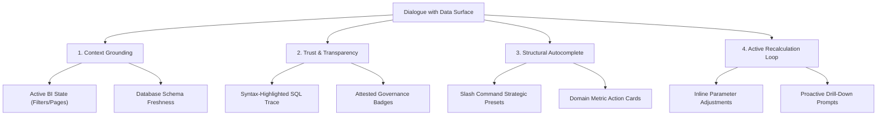

# Dialogue with Data: UX/UI Standards for Modern AI Chat Surfaces

This document establishes the **Product, UX, and Architectural Standards** for a modern, professional, and engaging AI chat screen designed specifically for **Dialogue with Data** (natural language querying over structured databases, BI tools, and data lakes).

Unlike generic AI assistants (which focus on text generation or creative writing), a data-dialogue screen is a **precision instrument**. It must prioritize **mathematical truth, transparency, state-grounding, and proactive business analysis** while keeping cognitive load minimal.

---

## 1. The Core Architecture: The Four Pillars of Data Dialogue

---

## 2. Pillar 1: Context Grounding (The "No Blind Chats" Policy)

A modern data assistant must never operate in a vacuum. It must display, respect, and react to the user's active viewport state.

### A. Core Elements
* **Active State Badge**: A persistent strip showing the exactly bound data source (e.g., `Sales DB`, `Databricks Catalog`).
* **Visual Context Breadcrumbs**: Dynamic chips displaying active dashboard filters (e.g., `[Region: East] [Category: Technology]`).
* **Freshness & Freshness Timestamp**: Indicators like `Updated 2m ago` or `Live Stream` so users know the currency of the calculations.

### B. Dialogue Design Best Practice
* **Automatic Context Synced Prompts**: When the user asks "Why did sales drop?", the interface automatically prepends active BI filters, sending:
  > *"Analyze the sales drop given [Region: East] and [Year: 2026]."*
* **Interactive Synced Highlights**: If the user asks about a specific outlier row in chat, that row should highlight on the dashboard canvas.

---

## 3. Pillar 2: Trust & Transparency (Prove the Math)

In corporate decision-making, "hallucinations" are fatal. The UI must present proof of its underlying logic rather than asking for blind faith.

### A. Core Elements
* **Syntax-Highlighted SQL Drawer**: An expandable block showing the exact, sanitized SQL query compiled by the AI and run on the warehouse.
* **Interactive Result Tables**: Collapsible tables with row-cap previews (e.g., up to 20 rows) and an instant `⎘ Copy CSV / Copy TSV` action button.
* **Telemetry & Speed Stamps**: Showing `Execution Time: 340ms` and `Rows Returned: 4,000`.
* **Attested Governance Signifiers**: Indication of whether the query was executed through governed pathways:
  * 🟢 **Verified**: Grounded in audited database views with a valid SQL query run.
  * 🟡 **Grounded Draft**: AI-generated reasoning with high relevance, but not formally audited.
  * 🔴 **Caution/Blocked**: Governed fields (e.g., PII allowlists) blocked access to that specific query.

---

## 4. Pillar 3: Structural Autocomplete (Surfacing Gated Value)

Data chat fields frequently suffer from the "Empty Page Syndrome." Business users often do not know what questions the semantic model supports.

### A. Core Elements
* **Slash Commands `/` Dropdown**: SURFACES analytical frameworks as structured mathematical templates rather than just free-form prose.
  * `/swot` (Quantified SWOT matrix)
  * `/bcg` (Growth-share analysis using median splits)
  * `/rfm` (Recency, Frequency, Monetary cohort segmentation)
  * `/pareto` (80/20 concentration analysis)
  * `/variance` (YoY waterfall bridge attribution)
* **Active Domain suggestion chips**: Suggested entry-points that change based on what is loaded. If the user mounts a "Hospital Operations" dashboard, suggest:
  * `[🟢 Bed Occupancy limits]` or `[📊 Run Emergency Flow SWOT]`.

---

## 5. Pillar 4: The Active Recalculation Loop (Tuning in-Chat)

Dialogue is an iterative process. A modern UI must allow quick refinements without starting a brand-new conversation.

### A. Core Elements
* **Collapsible Parameter Drawer**: Sliding open to modify active analysis parameters (e.g. changing SWOT Materiality from `$5,000` to `$10,000`) dynamically in-chat.
* **Drill-Down suggested follow-ups**: Suggested subsequent questions that are data-aware:
  * If sales grew but margins declined, the chat should suggest: `[🔍 Show discounting impact in East Region →]`.
* **Structured Clarification Cards**: If a prompt is ambiguous (e.g., "sales" could mean gross, net, or shipped sales), instead of guessing, the chat presents quick-pick buttons to resolve the ambiguity.

---

## 6. Premium Aesthetic Specifications (HSL Grammar)

To look state-of-the-art and feel engaging, the UI should employ a dense, high-end "Sugar Candy" visual style:

* **Tailored Dark Modes**: Use deep neutral HSL tones (e.g. `hsl(222, 47%, 11%)` background, `hsl(217, 33%, 17%)` borders) rather than harsh plain black (`#000`).
* **Motion Staggering**: Apply sequential delays on incoming sections so they slide up progressively rather than popping in aggressively.
* **Glassmorphic Composers**: The chat input bar should feel integrated, with high-end glassmorphism, transparent elements, and subtle focus glows.
* **Color Tone Tints**: Metric tables should have a light tone tint (10-14% opacity) based on the metric direction rules (e.g. green for positive margin growth, red for return rate spikes) to guide the reader’s eye immediately.
