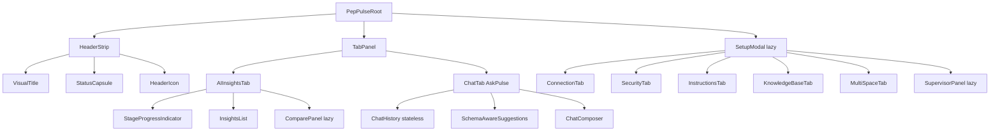
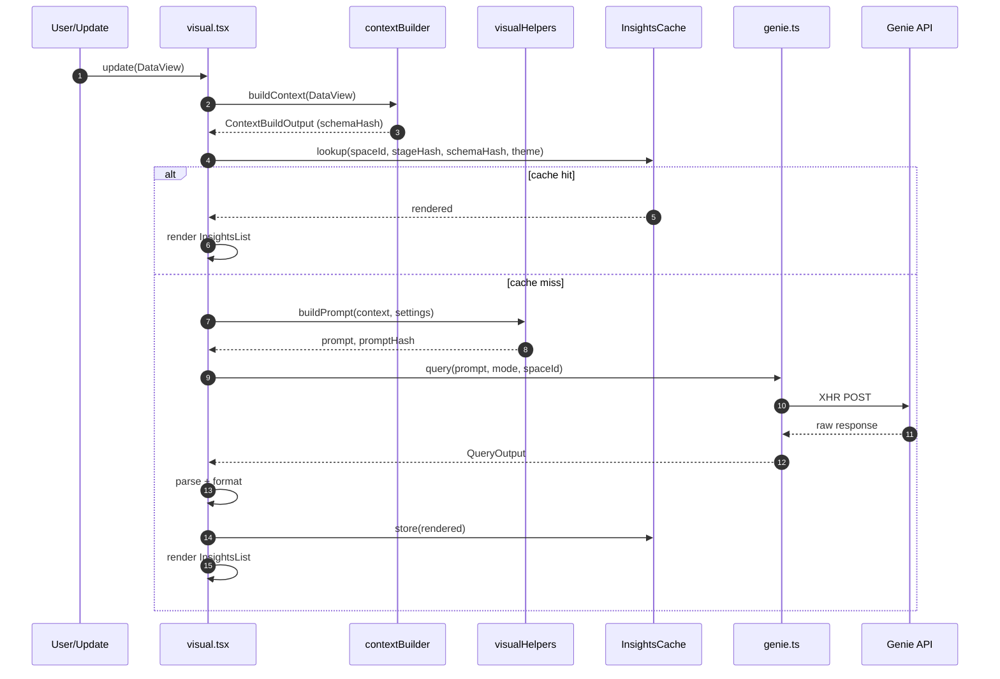
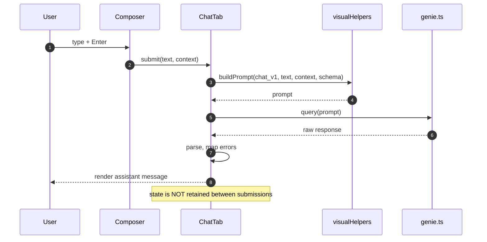
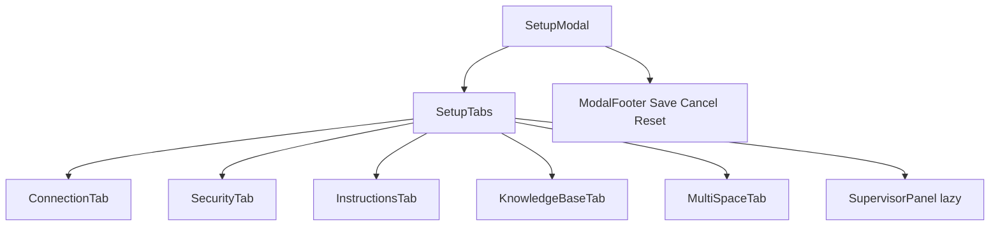
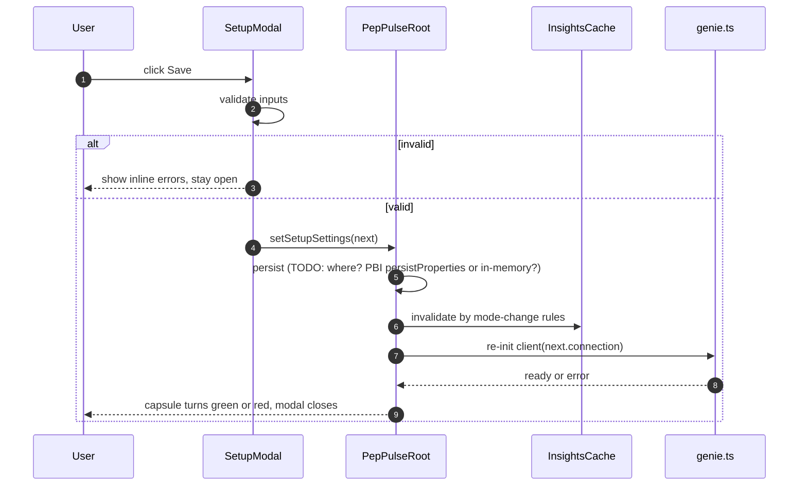

# PepPulse Build Blueprint

> Status: DRAFT v0.1. Built from the existing Functional & Technical Reference plus reasonable defaults. Every TODO marks a place where the codebase is the source of truth. Replace TODOs with verbatim values from the named file before treating this as authoritative.

## Table of Contents

1. [Glossary](#1-glossary)
2. [Component tree](#2-component-tree)
3. [Root state shape](#3-root-state-shape)
4. [Settings model](#4-settings-model)
5. [capabilities.json](#5-capabilitiesjson)
6. [Power BI visual lifecycle](#6-power-bi-visual-lifecycle)
7. [Connection modes](#7-connection-modes)
8. [Proxy server contract](#8-proxy-server-contract)
9. [AI Insights pipeline](#9-ai-insights-pipeline)
10. [Prompt templates](#10-prompt-templates)
11. [Chat Ask Pulse](#11-chat-ask-pulse)
12. [Settings Setup modal](#12-settings-setup-modal)
13. [Format pane](#13-format-pane)
14. [Security pipeline](#14-security-pipeline)
15. [Cache spec](#15-cache-spec)
16. [Theming](#16-theming)
17. [i18n and locale](#17-i18n-and-locale)
18. [Failure and degradation modes](#18-failure-and-degradation-modes)
19. [Build and dev workflow](#19-build-and-dev-workflow)
20. [Performance](#20-performance)
21. [Accessibility](#21-accessibility)
22. [File map](#22-file-map)
23. [Tripwires](#23-tripwires)
24. [Open questions and TODOs](#24-open-questions-and-todos)

---

## 1. Glossary

| Term | Definition | Where it appears in code |
|---|---|---|
| Genie | Databricks' natural language to SQL service. The model that PepPulse talks to for both AI Insights and Chat. | `peppulseVisual/src/genie.ts` |
| Genie space | A scoped workspace inside Databricks Genie containing tables, sample queries, and instructions. PepPulse calls Genie within one or more spaces. | `TODO: confirm from genie.ts` |
| Stage | One of the six steps in the AI Insights pipeline (Context Build, Prompt Build, Query, Parse, Format, Display). | `peppulseVisual/src/visual.tsx`, `visualHelpers.ts` |
| Status capsule | The header element that doubles as the Setup modal trigger. State is encoded as color and icon. | `peppulseVisual/src/visual.tsx` |
| Setup modal | In-visual modal dialog that holds all operational configuration (connection, security, instructions, knowledge base). Distinct from the format pane. | `peppulseVisual/src/visual.tsx` |
| Format pane | Power BI's native side panel. PepPulse only exposes appearance and layout controls here. | `peppulseVisual/capabilities.json`, `settings.ts` |
| Compare panel | Lazy-loaded panel for comparing insights. `TODO: confirm purpose and trigger from visual.tsx`. | `TODO: confirm file path` |
| Supervisor panel | Lazy-loaded panel. `TODO: confirm purpose, audience (admin?), and trigger from visual.tsx`. | `TODO: confirm file path` |
| Knowledge base | Curated context (table descriptions, glossary terms, query examples) attached to the Genie space and injected into prompts. | `TODO: confirm source` |
| Multi-space config | The configuration that lets PepPulse fan out queries across more than one Genie space. | `TODO: confirm source` |
| Context injection | Mechanism for users to attach extra context to a chat message (selected rows, custom text, hints). `TODO: confirm exact syntax`. | `peppulseVisual/src/visual.tsx` (Chat tab) |
| Schema-aware suggestion | Autocomplete or recommended-question feature that uses the live DataView schema to suggest valid questions. | `TODO: confirm source` |
| Prompt injection moat | The regex-based sanitization layer that runs on user input before it reaches the prompt. Blocks DML, strips control chars, neutralizes quote and newline injection. | `TODO: confirm file (likely visualHelpers.ts or a security.ts)` |
| DataView | Power BI's data model passed to the visual's `update()` method. PepPulse reads schema, metadata, and sample rows from it. | `peppulseVisual/src/contextBuilder.ts` |
| pbiviz | The Power BI Visuals Tools CLI. Used for `start`, `package`, `update`. Pinned to a version that supports Node 18 to 22. | `package.json`, build scripts |

---

## 2. Component tree

The exact React component names below need verification against `visual.tsx`. The hierarchy reflects what the reference doc describes.



`TODO: replace placeholder component names with the actual exports from visual.tsx and any sibling files.`

Major props passed down: `TODO: enumerate after reading visual.tsx`.

---

## 3. Root state shape

Draft based on what the reference doc implies. Verify field names and types against `visual.tsx`.

```ts
// DRAFT: confirm from peppulseVisual/src/visual.tsx
interface PepPulseRootState {
  // Tab routing
  activeTab: "insights" | "chat";

  // Operational settings (loaded from Setup modal, persisted)
  setup: SetupSettings;

  // Appearance settings (loaded from format pane, ephemeral within update())
  appearance: AppearanceSettings;

  // Runtime status
  connection: {
    mode: ConnectionMode;
    status: "disconnected" | "connecting" | "ready" | "error";
    lastError?: MappedError;
  };

  // AI Insights state
  insights: {
    stage: "idle" | "contextBuild" | "promptBuild" | "query" | "parse" | "format" | "display" | "error";
    progress: number; // 0..1 within current stage
    results: InsightResult[];
    cacheHit: boolean;
  };

  // Chat state (stateless across messages by contract; only transient input)
  chat: {
    draftInput: string;
    pendingMessage: ChatMessage | null;
    suggestions: string[];
  };

  // Modal visibility
  setupModalOpen: boolean;

  // Locale and theme (server-injected)
  locale: string; // BCP 47, e.g. "en-IN"
  theme: ThemeTokens;
}
```

Initialization: `TODO: paste constructor and getInitialState from visual.tsx`.

State update pattern: `TODO: confirm whether visual.tsx uses useState/useReducer/class setState/external store`.

Tab ownership: `insights.*` is written only by the AI Insights tab; `chat.*` only by the Chat tab; everything else is shared.

---

## 4. Settings model

Two distinct interfaces. The split is enforced: operational settings live in the Setup modal, appearance in the format pane.

### 4.1 Setup modal settings (operational)

```ts
// DRAFT: confirm field names from peppulseVisual/src/visual.tsx (Setup modal section)
interface SetupSettings {
  connection: {
    mode: ConnectionMode; // see Section 7
    direct?: { workspaceUrl: string; token: string; spaceId: string };
    proxy?: { baseUrl: string; apiKey?: string };
    gateway?: { gatewayUrl: string; clientId: string; tenantId: string };
    azureOpenAI?: { endpoint: string; deployment: string; apiKey: string };
    awsBedrock?: { region: string; modelId: string; accessKeyId: string; secretAccessKey: string };
  };

  security: {
    forbiddenTables: string[];
    forbiddenColumns: string[];
    securityContext: string; // free-text injected into prompt
    redactPII: boolean;
  };

  instructions: {
    systemInstructions: string;
    fewShotExamples: { q: string; a: string }[];
  };

  knowledgeBase: {
    entries: { term: string; definition: string }[];
  };

  multiSpace: {
    enabled: boolean;
    spaces: { id: string; label: string; default: boolean }[];
  };
}
```

### 4.2 Format pane settings (appearance)

```ts
// DRAFT: confirm from peppulseVisual/src/settings.ts and capabilities.json
interface AppearanceSettings {
  header: {
    visible: boolean;
    iconStyle: "icon1" | "icon2" | "icon3" | "icon4" | "icon5" | "icon6"; // 6 SVG options
    // TODO: confirm enum values from settings.ts
  };
  layout: {
    mode: "compact" | "expanded";
    scale: number; // 0.8..1.4 step 0.1 (TODO: confirm range)
  };
  theme: {
    preset: "auto" | "light" | "dark" | "custom";
    // custom token overrides: TODO
  };
  setupAccess: {
    enabled: boolean; // controls visibility of Setup modal trigger
  };
}
```

### 4.3 Field to consumer mapping

| Field | Consumer component |
|---|---|
| `header.visible` | `HeaderStrip` |
| `header.iconStyle` | `HeaderIcon` |
| `layout.mode` | `PepPulseRoot` (root class) |
| `layout.scale` | `PepPulseRoot` (CSS custom property `--pp-scale`) |
| `theme.preset` | `PepPulseRoot` (theme provider) |
| `setupAccess.enabled` | `StatusCapsule` (click handler enabled/disabled) |
| `connection.mode` | `genie.ts` client factory |
| `security.forbiddenTables` | `contextBuilder.ts` (schema filter) |
| `security.securityContext` | `visualHelpers.ts` (prompt builder) |
| `instructions.systemInstructions` | `visualHelpers.ts` (prompt builder) |
| `knowledgeBase.entries` | `visualHelpers.ts` (prompt builder) |
| `multiSpace.spaces` | `genie.ts` (request fan-out) |

`TODO: verify each consumer mapping against the codebase.`

---

## 5. capabilities.json

The full file goes here. Verify against `peppulseVisual/capabilities.json`.

```json
{
  "dataRoles": [
    {
      "displayName": "TODO",
      "name": "TODO",
      "kind": "TODO_Grouping_or_Measure"
    }
  ],
  "dataViewMappings": [
    {
      "TODO": "confirm mapping shape (table vs categorical vs matrix)"
    }
  ],
  "objects": {
    "header": {
      "displayName": "Header",
      "properties": {
        "visible": { "type": { "bool": true } },
        "iconStyle": { "type": { "enumeration": [] } }
      }
    },
    "layout": {
      "displayName": "Layout",
      "properties": {
        "mode": { "type": { "enumeration": [{ "value": "compact" }, { "value": "expanded" }] } },
        "scale": { "type": { "numeric": true } }
      }
    },
    "theme": {
      "displayName": "Theme",
      "properties": {
        "preset": { "type": { "enumeration": [] } }
      }
    },
    "setupAccess": {
      "displayName": "Setup access",
      "properties": {
        "enabled": { "type": { "bool": true } }
      }
    }
  },
  "privileges": [
    {
      "name": "WebAccess",
      "essential": true,
      "parameters": [
        "TODO: list every URL pattern the visual must reach"
      ]
    }
  ]
}
```

`TODO: paste the verbatim file. The shape above is conventional but not authoritative.`

**WebAccess allowlist justification.** Every entry must be justified. Common entries you will likely see and the reason for each:

| URL pattern | Reason |
|---|---|
| `https://*.cloud.databricks.com/*` | Direct mode Genie endpoint |
| `https://127.0.0.1:*` | Local proxy mode (HTTPS required by PBI sandbox) |
| `https://*.openai.azure.com/*` | Azure OpenAI mode |
| `https://bedrock-runtime.*.amazonaws.com/*` | AWS Bedrock mode |
| `https://*.example.com/*` | `TODO: confirm gateway URL pattern` |

---

## 6. Power BI visual lifecycle

PepPulse implements the standard `IVisual` interface. Below is what each method must do based on the reference doc; verify the actual code.

### 6.1 constructor

Called once when the visual is created. Initializes React root, loads persisted settings, fetches locale and theme from proxy.

```ts
// DRAFT: confirm from visual.tsx
constructor(options: VisualConstructorOptions) {
  this.host = options.host;
  this.root = createRoot(options.element);
  this.locale = options.host.locale;
  // TODO: confirm locale fetch (server vs host)
}
```

### 6.2 update

Called by PBI on every data, viewport, or settings change. PepPulse re-reads DataView, recomputes `schemaHash`, checks insights cache, and re-renders.

```ts
// DRAFT: confirm from visual.tsx
public update(options: VisualUpdateOptions): void {
  const dataView = options.dataViews?.[0];
  const settings = parseSettings(dataView);
  const context = buildContext(dataView); // contextBuilder.ts
  this.root.render(<PepPulseRoot context={context} settings={settings} />);
}
```

### 6.3 destroy

Called when the visual is removed. Must unmount React, abort in-flight Genie XHR, flush no state.

```ts
// DRAFT
public destroy(): void {
  this.abortInFlight();
  this.root.unmount();
}
```

`TODO: confirm abort mechanism in genie.ts (XHR.abort vs AbortController).`

### 6.4 enumerateObjectInstances

Drives the format pane. Returns the appearance object instances based on current `settings`.

```ts
// DRAFT: confirm from settings.ts
public enumerateObjectInstances(
  options: EnumerateVisualObjectInstancesOptions
): VisualObjectInstanceEnumeration {
  return FormatSettings.enumerateObjectInstances(this.settings || FormatSettings.getDefault(), options);
}
```

---

## 7. Connection modes

| Mode | Auth mechanism | Endpoint pattern | Request shape | Response shape | When to use | Trade-offs |
|---|---|---|---|---|---|---|
| Direct | Databricks PAT in `Authorization: Bearer <token>` | `https://<workspace>.cloud.databricks.com/api/2.0/genie/spaces/<spaceId>/...` | `{ content: string }` | `{ message_id, content, sql, error? }` | Single user, dev, no compliance constraints | Token sits in PBI report file; error bodies redacted on purpose |
| Proxy | API key or none, depending on proxy config | `https://127.0.0.1:<port>/genie/...` | Same as Direct, proxied | Same as Direct, proxied | Local dev, CORS workarounds, auth injection | Requires the proxy process to run; HTTPS cert setup needed |
| Gateway | OAuth2 (client credentials) | `https://<gateway>/<tenant>/genie/...` | `TODO` | `TODO` | Enterprise, central auth, audit | Adds latency; needs gateway team |
| Azure OpenAI | `api-key` header | `https://<resource>.openai.azure.com/openai/deployments/<deployment>/chat/completions?api-version=...` | OpenAI chat shape | OpenAI chat shape | Org standardized on Azure OpenAI; Genie unavailable | Not Genie; needs SQL parsing on client (`TODO: confirm`) |
| AWS Bedrock | SigV4 (`TODO: confirm signing happens client-side or in proxy`) | `https://bedrock-runtime.<region>.amazonaws.com/model/<modelId>/invoke` | Bedrock invoke shape | Bedrock invoke shape | Org on AWS; Anthropic/Mistral preference | SigV4 in-browser is heavy; usually proxied |

Runtime mode-switching code:

```ts
// TODO: paste from genie.ts (the factory that returns a client per mode)
```

---

## 8. Proxy server contract

Path: `proxy/server.js`. Express server providing CORS, auth injection, and rate limiting for the Direct and Bedrock modes.

### 8.1 Env vars

| Var | Required | Default | Purpose |
|---|---|---|---|
| `PORT` | no | `TODO` | Listen port (HTTPS) |
| `DATABRICKS_HOST` | yes (proxy mode) | none | Workspace URL |
| `DATABRICKS_TOKEN` | yes (proxy mode) | none | PAT to inject |
| `RATE_LIMIT_PER_MIN` | no | `TODO` | Token bucket size |
| `TLS_CERT_PATH` | yes | none | HTTPS cert path |
| `TLS_KEY_PATH` | yes | none | HTTPS key path |
| `LOCALE` | no | `en-US` | Locale injected into responses |
| `THEME` | no | `auto` | Theme injected into responses |

`TODO: confirm full env var list from proxy/server.js.`

### 8.2 Endpoints

| Method | Path | Request | Response | Auth | Rate limit |
|---|---|---|---|---|---|
| GET | `/health` | none | `{ ok: true }` | none | none |
| GET | `/runtime` | none | `{ locale, theme }` | none | none |
| POST | `/genie/spaces/:id/query` | `{ content }` | Genie response | header `X-PP-Key` (if set) | yes |
| POST | `/bedrock/invoke` | Bedrock body | Bedrock body | SigV4 server-side | yes |

`TODO: confirm endpoint list.`

### 8.3 Startup sequence

```bash
# 1. Generate or install a local HTTPS cert trusted by Windows
# (PBI Desktop requires HTTPS for external visuals)
mkcert -install
mkcert 127.0.0.1 localhost ::1

# 2. Set env vars
export DATABRICKS_HOST="https://adb-xxxxx.azuredatabricks.net"
export DATABRICKS_TOKEN="dapi..."
export TLS_CERT_PATH="./127.0.0.1+2.pem"
export TLS_KEY_PATH="./127.0.0.1+2-key.pem"

# 3. Start
node proxy/server.js
# Expected: "PepPulse proxy listening on https://127.0.0.1:<port> (IPv4+IPv6)"
```

### 8.4 IPv4/IPv6 dual-bind

```js
// DRAFT: confirm from proxy/server.js
const http = require("https");
const app = require("./app");
const opts = { cert: fs.readFileSync(CERT), key: fs.readFileSync(KEY) };
http.createServer(opts, app).listen(PORT, "0.0.0.0");
http.createServer(opts, app).listen(PORT, "::");
```

### 8.5 CORS config

```js
// DRAFT
app.use(cors({
  origin: [/^https:\/\/app\.powerbi\.com$/, /^https:\/\/[\w-]+\.pbidedicated\.windows\.net$/],
  credentials: true
}));
```

### 8.6 Why 127.0.0.1, not localhost

PBI Desktop's Edge WebView2 resolves `localhost` inconsistently across Windows network stacks, and on some machines resolves it to IPv6 `::1` first while the proxy is listening only on IPv4, causing silent connection refusals. `127.0.0.1` forces IPv4. Combined with the IPv6 bind above, both stacks work without DNS guesswork.

---

## 9. AI Insights pipeline

Six stages, each cacheable. The pipeline is driven by the AI Insights tab on first activation and on schema change.

### 9.1 Stage 1: Context Build

Purpose: turn the `DataView` into a compact, prompt-ready schema and sample.

```ts
// DRAFT: confirm from contextBuilder.ts
interface ContextBuildInput { dataView: DataView; security: SetupSettings["security"]; }
interface ContextBuildOutput {
  schema: { table: string; columns: { name: string; type: string }[] }[];
  sample: Record<string, unknown>[]; // first N rows, PII-redacted
  schemaHash: string;
}
```

Algorithm: walk DataView columns, classify type, drop columns in `forbiddenColumns`, sample first N rows (`TODO: confirm N`), redact PII via column-name heuristics and value patterns (see Section 14).

Cached: yes, keyed by `schemaHash`.

Failures: empty DataView, all columns redacted, sample size 0. Recovery: show empty-state in Insights tab with "add fields to the visual" message.

### 9.2 Stage 2: Prompt Build

Purpose: assemble the Genie prompt from context, system instructions, security context, and knowledge base.

```ts
// DRAFT: confirm from visualHelpers.ts
interface PromptBuildInput {
  context: ContextBuildOutput;
  settings: SetupSettings;
  templateId: "insights_v1" | "chat_v1";
}
interface PromptBuildOutput { prompt: string; promptHash: string; }
```

Templates: see Section 10. Cached: no (cheap to recompute).

Failures: template missing, variable interpolation error. Recovery: log, surface mapped error, halt pipeline.

### 9.3 Stage 3: Query

Purpose: send prompt to Genie via XHR, await response.

```ts
// DRAFT: confirm from genie.ts
interface QueryInput { prompt: string; mode: ConnectionMode; spaceId: string; signal?: AbortController; }
interface QueryOutput { raw: string; status: number; latencyMs: number; }
```

Transport: XHR. Reason: `fetch` is blocked or unreliable in the PBI Desktop sandbox; XHR works across Desktop and Service.

Cached: yes, keyed by `(spaceId, promptHash)`.

Failures: 401, 403, 429, 5xx, timeout, abort. Recovery: map error (Section 14), surface friendly message, keep prior cached insight if any.

### 9.4 Stage 4: Parse

Purpose: extract structured insights from Genie's response.

```ts
// DRAFT
interface ParseInput { raw: string; }
interface ParseOutput {
  insights: { title: string; body: string; sql?: string; chartHint?: string }[];
  meta: { messageId: string; tokensUsed?: number };
}
```

Cached: no (cheap, derived from cached query result).

Failures: malformed JSON, schema drift, empty insights array. Recovery: surface "Genie returned an unexpected response" mapped error.

### 9.5 Stage 5: Format

Purpose: apply theme, locale, and number/date formatting.

```ts
// DRAFT
interface FormatInput { parsed: ParseOutput; locale: string; theme: ThemeTokens; }
interface FormatOutput { rendered: RenderedInsight[]; }
```

Cached: yes, keyed by `(parseHash, theme, locale)`.

Failures: locale not loaded yet, formatter throws on bad value. Recovery: fall back to en-US for the offending value, log.

### 9.6 Stage 6: Display

Purpose: hand `rendered` to React for the InsightsList component.

Cached: not applicable (pure render).

Failures: React render error. Recovery: ErrorBoundary fallback, surface "Display error" with a Retry button.

### 9.7 Sequence diagram



---

## 10. Prompt templates

`TODO: paste verbatim from visualHelpers.ts. Below are placeholder slots that match the variables the reference doc implies.`

### 10.1 insights_v1 template

```
SYSTEM:
{systemInstructions}

SECURITY CONTEXT:
{securityContext}
Forbidden tables: {forbiddenTables}
Forbidden columns: {forbiddenColumns}

KNOWLEDGE BASE:
{knowledgeBaseEntries}

DATA CONTEXT:
Schema:
{schemaSummary}
Sample rows:
{sampleRows}

TASK:
Produce N concise insights about this dataset. For each insight, include a title, a one-paragraph body, and the SQL that would reproduce the underlying measure. Do not include any DML.

OUTPUT FORMAT (JSON):
{ "insights": [ { "title": "...", "body": "...", "sql": "...", "chartHint": "bar|line|kpi|table" } ] }
```

Variables and their sources:

| Variable | Source |
|---|---|
| `systemInstructions` | `SetupSettings.instructions.systemInstructions` |
| `securityContext` | `SetupSettings.security.securityContext` |
| `forbiddenTables` | `SetupSettings.security.forbiddenTables` |
| `forbiddenColumns` | `SetupSettings.security.forbiddenColumns` |
| `knowledgeBaseEntries` | `SetupSettings.knowledgeBase.entries` |
| `schemaSummary` | `ContextBuildOutput.schema` rendered as text |
| `sampleRows` | `ContextBuildOutput.sample` rendered as text |

### 10.2 chat_v1 template

`TODO: paste verbatim.`

---

## 11. Chat (Ask Pulse)

### 11.1 Message shape

```ts
// DRAFT
interface ChatMessage {
  id: string;
  role: "user" | "assistant" | "system";
  text: string;
  context?: InjectedContext;     // optional user-provided context
  meta?: { sql?: string; messageId?: string };
  createdAt: number;
}

interface InjectedContext {
  selectionHint?: string;        // free-form text appended to prompt
  pinnedRows?: Record<string, unknown>[];
}
```

### 11.2 Round-trip diagram



### 11.3 Schema-aware suggestion algorithm

```
on schema change:
  cols = dataView.columns
  measures = cols.where(role == "Measure")
  groups = cols.where(role == "Grouping")
  templates = [
    "What is the total of {m} by {g}?",
    "Which {g} has the highest {m}?",
    "Show {m} trend over {timeCol}",
    "Compare {m} between top 5 {g}"
  ]
  for each template:
    fill with random valid (m, g, timeCol) tuple
  return top K (TODO: confirm K) suggestions
```

`TODO: confirm exact algorithm and templates from visual.tsx.`

### 11.4 Context injection mechanism

`TODO: confirm syntax. The reference doc says "supports context injection for advanced users" without specifying.` Likely options: a `/context ...` prefix, a separate textarea, or row-selection passthrough. Confirm from `visual.tsx`.

### 11.5 Stateless guarantee

The Chat tab does not retain message history across submissions in a way that affects subsequent prompts. `TODO: name the file and line where this is enforced (e.g. where the array is cleared or never appended).`

---

## 12. Settings / Setup modal

### 12.1 Component tree



### 12.2 Status capsule states

| State | Color | Icon | Trigger condition | Click behavior |
|---|---|---|---|---|
| Disconnected | gray | plug-off | No connection configured | Open Setup modal on Connection tab |
| Connecting | amber | spinner | Connection attempt in progress | Open Setup modal, no other action |
| Ready | green | check | Successful handshake | Open Setup modal on last-viewed tab |
| Error | red | warn | Last attempt failed | Open Setup modal on Connection tab with error pre-expanded |
| Setup disabled | hidden | none | `setupAccess.enabled == false` in format pane | Capsule not rendered |

`TODO: confirm exact color tokens and icon names.`

### 12.3 Save flow



`TODO: confirm persistence strategy. PBI's persistProperties stores in the report file; in-memory only would mean settings reset per session.`

---

## 13. Format pane

### 13.1 Object schema

See Section 5 for the `objects` block. Extracted summary:

| Object | Property | Type | Default |
|---|---|---|---|
| `header` | `visible` | bool | `true` |
| `header` | `iconStyle` | enum (6 options) | `TODO` |
| `layout` | `mode` | enum (compact, expanded) | `expanded` |
| `layout` | `scale` | numeric | `1.0` |
| `theme` | `preset` | enum (auto, light, dark, custom) | `auto` |
| `setupAccess` | `enabled` | bool | `true` |

### 13.2 Consumer mapping

See Section 4.3.

### 13.3 Setup modal vs Format pane

| Belongs in Setup modal (operational) | Belongs in Format pane (appearance) |
|---|---|
| Connection mode and credentials | Header visibility |
| Forbidden tables and columns | Header icon style |
| Security context text | Layout mode (compact/expanded) |
| System instructions | UI scale |
| Knowledge base entries | Theme preset |
| Multi-space configuration | Setup-access toggle |

The line is: anything that affects what data is fetched or what is sent to Genie belongs in Setup. Anything that only affects how PepPulse looks belongs in the format pane. The format pane's `setupAccess.enabled` is the one exception: it sits in the format pane because it gates visibility of a UI element, but it does not change behavior beyond that.

---

## 14. Security pipeline

### 14.1 Blocked DML keywords

```
TODO: paste verbatim list from the regex source.
Likely set: INSERT, UPDATE, DELETE, MERGE, DROP, TRUNCATE, ALTER, CREATE, GRANT, REVOKE, REPLACE
```

### 14.2 Regex patterns

| Pattern | Purpose | Source |
|---|---|---|
| `TODO` | Block DML statements | `TODO` |
| `TODO` | Strip ASCII control chars (0x00-0x1F except 0x09, 0x0A) | `TODO` |
| `TODO` | Neutralize prompt-boundary tokens (e.g. triple backticks, role markers) | `TODO` |
| `TODO` | Neutralize newline injection in single-line fields | `TODO` |

### 14.3 PII redaction

Column-name heuristics: any column whose lowercased name contains one of `email, phone, ssn, aadhaar, pan, dob, address, ip` is redacted. `TODO: confirm full list.`

Value patterns: regex match against emails, phone numbers, SSN-like, Aadhaar-like 12-digit, credit card BIN ranges. `TODO: confirm.`

Replacement: `[REDACTED]` or column-type sentinel (e.g. `[email]`). `TODO: confirm.`

### 14.4 Token and credential storage

| Mode | Where stored | Encryption | Lifecycle |
|---|---|---|---|
| Direct | `TODO` (likely PBI persistProperties, plaintext) | none | Persists in report file |
| Proxy | proxy env vars | depends on host | Process lifetime |
| Gateway | OAuth token in memory | none | Token TTL |
| Azure OpenAI | `TODO` | `TODO` | `TODO` |
| AWS Bedrock | `TODO` (recommend proxy-only) | `TODO` | `TODO` |

`TODO: confirm. If tokens are stored in PBI persistProperties, document the implication that anyone with the .pbix has the token.`

### 14.5 Error redaction policy

Raw error bodies are never shown to users. Mapping table:

| Raw pattern | User-facing string | Logged internally |
|---|---|---|
| HTTP 401 | "Sign-in expired. Please reconnect." | yes |
| HTTP 403 | "Access denied to this Genie space." | yes |
| HTTP 404 | "Genie space not found. Check the Setup modal." | yes |
| HTTP 429 | "Rate limit reached. Try again in a moment." | yes |
| HTTP 5xx | "Genie is unavailable. Try again." | yes |
| Network error | "Cannot reach Genie. Check connection." | yes |
| JSON parse fail | "Genie returned an unexpected response." | yes (with raw) |
| Direct mode any error | "Connection error." (intentionally vague) | yes |
| Timeout | "Request timed out." | yes |

`TODO: confirm exact strings and any additional rows.`

---

## 15. Cache spec

### 15.1 Cache key tuple

```
key = ["pp", VERSION, spaceId, stageHash, schemaHash, theme].join(":")
```

Order rationale, from coarse to fine:
1. `pp` namespace prefix to avoid localStorage collisions with other PBI visuals.
2. `VERSION` for schema-of-cache migrations (bump invalidates all prior entries).
3. `spaceId` because two spaces never share entries.
4. `stageHash` identifies the pipeline-stage shape (so a code change to a stage invalidates only that stage's entries).
5. `schemaHash` invalidates on DataView shape change.
6. `theme` last because it varies most often and is cheapest to recompute downstream.

`TODO: confirm the exact tuple, exact separator, and exact prefix from the codebase. Reordering changes the invalidation semantics, do not change without a VERSION bump.`

### 15.2 Hash algorithm

```ts
// DRAFT: confirm
function hash(input: unknown): string {
  const s = JSON.stringify(input, Object.keys(input as object).sort());
  // FNV-1a 32-bit or sha1 truncated, TODO confirm
  return fnv1a32(s).toString(16);
}
```

### 15.3 TTL

`TODO: confirm. Likely options: session only, 24 hours, indefinite until version bump.`

### 15.4 Invalidation triggers

- Schema change (new `schemaHash`).
- Settings change that affects security or instructions.
- Connection mode change.
- `VERSION` bump.
- Manual "Refresh insights" action (`TODO: confirm UI exists`).

### 15.5 Version bump protocol

1. Increment `VERSION` constant in cache key.
2. Ship in patch release.
3. On first load with new version, all old entries become unreachable (not deleted, just orphaned).
4. Optional: run a one-time sweep that deletes keys with the old `VERSION` prefix to reclaim space.

### 15.6 localStorage budget

Browsers cap localStorage at roughly 5 MB per origin. PBI visuals share the host origin with other visuals.

`TODO: confirm per-visual budget and eviction policy (LRU? oldest-first?).`

---

## 16. Theming

### 16.1 Token list

```ts
// DRAFT
interface ThemeTokens {
  colorBg: string;
  colorFg: string;
  colorMuted: string;
  colorAccent: string;
  colorDanger: string;
  colorOk: string;
  fontFamily: string;
  fontSize: number;     // base px
  radius: number;       // px
  spacing: number;      // base unit px
}
```

### 16.2 Injection

`TODO: confirm mechanism. Likely CSS custom properties set on the root element, e.g. --pp-color-bg, --pp-spacing.`

### 16.3 PBI host theme mapping

| PBI host token | PepPulse token |
|---|---|
| `colors.background` | `colorBg` |
| `colors.foreground` | `colorFg` |
| `colors.foregroundNeutralSecondary` | `colorMuted` |
| `colors.brand` | `colorAccent` |
| `colors.danger` | `colorDanger` |

`TODO: confirm exact host token names from the IVisualHost API surface used.`

### 16.4 Dark/light handling

`auto` reads from PBI host theme. `light` and `dark` force fixed presets. `custom` reads from `TODO: confirm where custom tokens are entered (format pane vs Setup modal)`.

---

## 17. i18n and locale

### 17.1 Source

Locale is injected by the proxy at runtime via `GET /runtime`. Falls back to `IVisualHost.locale` if the proxy is unreachable.

`TODO: confirm code path in visual.tsx and proxy/server.js.`

### 17.2 Fallback chain

1. Proxy-injected locale.
2. `IVisualHost.locale`.
3. `navigator.language`.
4. Hardcoded `en-US`.

### 17.3 Formatting

```ts
// DRAFT
new Intl.NumberFormat(locale, { maximumFractionDigits: 2 }).format(value);
new Intl.DateTimeFormat(locale, { dateStyle: "medium" }).format(date);
```

### 17.4 String catalog

`TODO: confirm whether a string catalog exists. If not, document that user-facing strings are inline in components.`

---

## 18. Failure and degradation modes

| Failure | Detection | User-facing behavior | Recovery | Logged |
|---|---|---|---|---|
| Genie 5xx | HTTP status >= 500 | "Genie is unavailable" toast, last cached insights remain visible | Auto-retry once with backoff; user can manually retry | yes |
| Network drop mid-stage | XHR error event | "Cannot reach Genie" inline banner | User retries; no auto-retry to avoid duplicate spend | yes |
| Proxy unreachable | XHR error to proxy URL | "Local proxy not responding. Check that it is running." | User starts proxy and retries | yes |
| Cache corrupt | JSON.parse throws on read | Treat as miss, proceed with full pipeline | Cache rewritten on successful run | yes |
| Schema change between runs | New `schemaHash` differs | Recompute from Stage 1 | Automatic; transparent to user | no |
| Auth token expiry | HTTP 401 | "Sign-in expired. Please reconnect." Modal opens to Connection tab. | User re-enters token | yes |
| Rate limit (429) | HTTP 429 | "Rate limit reached. Try again in a moment." | User waits and retries | yes |
| Malformed Genie response | JSON.parse throws on response | "Genie returned an unexpected response." | User retries | yes (with raw body) |
| DataView empty | `dataViews?.[0]` undefined or no rows | Empty state in Insights tab: "Add fields to see insights." | User adds data | no |
| Locale fetch fails | XHR error to `/runtime` | Silent; use fallback chain | Next render attempts again | yes |

---

## 19. Build and dev workflow

### 19.1 First-time setup (Windows)

```powershell
# Install Node 20.19.1 (pbiviz toolchain does not support Node 24+)
nvm install 20.19.1
nvm use 20.19.1
node --version  # should print v20.19.1

# Install pbiviz globally
npm install -g powerbi-visuals-tools

# Install and trust the dev cert that PBI Desktop expects
pbiviz install-cert
# Follow the prompt to import to Trusted Root Certification Authorities

# Clone and install project deps
git clone <repo>
cd peppulseVisual
npm install
```

### 19.2 Proxy startup

```bash
cd proxy
npm install
# set env vars (see Section 8.1), then:
node server.js
# Expected: "PepPulse proxy listening on https://127.0.0.1:<port> (IPv4+IPv6)"
```

### 19.3 Visual dev mode

```bash
cd peppulseVisual
pbiviz start
# Then in PBI Desktop or Service:
# - Enable Developer Visual in options (Desktop) or Developer settings (Service)
# - Drop the "Developer Visual" tile onto the report canvas
```

### 19.4 Production package

```bash
pbiviz package
# Output: dist/peppulseVisual.pbiviz (target < 350 KB)
```

### 19.5 Environment matrix

| OS | Host | Supported | Notes |
|---|---|---|---|
| Windows 10/11 | PBI Desktop | yes | Primary dev target; cert install required |
| Windows 10/11 | PBI Service (Edge/Chrome) | yes | No cert install needed |
| macOS | PBI Desktop | no | PBI Desktop is Windows-only |
| macOS | PBI Service (browser) | yes | Build works on macOS; test only in Service |
| Linux | PBI Service (browser) | yes | Build works on Linux; test only in Service |

---

## 20. Performance

### 20.1 Bundle size budget

| Chunk | Budget | Loading |
|---|---|---|
| Main `.pbiviz` | < 350 KB | Eager |
| Compare panel | `TODO` | Dynamic `import()` on tab activation |
| Supervisor panel | `TODO` | Dynamic `import()` on admin access |

### 20.2 Code-splitting boundaries

Dynamic imports are used for panels that most users will never open (compare, supervisor) and any large dependency that is feature-gated. `TODO: confirm the exact import() call sites in visual.tsx.`

### 20.3 Render budget per stage

`TODO: confirm. Suggested targets to validate against:`

| Stage | Target |
|---|---|
| Context Build | < 50 ms for 10k rows |
| Prompt Build | < 5 ms |
| Query | network-bound (typically 1-5 s) |
| Parse | < 20 ms |
| Format | < 30 ms |
| Display | < 50 ms (React commit) |

### 20.4 Measurement method

`TODO: confirm. Likely `performance.now()` deltas around each stage, logged in dev mode only.`

---

## 21. Accessibility

### 21.1 ARIA per interactive element

| Element | role | aria attributes | Why |
|---|---|---|---|
| Tab | `tab` | `aria-selected`, `aria-controls` | Standard tab pattern |
| Tab panel | `tabpanel` | `aria-labelledby` | Pair with tab |
| Status capsule | `button` | `aria-label="Open setup"`, `aria-haspopup="dialog"` | Doubles as modal trigger |
| Setup modal | `dialog` | `aria-modal="true"`, `aria-labelledby` | Modal pattern |
| Header icon SVG | `img` | `aria-label` or `aria-hidden="true"` if decorative | Avoid noisy SR output |
| Chat composer | `textbox` | `aria-label`, `aria-multiline="true"` | Multiline input |
| Suggestion chip | `button` | `aria-label` | Pressable suggestion |
| Insight card | `article` | `aria-labelledby` (title) | Logical grouping |

`TODO: verify by reading visual.tsx for the actual attributes used.`

### 21.2 Keyboard map

| Key | Action | Context |
|---|---|---|
| Tab | Move focus forward | Global |
| Shift+Tab | Move focus backward | Global |
| Left/Right | Switch tabs | Tab list focused |
| Enter | Activate focused button or submit chat | Buttons, composer |
| Esc | Close Setup modal | Modal open |
| Ctrl+Enter | Insert newline in chat | Composer focused |

`TODO: confirm.`

### 21.3 Focus management

- Opening Setup modal: focus moves to first focusable inside the modal.
- Closing Setup modal: focus returns to the status capsule.
- Tab switch: focus moves to the new tab panel root.
- After async response in chat: focus stays in composer; SR announces new message via `aria-live="polite"` region.

`TODO: confirm.`

---

## 22. File map

Group: `peppulseVisual/src/`

| Path | Purpose | LOC | Key exports | Depends on |
|---|---|---|---|---|
| `visual.tsx` | Main React UI, state, tabs, orchestration, lifecycle methods | ~5200 | `Visual` (class), `PepPulseRoot` | `genie.ts`, `contextBuilder.ts`, `visualHelpers.ts`, `settings.ts` |
| `genie.ts` | Databricks Genie REST client (XHR only); per-mode factory; error mapping | `TODO` | `createGenieClient`, `GenieClient` interface | none (pure) |
| `contextBuilder.ts` | DataView to Genie context; PII redaction; sample extraction | `TODO` | `buildContext` | none (pure) |
| `visualHelpers.ts` | Prompt builders; formatting helpers; sanitization regex | `TODO` | `buildPrompt`, `sanitize`, `formatNumber`, `formatDate` | none (pure) |
| `settings.ts` | Format-pane settings model and enumeration | `TODO` | `FormatSettings`, `AppearanceSettings` | PBI types |
| `comparePanel.tsx` | Compare panel (lazy) | `TODO` | default export | `TODO` |
| `supervisorPanel.tsx` | Supervisor panel (lazy) | `TODO` | default export | `TODO` |

Group: `peppulseVisual/`

| Path | Purpose |
|---|---|
| `capabilities.json` | Data roles, WebAccess allowlist, format-pane object schema |
| `pbiviz.json` | Visual metadata (guid, version, author) |
| `style/visual.less` | LESS styles (imported from `visual.tsx`) |

Group: `proxy/`

| Path | Purpose | LOC | Key exports | Depends on |
|---|---|---|---|---|
| `server.js` | Express server: CORS, auth injection, rate limiting, IPv4/IPv6 dual-bind | `TODO` | none (entry point) | `express`, `cors`, `https`, `fs` |

`TODO: complete LOC and key exports columns from the codebase.`

---

## 23. Tripwires

Each item: rule, why, what breaks, correct snippet.

### 23.1 Import LESS in TypeScript, not via build config

- **Rule:** `import "../style/visual.less";` at the top of `visual.tsx`.
- **Why:** pbiviz's webpack config discovers styles through TypeScript imports. Configuring LESS in `pbiviz.json` instead does not work in current toolchain versions.
- **Breaks if violated:** styles missing in production build; visual renders unstyled.
- **Correct:**
  ```ts
  import "../style/visual.less";
  ```

### 23.2 XHR only in Genie client, never fetch

- **Rule:** Use `XMLHttpRequest` for every call from `genie.ts`.
- **Why:** `fetch` is blocked or unreliable in the PBI Desktop sandbox.
- **Breaks if violated:** all Genie calls fail in PBI Desktop with no clear error.
- **Correct:**
  ```ts
  const xhr = new XMLHttpRequest();
  xhr.open("POST", url);
  xhr.setRequestHeader("Content-Type", "application/json");
  xhr.onload = () => resolve(xhr.responseText);
  xhr.onerror = () => reject(new Error("network"));
  xhr.send(JSON.stringify(body));
  ```

### 23.3 Header visibility and icon style are independent toggles

- **Rule:** Do not couple `header.visible` and `header.iconStyle`. Either may change without the other.
- **Why:** Users want to hide the header while keeping their icon preference; conversely, users want the header visible with a specific icon.
- **Breaks if violated:** changing one resets the other; user complaints about lost preference.
- **Correct:** treat the two properties as orthogonal in the format pane and in the consumer component.

### 23.4 Operational setup belongs in Setup modal, not format pane

- **Rule:** Connection, security, instructions, knowledge base, multi-space all live in the Setup modal. The format pane only holds appearance.
- **Why:** Format pane is editor-only and not theme-able; sensitive fields (tokens) should not be in the persisted appearance objects.
- **Breaks if violated:** tokens leak into report theme JSON; users cannot configure connection in PBI Service.
- **Correct:** see Section 13.3.

### 23.5 Direct mode error mapping is intentionally vague

- **Rule:** In Direct mode, error messages shown to the user are deliberately vague ("Connection error.") rather than echoing the Genie error body.
- **Why:** Direct mode has no proxy to strip identifiers; raw bodies can leak workspace URLs and token prefixes into screenshots.
- **Breaks if violated:** security leak in user screenshots and support tickets.
- **Correct:**
  ```ts
  if (mode === "direct") return "Connection error.";
  return mapKnownError(status);
  ```

### 23.6 Strict cache key ordering, never reorder without version bump

- **Rule:** The cache key tuple is `[pp, VERSION, spaceId, stageHash, schemaHash, theme]`. Do not reorder.
- **Why:** Reordering changes which keys collide; existing entries become wrongly addressable.
- **Breaks if violated:** stale results shown to users; data leakage between spaces.
- **Correct:** if a change is needed, bump `VERSION` and add a one-time sweep (see Section 15.5).

### 23.7 Dual-bind proxy for IPv4 and IPv6; always use 127.0.0.1 in client URLs

- **Rule:** Proxy binds both `0.0.0.0` and `::`. Client always points to `127.0.0.1`, never `localhost`.
- **Why:** WebView2 in PBI Desktop resolves `localhost` inconsistently; `127.0.0.1` forces IPv4 and the dual bind covers IPv6 hosts.
- **Breaks if violated:** intermittent "connection refused" only on some user machines.
- **Correct:** see Section 8.4.

### 23.8 Node version pinning to 20.19.1

- **Rule:** Use Node 20.19.1 for development and CI.
- **Why:** pbiviz toolchain supports Node 18 to 22 only; Node 24+ breaks the build.
- **Breaks if violated:** build fails with cryptic webpack or loader errors.
- **Correct:** `nvm use 20.19.1`, commit a `.nvmrc`.

### 23.9 No hardcoded table or column names anywhere

- **Rule:** The visual is fully generic. Logic must derive from `DataView`, not assume specific names.
- **Why:** Visual is reused across reports with different schemas.
- **Breaks if violated:** visual silently fails on schemas other than the original.
- **Correct:** read column names from `dataView.metadata.columns`; never compare against string literals.

---

## 24. Open questions and TODOs

A consolidated checklist of every `TODO` above. Resolve from the codebase, then delete the corresponding marker.

- [ ] Section 1: confirm code locations for Genie space, supervisor panel, compare panel, knowledge base, multi-space, context injection, schema-aware suggestion, prompt injection moat
- [ ] Section 2: replace placeholder component names with actual exports from `visual.tsx`
- [ ] Section 2: enumerate major props between components
- [ ] Section 3: confirm root state shape and update pattern (useState/useReducer/class)
- [ ] Section 3: paste constructor and getInitialState
- [ ] Section 4: confirm `SetupSettings` field names from `visual.tsx`
- [ ] Section 4: confirm `AppearanceSettings` enums and ranges from `settings.ts`
- [ ] Section 4: verify field-to-consumer mapping
- [ ] Section 5: paste verbatim `capabilities.json`
- [ ] Section 5: confirm full WebAccess allowlist
- [ ] Section 6: confirm constructor, update, destroy, enumerateObjectInstances code
- [ ] Section 6: confirm XHR abort mechanism
- [ ] Section 7: complete Gateway, Azure OpenAI, AWS Bedrock request/response shapes
- [ ] Section 7: confirm whether SigV4 is client-side or proxied
- [ ] Section 7: paste mode-switching factory from `genie.ts`
- [ ] Section 8: confirm full env var list, endpoint list, rate limit policy
- [ ] Section 9: confirm sample size N in Context Build
- [ ] Section 10: paste verbatim prompt templates from `visualHelpers.ts`
- [ ] Section 11: confirm context injection syntax
- [ ] Section 11: confirm K in suggestion algorithm and where suggestions live
- [ ] Section 11: name the file and line that enforces statelessness
- [ ] Section 12: confirm capsule color tokens and icon names
- [ ] Section 12: confirm persistence strategy for Setup settings
- [ ] Section 13: fill iconStyle default
- [ ] Section 14: paste verbatim DML keyword list and all regex patterns
- [ ] Section 14: confirm PII column heuristics and value patterns
- [ ] Section 14: confirm replacement string
- [ ] Section 14: confirm token storage locations per mode and document security implications
- [ ] Section 14: confirm exact error-mapping strings
- [ ] Section 15: confirm exact cache key tuple, separator, prefix, and `VERSION` constant
- [ ] Section 15: confirm hash algorithm
- [ ] Section 15: confirm TTL
- [ ] Section 15: confirm UI control for manual refresh exists
- [ ] Section 15: confirm budget and eviction policy
- [ ] Section 16: confirm theme injection mechanism
- [ ] Section 16: confirm PBI host token names used
- [ ] Section 16: confirm where custom theme tokens are entered
- [ ] Section 17: confirm locale fetch path
- [ ] Section 17: confirm whether a string catalog exists
- [ ] Section 18: confirm degradation behaviors match implementation
- [ ] Section 20: confirm bundle budgets for lazy chunks
- [ ] Section 20: confirm import() call sites
- [ ] Section 20: confirm render budgets and measurement method
- [ ] Section 21: confirm ARIA attributes and keyboard map
- [ ] Section 21: confirm focus management
- [ ] Section 22: complete LOC and key exports for every file
- [ ] Section 23: verify each tripwire's correct snippet against current code
